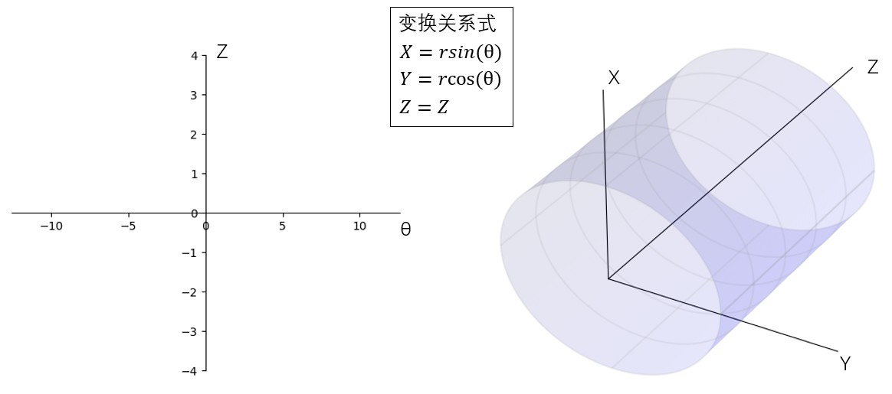
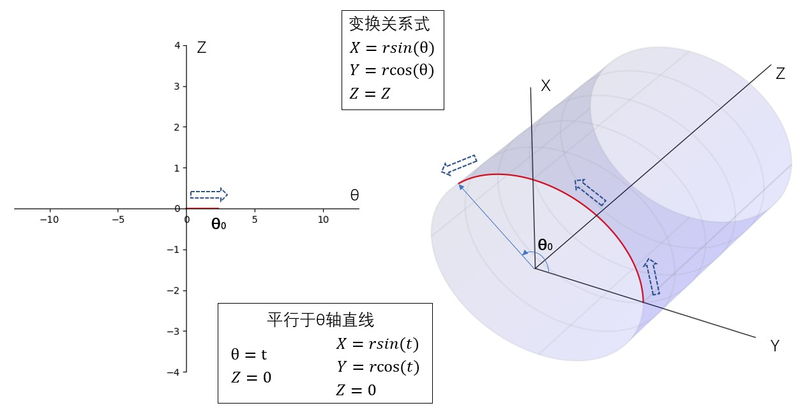
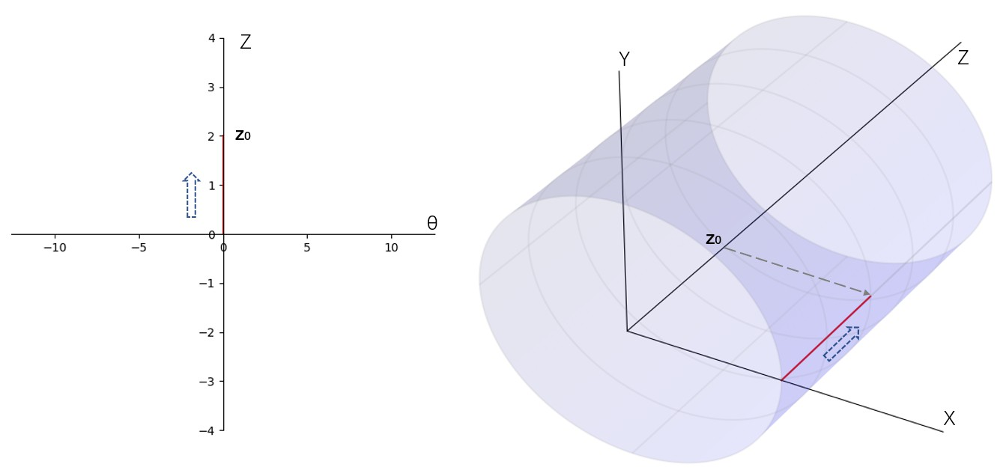
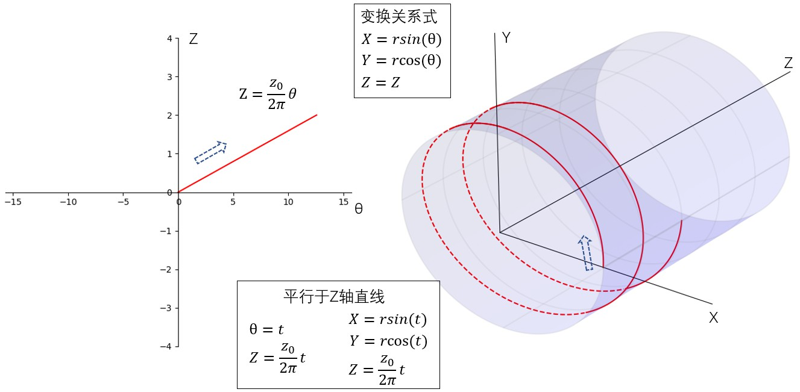

# 直线 CCT 和圆柱面 -- 建立二维到三维映射

引入：CCT 的路径是一条三维曲线，不利于观察分析，但同时 CCT 缠绕在圆柱表面（直线CCT）,在曲面上建立坐标系，可以把三维 CCT 路径方程，映射到二维。

## 圆柱面

建立如下图所示的圆柱面到二维坐标系(θ,z)的映射

</img>

图和CODE见同名PPT-1

其中右图三维坐标系中 Z 轴即圆柱轴线，XY 平面为圆柱的一个正横截面。左图二维坐标系 Z 轴和 三维坐标系 Z 轴相同，θ 轴取值表示以三维 X 轴为极轴的极角。

考虑三种简单的路径

1. 从二维(θ,z)坐标系原点出发，沿 θ 轴运动。在圆柱面上，点在 Z=0 的 XY 平面画出一个半径 r 的圆弧，起点为 (r,0,0)

</img>

图和CODE见同名PPT-2

2. 从二维(θ,z)坐标系原点出发，沿 Z 轴运动。在圆柱面上，点沿着 Z 轴移动，起点为 (r,0,0)

</img>

图和CODE见同名PPT-3

3. 从二维(θ,z)坐标系原点出发，向左上角运动。在圆柱面上，点正好走出一条螺线。

</img>

图和CODE见同名PPT-4
