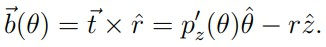
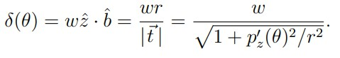
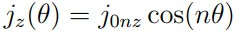
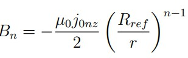
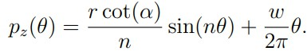
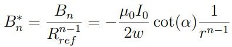

# Ch 2 Analytic Modeling

## 2.1 目标和概览  Goals and overview

分析化的建模，CCT 绕线和磁场关系。有利于分析自由变量的效应。几何分析、面电流模型.

直线 CCT 的特殊对称性。

**分析对象：路径方程、电流、磁矢势、磁场、力/压力、储能、电感、3维对称**

## 2.2 ；路径方程和磁场关系 —— 一层 CCT Winding path to field relation for a CCT layer

### 参数化路径的定义 Definition of the parametric path

</img>

路径为 p，绕线方向 t，主法线方向 / 径向 r，次法线方向 b，表达式如下：

</img>
</img>
</img>

## 周期函数 pz(θ) A periodic function for pz(θ)

pz 即 p 在 z 方向的投影，周期性：

</img>

可以计算出相邻两匝线圈的距离。注意不是匝间距 w。同时注意这是一个近似公式。（这个公式我也推出来了）

</img>

### 平均电流密度 A pitch averaged current density

</img>

面电流密度，有两个方向：螺线管方向和轴向振动方向，后者产生横向磁场（(generating transverse fields）。

### 磁场和电流密度关系 Relation of current density to magnetic field

产生 n 极场。

</img>

</img>

因此电流密度为

</img>

反推 pz，有

</img>

引入中平面倾斜角 α 的概念

</img>

得到熟悉的式子

</img>

磁场

</img>

## 2.3 磁矢势、磁场、储能、电感 A vector potential model for a multi-layer CCT: fields, stored energy, and inductance

2.2 使用面电流密度，找到路径方程和磁场的关系，磁矢势用于分析多层 CCT，并方便地得到磁场、储能、电感。

### 磁矢势 Finding the vector potential

