## 00 A novel beam optics concept in a particle therapy gantry utilizing the advantages of superconducting magnets

https://www.sciencedirect.com/science/article/abs/pii/S0939388916300010

时间 2015 作者 Alexander Gerbershagen, David Meer, Jacobus Maarten Schippers, Mike Seidel 机构 PSI

摘要

Purpose
**A first order design** of the beam optics of a superconducting proton therapy gantry beam is presented. The possibilities of superconducting magnets with respect to the beam optics such as strong fields, large apertures and superposition of different multipole fields have been exploited for novel concepts in a gantry. Since various techniques used in existing gantries have been used in our first design steps, some examples of the existing superconducting gantry designs are described and the necessary requirements of such a gantry are explained.

提出了超导质子治疗龙门光束的光束光学系统的一阶设计。对于机架中的新颖概念，已经开发了相对于束光学器件（例如强场，大孔径和不同多极场的叠加）的超导磁体的可能性。由于在我们的第一个设计步骤中已经使用了现有龙门架中使用的各种技术，因此将描述现有超导龙门架设计的一些示例，并说明这种龙门架的必要要求。

Methods
The study of a gantry beam optics design is based on superconducting combined function magnets. The simulations have been performed in first order with the conventional beam transport codes.

龙门束光学设计的研究基于超导组合功能磁体。已经使用常规的束传输码以第一顺序执行了仿真。

Results
The superposition of strong dipole and quadrupole fields generated by superconducting magnets enables the introduction of locally achromatic bending sections without increasing the gantry size. A rigorous implementation of such beam optics concepts into the proposed gantry design dramatically increases the momentum acceptance compared to gantries with normal conducting magnets. In our design this large acceptance has been exploited by the implementation of a degrader within the gantry and a potential possibility to use the same magnetic field for all energies used in a treatment, so that the superconducting magnets do not have to vary their fields during a treatment. This also enables very fast beam energy changes, which is beneficial for spreading the Bragg peak over the thickness of the tumor.

由超导磁体产生的强偶极和四极场的叠加使得能够引入局部消色差的弯曲部分，而不会增加机架的尺寸。与带有普通导电磁体的龙门架相比，在提出的龙门架设计中严格执行此类射束光学概念可以显着提高动量接受度。在我们的设计中，通过在龙门架内安装降噪器以及对治疗中使用的所有能量使用相同磁场的潜在可能性，已开发出了广泛接受的技术，因此超导磁体不必在磁场作用期间改变其磁场。治疗。这也使光束能量的变化非常快，这对于在肿瘤的整个厚度上扩展布拉格峰是有利的。

Conclusions
The results show an improvement of its momentum acceptance. Large momentum acceptance in the gantry creates a possibility to implement faster dose application techniques.

结果表明其动量接受度有所提高。门架中的大动量接受度为实现更快的剂量应用技术提供了可能性。

1 Introduction

1.1 Scanning the proton beam over tumor tissue
**总结：布拉格峰 笔形扫描 加快扫描速度 磁场和束流能力同步变化 但是速度并不快**

Proton therapy makes use of the Bragg peak with its finite range to help provide conformal dose distributions, thus minimizing dose to healthy tissue. In the scanning pencil beam technique, a narrow proton beam is scanned in the two transverse directions and the depth of the Bragg peak is set by adjusting the energy of the pencil beam.

质子疗法利用布拉格峰的有限范围来帮助提供保形剂量分布，从而最大程度地减少对健康组织的剂量。 在扫描笔形束技术中，在两个横向方向上扫描窄质子束，并且通过调节笔形束的能量来设置布拉格峰的深度。

In this study we have chosen to examine a gantry design based on pencil beam scanning.

The size of the tumor projection in the plane perpendicular to the beam direction is usually much larger than the beam diameter. Scanning of the beam in both transverse directions is performed in most modern facilities via the deflection of the narrow ‘pencil beam’, a technique first demonstrated in NIRS [1] and LBNL [2] and first used in clinical routine in a gantry at PSI [3]. The beam is deflected via the scanning magnets, which are located before (upstream scanning) or behind (downstream scanning) the final bending magnet in the gantry, but also other possibilities exist [4], [5].

在这项研究中，我们选择检查基于笔形束扫描的龙门设计。

在垂直于光束方向的平面上的肿瘤投影的尺寸通常远大于光束直径。 在大多数现代化的设备中，通过狭窄的“铅笔束”的偏转，可以在两个横向方向上对光束进行扫描，该技术首先在NIRS [1]和LBNL [2]中得到证明，并且首先在PSI的龙门架中用于临床程序 [3]。 光束通过扫描磁体偏转，扫描磁体位于机架中最终弯曲磁体的前面（上游扫描）或后面（下游扫描），但是还存在其他可能性[4]，[5]。

The location in depth of the Bragg peak is set by choosing the beam energy. Presently, at almost all operating proton therapy facilities the beam is accelerated by a cyclotron with fixed extraction energy or by a synchrotron with adjustable energy. In cyclotron facilities the energy is being reduced by a so-called degrader – low Z material in the beam transport system – to the value required by the patient treatment plan. Such a system and the following magnets can be designed such that they allow energy variations to spread the dose in depth over the tumor thickness. The time needed to change energy accordingly, should be as short as possible to limit the total treatment time. Another advantage of the possibility to have fast energy changes is in the application of volumetric rescanning [6]. Currently, the energy change speed is limited by the time to change the magnetic fields between a degrader and the patient.

布拉格峰的深度位置通过选择光束能量来设置。 目前，几乎在所有运行中的质子治疗设施中，束流都由具有固定提取能量的回旋加速器或具有可调能量的同步加速器加速。 在回旋加速器设施中，能量被所谓的降解器（束传输系统中的低Z材料）降低至患者治疗计划所需的值。 可以设计这样的系统和随后的磁体，使得它们允许能量变化以在肿瘤厚度上深度扩散剂量。 因此，改变能量所需的时间应尽可能短，以限制总治疗时间。 能量快速变化的另一个优点是体积重新扫描的应用[6]。 当前，能量改变速度受到改变降级剂与患者之间的磁场的时间限制。

All magnets in the gantry must be ramped synchronously with the energy (proportionally to beam momentum) variation, which should be fast in order to minimize the treatment time. The PSI Gantry 2 magnetic field is changed on the order of ΔB/(BΔt) = 10% per second. We consider this speed as a desirable specification for a gantry with superconducting magnets. However, for such magnets the ramping speed of is slower due to limitations of AC-losses and hysteresis effects.

In order to reduce the treatment time, it is useful to reduce the time it takes to make an energy change. In Section 1.4 this will be discussed in more detail.

机架中的所有磁体必须与能量变化（与束动量成正比）同步变化，该变化应快速以最小化治疗时间。 PSI龙门2磁场的变化量为每秒ΔB/（BΔt）= 10％。 我们认为该速度是具有超导磁体的龙门的理想规格。 但是，对于此类磁体，由于交流电损耗和磁滞效应的限制，其斜坡速度较慢。

为了减少治疗时间，减少进行能量改变所花费的时间是有用的。 在第1.4节中将对此进行更详细的讨论。

### Proton therapy gantry high level requirements

**总结：机架的介绍、降低成本、打算使用超导磁铁**

A gantry is a rotating system at the final section of the particle therapy facility beamline. It is composed of several dipole and quadrupole magnets, which are able to bend proton beams with a maximum energy of approximately 230–250 MeV or carbon ions of approximately 450 MeV/nucl, not taking particle beam imaging into account. Its rotation together with the movement of the patient table allows irradiating the tumor tissue from different directions. In the so-called iso-centric gantries the gantry and magnets direct the central (non-scanned) beam toward the iso-center, the common point in space, where the gantry rotational axis is crossed with the beams from all gantry directions. The irradiated tumor must coincide with the beam trajectory and can be placed at the gantry iso-center [7]. The scanning system deflects the beam in a lateral direction with respect to the direction of the central (non-scanned) beam.

龙门架是位于粒子治疗设备光束线最后部分的旋转系统。 它由几个偶极和四极磁体组成，它们能够弯曲质子束，最大能量约为230–250 MeV，碳离子约为450 MeV /核，而无需考虑粒子束成像。 它的旋转以及患者床的移动允许从不同方向照射肿瘤组织。 在所谓的等中心龙门架中，龙门架和磁铁将中心（非扫描）光束引向等中心点，即空间中的公共点，在那里龙门架旋转轴与来自所有龙门架方向的光束交叉。 照射的肿瘤必须与光束轨迹一致，并且可以放置在龙门的等角点处[7]。 扫描系统相对于中心（未扫描）光束的方向在横向方向上偏转光束。

There is a big interest in the proton therapy research to reduce the cost of the proton therapy facilities in order to make this type of therapy more affordable. It is perhaps possible that a reduction in the magnet weight can play a role in cost reduction, but this has not yet been proven. Since most proton therapy facilities are located in the densely populated areas in order to allow a good access of the potential patients to the facility, the footprint and the volume of the facility play an important role in the gantry acquisition decisions. Consequently, these parameters must as well be taken into account during the gantry design. Although these considerations will have an effect on decisions the direction of certain solutions, in this paper we concentrate on the design of the beam optics when using superconducting magnets.

降低质子治疗设备的成本，以使这种类型的治疗更可负担，这在质子治疗研究中引起了极大的兴趣。 降低磁体重量可能会在降低成本方面发挥作用，但这尚未得到证实。 由于大多数质子治疗设施都位于人口稠密的地区，以使潜在患者能够很好地进入该设施，因此设施的占地面积和体积在龙门架获取决策中起着重要作用。 因此，在龙门架设计中还必须考虑这些参数。 尽管这些考虑因素会对决定某些解决方案的方向产生影响，但在本文中，我们将重点讨论使用超导磁体时束光学的设计。

The use of superconducting magnets is an emerging issue in the development of proton and ion therapy gantries. Designs of superconducting gantries have been developed worldwide by research institutes as well as companies. Presently several of these designs are under commissioning or construction [8], [9], [10]. A possible motivation to apply superconducting magnets in a gantry could be the possibility to reduce the gantry's weight, eventually up to an order of magnitude for heavy ion facilities. In case of the larger heavy ion gantries (e.g. a normal conducting Heidelberger Ionenstrahl-Therapiezentrum gantry l = 25 m and r = 6.5 m), the National Institute of Radiological Sciences design shows that the size could be reduced significantly. The implications of these factors for a proton therapy facility are not yet fully understood. We believe they could have positive benefit, but in the current study our concentration is on the possible performance benefits of using superconducting magnets.

在质子和离子治疗门架的发展中，超导磁体的使用是一个新兴的问题。研究机构和公司已在全球范围内开发了超导龙门的设计。目前，其中一些设计正在调试或建造中[8]，[9]，[10]。在龙门架中使用超导磁体的一种可能动机可能是减轻龙门架的重量，最终使重离子设备的重量降低一个数量级。对于较大的重离子门架（例如，正常的传导式Heidelberger Ionenstrahl-Therapiezentrum龙门架，l = 25 m和r = 6.5 m），美国国家放射科学研究院的设计表明，可以大大减小尺寸。这些因素对质子治疗设施的影响尚不完全清楚。我们相信它们可以带来积极的好处，但是在当前的研究中，我们的注意力集中在使用超导磁体可能带来的性能好处上。

### 1.2 Beam optics

**介绍色散、孔径和最大横向位移决定动力接受、传统机架<1%、全局消色散、局部消色散**

The bending of the beam in every dipole magnet causes the trajectory of particles with a non-nominal momentum to deviate from the nominal axis of the beam. This chromatic phenomenon is called dispersion and can be described by the so-called dispersion function. The combination of gantry magnet apertures and the maximum amplitude of this trajectory determines the maximum momentum deviation that can be accepted by the gantry. In existing gantries with global chromatic correction a gantry accepts a momentum band of about ±0.5–1%.

In the present paper we distinguish global achromatic correction, meaning suppression of the transverse and angular dispersion at the iso-center, and local achromatic correction suppressing transverse and angular dispersion (see below) by a subgroup of magnets within the gantry. In both cases this is a first order achromaticity. The beam position is independent of energy, but chromatic focusing errors have not yet been taken into account. The gantry optics is simulated in first order with Transport [11], [12] software. In Transport the effect of the beamline elements on the beam envelope is described by so called “transform matrices” (R, with each matrix element represented by Rij) describing the beam optical elements (magnets and drift spaces).

每个偶极磁体中束的弯曲都会导致具有非标称动量的粒子的轨迹偏离束的标称轴。该色现象被称为色散，并且可以通过所谓的色散函数来描述。龙门磁铁孔径和该轨迹的最大振幅的组合确定了龙门可以接受的最大动量偏差。在具有整体色彩校正的现有龙门架中，龙门接受大约±0.5–1％的动量带。

在本文中，我们区分了全局消色差校正，即抑制等中心处的横向和角向色散，以及局部消色差校正，通过机架内的磁铁子组抑制横向和角向色散（见下文）。在两种情况下，这都是一阶消色差。光束位置与能量无关，但是尚未考虑色聚焦误差。用Transport [11]，[12]软件以一阶模拟机架光学系统。在传输中，光束线元素对光束包络线的影响通过所谓的“变换矩阵”（R，每个矩阵元素由Rij表示）来描述，它们描述了光束光学元素（磁体和漂移空间）。

### 1.3 Upstream and downstream transverse scanning

**总结：上下游扫描对比**

Scanning in the plane transverse to the depth direction is performed by “scanning magnets“, which are located upstream or downstream of the final bending section (see Fig. 1).

In the case of downstream scanning the gantry radius is larger than for a comparable upstream scanning gantry, since sufficient drift space for the beam after the scanner magnets is needed. One advantage of the downstream scanning is that the final bend dipole can have a smaller aperture and hence it can be lighter, easier to manufacture and may have more relaxed requirements for the field quality. Another advantage could be a larger clinical field size can be obtained.

在横向于深度方向的平面中的扫描是通过“扫描磁体”执行的，这些磁体位于最终弯曲部分的上游或下游（见图1）。

在下游扫描的情况下，机架半径大于可比的上游扫描机架的半径，因为需要在扫描仪磁体之后为光束提供足够的漂移空间。 下游扫描的一个优点是最终的弯曲偶极子可以具有较小的孔径，因此可以更轻，更容易制造，并且对场质量的要求可能更宽松。 另一个优点是可以获得更大的临床视野。

In case of upstream scanning, the scanning magnets can be imaged to the iso-center as “point to parallel“. A deflection of the scanning magnet then causes a parallel displacement of the pencil beam at isocenter, i.e. an infinite Source-to-Axis-Distance (SAD). In the terms of optical imaging, this is achieved by arranging for R22 and R44 between the scanning magnets location and the iso-center to be small, i.e. zero for the infinite SAD. Another advantage of the upstream scanning is a possible reduction of gantry radius. On the other hand, it can lead to an increase of the gantry length, due to the location of the scanning magnets in the horizontal section of the gantry. But, since gantry length contributes linearly to the volume and footprint area, and the radius contributes with its square to the volume, upstream scanning is still advantageous for the gantry volume. In addition, the gantry radius contributes with a factor of two to the total height of the needed vertical space in the building.

在上游扫描的情况下，可以将扫描磁体成像到等中心点为“平行点”。扫描磁体的偏转随后导致笔形束在等角点处平行移动，即无限远的源到轴距离（SAD）。在光学成像方面，这是通过在扫描磁体位置和等中心点之间将R22和R44设置为较小（即对于无限SAD为零）来实现的。上游扫描的另一个优点是可以减小龙门架半径。另一方面，由于扫描磁体在机架的水平部分中的位置，这可能导致机架长度的增加。但是，由于龙门架长度对体积和占地面积有线性影响，而半径与体积成平方关系，因此上游扫描对于龙门架体积仍然有利。此外，龙门架半径对建筑物中所需垂直空间的总高度的影响是其两倍。

In case of upstream scanning, the final bending dipole must have a relatively large aperture to enable a reasonable scanning field size in both x and y plane. For example in case of parallel scanning the aperture of the final bend must be at least as large as the sum of field size at the iso-center plus the beam spot size in the magnet. This may impose a complicated (due to large aperture and field homogeneity requirements) and costly design of the magnet [7], [13], and especially in this respect superconducting magnets are expected to be of advantage.

在上游扫描的情况下，最终的弯曲偶极子必须具有相对较大的孔径，以在x和y平面上实现合理的扫描场大小。 例如，在平行扫描的情况下，最终弯曲的孔径必须至少与等角点处的磁场大小加上磁体中的束斑大小之和一样大。 这可能会导致磁体的复杂（由于大孔径和场均匀性要求）和昂贵的设计[7]，[13]，尤其是在这方面，超导磁体有望成为优势。

It is also possible to position one scanning magnet before and one after the final bend, combining the upstream and downstream scanning [5]. When using the first scanning magnet for scanning in the bending plane of the following bending magnet, this magnet only needs a large aperture in the bending direction. Scanning in the dispersive plane can be performed with the scanning magnet behind the bending magnet. For example, the “racetrack” dipole layout has a much larger aperture in the dispersive plane than in the transverse one and is a good candidate for such a scanning option.

In IBA's gantry Proteus I the scanning magnets are located in between the bending magnets of the last bending section, which also has reduced the gantry radius [14].

也可以在最后弯曲之前和之后放置一个扫描磁体，结合上游和下游扫描[5]。 当使用第一扫描磁体在随后的弯曲磁体的弯曲平面中进行扫描时，该磁体仅需要在弯曲方向上的大孔径。 可以在弯曲磁体后面的扫描磁体处进行色散平面中的扫描。 例如，“跑道”偶极子布局在色散平面上的孔径比在横向平面上大得多，并且是此类扫描选项的良好候选者。

在IBA的门架Proteus I中，扫描磁铁位于最后一个弯曲段的弯曲磁铁之间，这也减小了门架半径[14]。

### 1.4 Energy modulation and magnetic ramping

**总结：具体扫描过程、详细的扫描时间安排、磁滞的影响、超导磁铁失超的影响**

Tumor tissue is scanned in depth by varying the energy of the beam and hence the penetration depth of the Bragg peak. Given the width of the Bragg peak in proton beams, scanning is performed in layers of approx. 5 mm thickness. The corresponding required change of the beam momentum per layer is of the order of ∼1%. The time needed for a momentum change between the layers should be kept as short as possible to reduce the treatment time. It varies from 1 s in existing commercial gantry models to 0.1 s at PSI Gantry 2, including a pause for the system to stabilize [15]. In this gantry the full range of energy change (70–230 MeV, which corresponds to ∼50% in the momentum) needs approx. 2.5 s. The fields of all magnets downstream of the degrader are changed synchronously, proportional to the momentum of the particles. Since each step (of ∼1% in momentum) requires an accurate synchronization and several checks, effectively such a step takes 80–100 ms. Of course a requirement is that the gantry should be able to “follow” such an energy change: there should be no change in position or spot shape in the transverse plane at isocenter when energy is changed. An achromatic layout is of great advantage in this respect. We have adopted this requirement for the specifications of the planned superconducting gantry as well.

通过改变束的能量并因此改变布拉格峰的穿透深度来对肿瘤组织进行深度扫描。给定布拉格峰在质子束中的宽度，扫描将在大约1到2层中进行。 5毫米的厚度。每层相应的所需束动量变化约为1％。层之间的动量变化所需的时间应保持尽可能短，以减少处理时间。从现有的商用龙门模型的1秒到PSI龙门2的0.1秒不等，包括系统稳定所需的暂停时间[15]。在该机架中，能量变化的整个范围（70-230 MeV，相当于动量的〜50％）大约需要。 2.5秒降级剂下游所有磁体的磁场与颗粒的动量成比例地同步变化。由于每个步骤（动量约为1％）都需要精确的同步和多次检查，因此，这一步骤实际上需要80-100毫秒。当然，要求的是龙门架应能够“跟随”这样的能量变化：当能量变化时，等中心横切面上的位置或光斑形状不应发生变化。在这方面，消色差的布局具有很大的优势。我们还针对计划中的超导龙门的规格采用了这一要求。

For the gantries with large ferromagnetic yokes the effect of the magnetic hysteresis must be considered as well. One way to deal with the effect is to perform the energy change only in one direction, e.g. from the higher to the lower energy, so that the impact of hysteresis becomes reproducible. Allowing energy changes in both directions would require a complicated algorithm taking into account the recent magnetic ramping history.

For the superconducting magnets achieving a high ramp rate might become a serious problem because of the eddy currents. Eddy currents in the normal conducting part of the cables generate heat and increase the probability of the magnetic quenching. Eddy currents in the superconducting cables are remanent, hence they can lead to field shape changes. If it is necessary to include rapid (e.g. <1 s) magnetic field changes, a particular focus must be laid on the design of a suitable magnet with large aperture, the choice of the optimal superconductor material and its filament-layout, as well as on the consideration of cooling possibilities (e.g. cryo-coolers, liquid helium etc.).

对于具有大铁磁轭的龙门架，还必须考虑磁滞的影响。处理该效果的一种方法是仅在一个方向上执行能量更改，例如从较高的能量到较低的能量，因此磁滞的影响变得可重现。考虑到最近的磁斜坡历史，允许在两个方向上的能量变化都将需要复杂的算法。

对于超导磁体，由于涡流，实现高斜率可能成为严重的问题。电缆正常传导部分中的涡流会产生热量，并增加磁猝灭的可能性。超导电缆中会残留涡流，因此它们会导致磁场形状变化。如果必须包括快速的磁场变化（例如<1 s），则必须特别关注具有大孔径的合适磁体的设计，最佳超导体材料的选择及其灯丝布局以及考虑到冷却的可能性（例如，低温冷却器，液氦等）。

</img>

### 2 Examples of existing superconducting gantries

**总结：介绍现存的超导机架**

Some interesting proposals of superconducting gantries have been published [16,10]. In the current chapter some examples of gantries with superconducting technology use are discussed. The chosen examples are based on designs or use components which we have used as starting points or have regarded as interesting concept for our study. In particular, the combination of dipole and quadrupole fields within one magnet in the currently commissioned NIRS gantry and the achromaticity and compactness of the two bending sections in the ProNova SC360 gantry have served as starting reference of the design presented here.

关于超导龙门架的一些有趣的提议已经发表[16,10]。 在本章中，讨论了使用超导技术的龙门架的一些示例。 选择的示例基于设计或使用的组件，这些组件或组件被我们用作起点或被认为是我们研究的有趣概念。 特别是，在当前调试的NIRS龙门架中的一个磁体中的偶极和四极场的组合以及ProNova SC360龙门架中两个弯曲部分的消色差和紧凑度已成为此处介绍的设计的开始参考。

### 2.1 ProNova SC360 Gantry

**总结：ProNova SC360 Gantry 动量接受率>3%**

In 2011 a design of a superconducting gantry for therapy with 230 MeV protons was proposed by the company ProNova [17,9]. This design consists of two superconducting bending sections. Each of them contains two superconducting dipoles with a superconducting quadrupole triplet between them (in Fig. 2 marked green). Before the first superconducting section and in between the two sections four normal conducting quadrupoles are located. This design performs downstream scanning (see Section 4.1), and makes use of superconducting separated-function magnets (i.e. separate dipoles and quadrupoles) in the bending sections. The optics of each bending section has been designed such that each is locally achromatic. This gantry is commercially available, but at the moment of writing no clinically working system was in operation yet.

The beam optics design of a superconducting gantry for 350 MeV protons, based on ProNova SC360, was developed in 2012 [18]. Such a gantry could be useful for proton radiography and for the treatment of smaller tumors [19,20].

The SC sections in this design were achromatic, resulting in a momentum acceptance of the gantry of p/p > ±3%. This larger momentum acceptance has initiated some studies at PSI on the potential possibilities of a gantry with even larger momentum acceptance in general and has triggered the design presented in this paper.

ProNova公司于2011年提出了一种用于治疗230 MeV质子的超导龙门架的设计[17,9]。该设计包括两个超导弯曲部分。它们每个都包含两个超导偶极子，它们之间有一个超导四极子三重态（在图2中标记为绿色）。在第一个超导部分之前和两个部分之间有四个正常的导电四极子。此设计执行下游扫描（请参阅第4.1节），并在弯曲部分使用超导分离功能磁体（即分离的偶极和四极）。每个弯曲部分的光学元件都经过了设计，以使每个光学元件都是局部消色差的。该龙门架可以从市场上买到，但在撰写本文时，尚无临床工作系统在运行。

2012年，基于ProNova SC360开发了用于350 MeV质子的超导龙门架的光束光学设计[18]。这种龙门架可用于质子射线照相术和治疗较小的肿瘤[19,20]。

此设计中的SC截面是消色差的，导致机架的动量接受率p / p>±3％。更大的动量接受度已经在PSI上启动了一些研究，该研究通常对具有更大动量接受度的龙门架进行了研究，并触发了本文提出的设计。

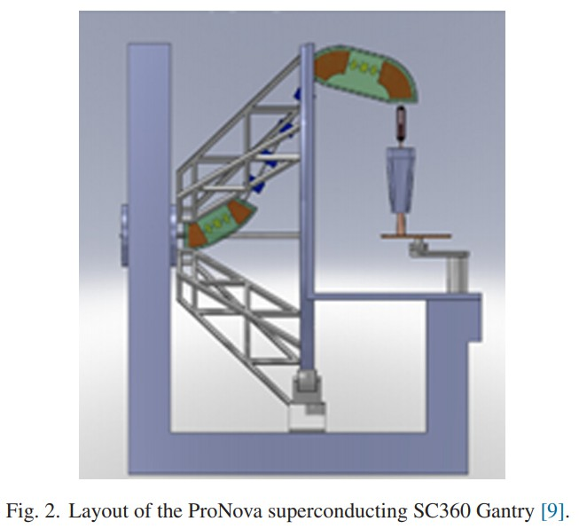</img>

### 2.2 NIRS superconducting carbon ion gantry

**总结：NIRS superconducting carbon ion gantry 碳离子机架 机架是整体消色差的，局部消色差没有应用于不同的弯曲部分 **

In particle therapy carbon ions are also used for tumor irradiation. The maximum energy of the carbon ions required for therapy is in the order of 450 MeV/nucl, so that the magnetic rigidity Bρ of the carbon beam is approximately a factor 3 higher than a proton beam with equal penetration range. This has resulted in very a large gantry for carbon therapy, the first one has been designed by Pavlovic and is in clinical operation at HIT in Heidelberg [21] since 2009. So especially for carbon therapy the very strong fields which are possible with superconducting magnets are expected to have a considerable effect in reducing the size and weight of the gantry.

The first superconducting gantry has been developed by Toshiba and is being commissioned at the National Institute of Radiological Science (NIRS) in Japan for carbon ion therapy [8,22,23]. It is an iso-centric gantry with a layout similar to PSI’s Gantry 2 [7] and gantry at GSI, having first bending sections with the dipoles of smaller aperture and a scanning system upstream of the final bending section. Therefore this last bending section of 90◦ has a larger aperture to match to the needed lateral space for the beam. In the NIRS gantry the superconducting dipoles of each bend are of the so called “cosine theta” type and have been designed such that they are combined with quadrupole fields with independent and adjustable strengths (see Fig. 3) [8]. Control of the beam size, dispersion suppression and focusing of the beam at the iso-center is performed simultaneously with bending. In this design the gantry is globally achromatic and local achromaticity has not been applied in the different bending sections.

在粒子疗法中，碳离子也用于肿瘤照射。治疗所需的碳离子最大能量约为450 MeV /核，因此碳束的磁刚度Bρ大约比具有相同穿透范围的质子束高3倍。这导致了一个非常大的用于碳疗法的龙门，第一个由帕夫洛维奇（Pavlovic）设计，并于2009年在海德堡的HIT进行临床操作[21]。因此，特别是对于碳疗法而言，超导磁体可能具有非常强的磁场有望在减小龙门架的尺寸和重量方面起到相当大的作用。

东芝开发了第一台超导龙门，并已在日本国立放射科学研究所（NIRS）进行碳离子治疗[8,22,23]。这是一个等心龙门，其布局类似于PSI的龙门2 [7]和GSI的龙门，具有带较小孔径偶极子的第一弯曲段和位于最终弯曲段上游的扫描系统。因此，最后的90°弯曲段具有较大的孔径，以匹配梁所需的横向空间。在NIRS机架中，每个弯头的超导偶极子都是所谓的“余弦theta”型，并且设计成将它们与具有独立且可调节强度的四极子场组合在一起（见图3）[8]。光束大小控制，色散抑制和光束在等角点的聚焦与弯曲同时进行。在这种设计中，机架是整体消色差的，局部消色差没有应用于不同的弯曲部分。

### 3 Technical aspects

**总结：技术层面 机架大小和重量**

We have started the design of a gantry for scanning proton beams of maximum 230 MeV, with superconducting magnets in the bending sections as previously described.

我们已经开始设计用于扫描最大230 MeV的质子束的龙门架，如上所述，在弯曲部分带有超导磁体。

### 3.1 Size and weight of the gantry

Contrary to the possibilities in an ion gantry, it is not to expect that the diameter of a proton therapy gantry can be reduced drastically by utilizing superconducting magnets, since a reduction of the bending radius of the proton beam from approximately 1 m to, say, 0.5 m, would only decrease the total gantry radius with not more than 0.5 m. In proton gantries the major factor influencing the diameter is the choice between scattering, upstream, downstream or combined scanning methods. Superconducting magnets, however, offer more possibilities for upstream scanning due to the larger aperture of the magnets of this type.

It can be expected that usage of magnets with no or little iron yoke can reduce the weight of the gantry substantially by a factor of 5 to 10. This can be illustrated by the comparison of the ProNova SC360 gantry weight (∼25 tons [9]) with the weight of PSI Gantry 2 (∼200 tons).

与离子龙门架的可能性相反，不要期望通过使用超导磁体来大幅减少质子治疗龙门架的直径，因为质子束的弯曲半径从大约1 m减小到，例如， 0.5 m，只会将龙门架总半径减小不超过0.5 m。 在质子龙门架中，影响直径的主要因素是散射，上游，下游或组合扫描方法之间的选择。 然而，由于这种类型的磁体的较大孔径，超导磁体为上游扫描提供了更多的可能性。

可以预期，使用无铁轭或铁轭很少的磁体可以将龙门架的重量减少5到10倍。这可以通过比较ProNova SC360龙门架重量（约25吨[9]）来说明。 ），重量为PSI龙门2（〜200吨）。

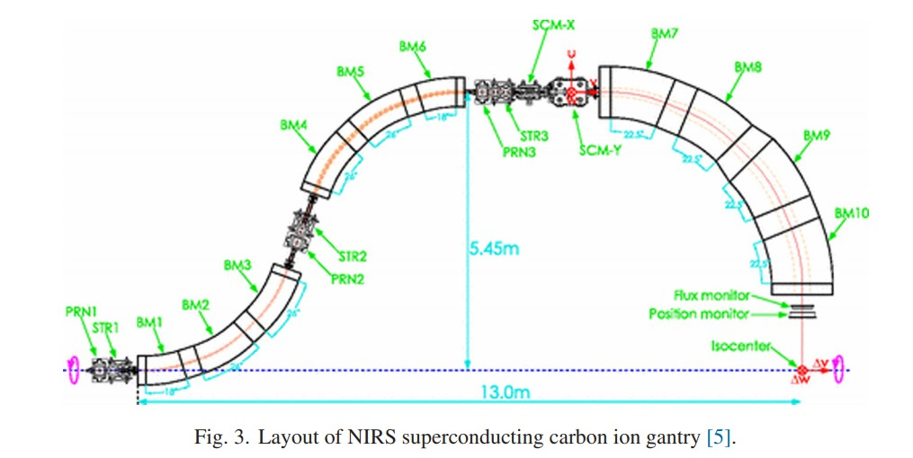</img>

### 3.2 Dealing with superconducting magnet technology in a clinical environment 在临床环境中处理超导磁体技术

**总结：在临床环境中处理超导磁体技术。等中心点处剩余磁场<0.5mT，机架的液氦低温技术**

The fractionation scheme mostly used in a radiation treatment with proton therapy and the needed high availability allows only maintenance shutdowns of 1–2 days. Therefore the cryogenic system and the magnets should be designed such that they do not need to be warmed up on a time scale of 10 or more times per year and a quench of the superconducting system cannot be accepted in the clinical environment which would cause a treatment interruption of several days.

Superconducting magnets can be designed to have a very strong magnetic field. One should take care that the stray field of the magnets is not larger than 0.5 mT at the iso-center [24]. This is a level which is considered to be safe for patients with pacemakers, and of other critical devices next to the magnets may cause a gantry angle dependence of the field quality in the magnets due to the presence of iron in the gantry’s environment (e.g. in the concrete). Therefore shielding with additional coils or some iron will be necessary

In order to limit the cryogenic complexity of a rotating system with liquid helium, the use of cryo-coolers is also considered. This has been implemented on the gantry at NIRS [8]. The cryo-coolers must be designed and mounted such that they can be subject to the gantry rotational movement and their choice has to be feasible from the commercial point of view.

分馏方案主要用于质子放射治疗，所需的高可用性仅允许停机1至2天。因此，应设计低温系统和磁体，使得它们不需要每年以10次或更多次的时间进行预热，并且在临床环境中超导系统的淬灭不能接受，这会导致治疗中断了几天。

超导磁体可以设计成具有非常强的磁场。应该注意的是，在等中心处磁体的杂散场不大于0.5 mT [24]。该水平被认为对装有起搏器的患者是安全的，并且由于机架环境中铁的存在（例如，在磁体周围），磁体附近的其他关键设备可能会导致磁体中磁场质量的机架角度依赖性。具体）。因此，有必要使用额外的线圈或一些铁进行屏蔽

为了限制具有液氦的旋转系统的低温复杂性，还考虑使用低温冷却器。这已在NIRS的龙门架上实现[8]。低温冷却器的设计和安装必须使其能够承受机架的旋转运动，并且从商业角度出发，必须进行可行的选择。

### 3.3 Design related to aspects of beam properties

**总结：连接点 coupling point 和 ISCO 处的束流参数（机架角度无关--横向平面x和y之间是对称的）、忽略高阶效应**

### 3.3.1 Beam phase space at the coupling point and at the iso-center

We aim for a design of the ion-optics that is independent of gantry angle. The phase space of the beam is assumed to be symmetric between the transverse planes x and y and free of momentum dispersion, at the coupling point, so that there is no correlation between energy and position in the beam spot. This insures that the beam shape in the gantry is independent of gantry’s rotation angle. Installation of a circular collimator at the coupling point can further constrain the beam properties. Such a collimator could limit the beam size transported to iso-center and decouple beam misalignment errors in the fixed beamline from the iso-center in such a way that would only lead to intensity changes rather than beam position changes at iso-center. At the iso-center the spot is desired to be a symmetric, Gaussian shape with a radius of 2.5 mm (1σ). The beam size at iso-center is determined by the beam (or collimator) size at the coupling point, the beam optics in the gantry, the scattering in materials such as the vacuum window at the magnet exit, air, the monitors, possible range shifters and in the nozzle and in the air between the vacuum window. The scattering contributions dominate at low energies.

The optics calculations presented here, have all been performed at high energies, neglecting distortions due to scattering, deviations from ideal magnetic fields (homogeneous fields and gradients and sharp magnet boundaries) and higher order effects. These distortions are currently under investigation.

我们的目标是设计与机架角度无关的离子光学器件。假定光束的相空间在横向平面x和y之间是对称的，并且在耦合点处没有动量色散，因此光束点的能量和位置之间没有相关性。这样可以确保龙门中的光束形状与龙门的旋转角度无关。在耦合点处安装圆形准直器会进一步限制光束特性。这种准直仪可以限制传输到等中心线的光束大小，并以这样的方式将固定光束线中的光束失准误差与等中心线解耦，从而只会导致强度变化，而不会导致等点线位置的变化。在等角点处，点应为对称的高斯形状，半径为2.5毫米（1σ）。等中心点的光束大小取决于耦合点处的光束（或准直器）大小，机架中的光束光学器件，磁体出口处的真空窗口等材料的散射，空气，监视器以及可能的范围移位器并在喷嘴和真空窗口之间的空气中。散射贡献在低能量下占主导地位。（真能写呀）

此处介绍的光学计算都是在高能量下进行的，忽略了由于散射引起的畸变，与理想磁场的偏离（均匀磁场和梯度以及尖锐的磁体边界）以及高阶效应。目前正在研究这些失真。

### 3.3.2 Ion optical design and introduction of a collimator

**总结：对传输矩阵的要求、对称、成像（光束发散和耦合点处的入射角的误差不会导致笔形光束位移或等角点处的光斑尺寸增大）**

The first order optics is designed such that the collimator at the coupling point is imaged to the iso-center. In the optics transport matrix [25,26], the matrix elementsR11,R12,R33 and R34 relate the particle location xisoc and yisoc at iso-center to the particle location xcoupl and ycoupl and particle angle θcoupl and ϕcoupl at the coupling point:

xisoc = R11 · xcoupl + R12 · θcoupl and

yisoc = R33 · ycoup + R34 · ϕcoupl

The imaging of the coupling point to the iso-center (pointto-point imaging) requires the elements R12 and R34 to be zero, so that:

R12 · θcoupl = R34 · ϕcoupl = 0

Since we require the imaging to be achromatic as well, we obtain the situation that the magnifications in x and y (R11 and R33) are determining the particle location according to first order optics:

xisoc = R11 · xcoupl and yisoc = R33 · ycoupl

一阶光学器件的设计应使准直器在耦合点成像到等中心点。 在光学传输矩阵[25,26]中，矩阵元素R11，R12，R33和R34将等中心点处的粒子位置xisoc和yisoc与耦合点处的粒子位置xcoupl和ycoupl和粒子角度θcoupl和ϕcoupl相关联：

xisoc = R11·xcoupl + R12·θcoupl和

yisoc = R33·ycoup + R34·ϕcoupl

耦合点到等中心点的成像（点对点成像）要求元素R12和R34为零，因此：

R12·θcoupl= R34·ϕcoupl = 0

由于我们还要求成像也必须是消色差的，因此我们得到如下情况：x和y的放大倍数（R11和R33）根据一阶光学器件确定粒子的位置：

xisoc = R11 · xcoupl and yisoc = R33 · ycoupl

It is useful for the elements R11 and R33 to be equal so that a symmetric beam spot size at the coupling yields a symmetric beam spot size at the iso-center, hence facilitating the treatment planning.

The advantage of these imaging conditions is that, in first order, errors in beam divergence and entering angle at the coupling point do not result in pencil beam displacement or spot size increase at the iso-center. Also, beam offset or beam size errors at the coupling point result only in larger losses on the collimator at this location, but not in the beam offset or spot size increase at the iso-center. This results in conditions at iso-center becoming less sensitive to alignment errors in the beamline upstream of the gantry.

An additional collimator at an intermediate focus before the last bending section is also included. The design is such that a similar imaging exists between this collimator and the iso-center. Also, if a degrader is included immediately before the second collimator the pencil beam size at isocenter will be determined mostly by the diameter of this degradercollimator.

元件R11和R33相等是有用的，以使得在耦合处的对称束斑尺寸在等中心处产生对称束斑尺寸，因此有利于治疗计划。

这些成像条件的优势在于，首先，光束发散和耦合点处的入射角的误差不会导致笔形光束位移或等角点处的光斑尺寸增大。同样，在耦合点处的光束偏移或光束尺寸误差仅导致在该位置处的准直仪上的较大损失，而不会导致在等角点处的光束偏移或光斑尺寸增加。这导致等中心处的条件对龙门架上游的光束线中的对准误差变得不太敏感。

还包括在最后弯曲部分之前的中间焦点处的附加准直器。该设计使得在该准直仪和等中心点之间存在相似的成像。同样，如果在第二个准直仪之前立即包括一个降级镜，则等中心点处的笔形光束大小将主要由该降级镜准直器的直径确定。

### 3.3.3 Ion optical design/achromaticity

**抑制色散、减少横向位移、增大动量接受度**

Dispersion in x-direction (plane of the bending magnets) can be represented by the transport matrix element R16. The beam size x at any location is given by

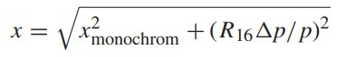</img>

where xmonochrom is the beam size without taking momentum deviation into account. At the coupling point the dispersion value must be zero in order to ensure the rotational symmetry of the gantry. At the iso-center the dispersion value must be kept low to minimize the beam size and to prevent any correlation of beam penetration depth with the horizontal position. It is also beneficial to keep the beam size value in the gantry itself as small as possible in order to have a larger momentum acceptance through the gantry, and one way to do that is to minimize the dispersion function.

x方向（弯曲磁体的平面）上的色散可由传输矩阵元素R16表示。 任意位置的光束大小x由下式给出

其中xmonochrom是不考虑动量偏差的光束尺寸。 在耦合点上，色散值必须为零，以确保机架的旋转对称性。 在等中心处，色散值必须保持较低，以最大程度地减小光束尺寸并防止光束穿透深度与水平位置相关。 将机架本身中的光束尺寸值保持尽可能小，以通过机架获得更大的动量接受度也是有益的，并且做到这一点的一种方法是最小化色散函数。

### 3.3.4 Beam losses

**因为将能器、狭缝在机架上，所以要防止辐射**

It is important, especially in the design of the static beamline upstream of the gantry, to concentrate beam losses only at particular locations which are specifically designed for it, such as collimators after the degrader or the energy selection slit. These areas must be sufficiently shielded, so that the losses do not affect the patients and the personnel working in the neighboring rooms. Also beam losses should be prevented in the superconducting magnets, since these could lead to quenching and consequently to a longer down time.

Therefore already in first order optics design, choices of distances and magnet strengths have been made such that he beam size and deflection due to scanning will have a limited amplitude within the gantry magnets, so that some space will be available for beam size increase due to the scattering and higher order effects.

重要的是，尤其是在龙门架上游的静态光束线的设计中，仅将光束损失集中在专门为其设计的特定位置上，例如在降束器或能量选择狭缝之后的准直器。 这些区域必须充分屏蔽，以免损失不影响患者和在相邻房间工作的人员。 此外，还应防止超导磁体中的束流损失，因为它们可能导致淬火并因此导致更长的停机时间。

因此，已经在第一级光学设计中，已经进行了距离和磁体强度的选择，以使得由于扫描而导致的光束大小和偏转在龙门磁体内的振幅将受到限制，因此由于 散射和高阶效应。

### 3.4 Beam optics requirements resulting from scanning considerations

**扫描需要的束流参数、无机械移动下仅靠扫描磁铁获得的最大范围30*40cm。关于扫描 SAD 的一些详细概述**

The maximal area at the iso-center, which can be covered by the scanning method without mechanical movement of the patient or the rotation of the gantry, is called field size. The requirement for the transverse clinical field size varies and can reach 30 cm × 40 cm. Since this field size has major consequences on the magnet aperture for an upstream scanning system and given the constraints on these apertures the field size requirement has been relaxed to 20 cm in each direction. All desired positions within a rectangular or elliptic field must be reachable with the scanner magnets for all energies. The modulation in depth should cover the full water equivalent range from ∼0 to 35 cm. The range between 0 and 4 cm depth can be covered by a pre-absorber (range shifter plates) in the nozzle, just before the patient, since the transmission through the degrader for the energy reduction below 70 MeV would be too low. Therefore we have assumed that the energies of the protons to be transported in the gantry magnets are in the range 70–250 MeV.

It is helpful to ensure that the spot size and shape do not change when transverse scanning is performed. In order to achieve that a high homogeneity of the final bend magnetic field must be ensured. Also, the focusing in the bend should not be dependent on the beam’s transverse position and a sufficient compensation of the higher order effects, if present, must be achieved.

等角点处的最大区域称为场大小，该区域可以通过扫描方法覆盖，而无需患者机械移动或机架旋转。横向临床视野大小的要求各不相同，可以达到30 cm×40 cm。由于该磁场大小对上游扫描系统的磁铁孔径有重大影响，并且鉴于这些孔径的限制，因此磁场大小要求已在每个方向上放宽到20 cm。对于所有能量，扫描仪磁体都必须能够到达矩形或椭圆形区域内的所有所需位置。深度调制应覆盖约0至35厘米的整个水当量范围。深度在0到4厘米之间的范围可以被喷嘴中的预吸收器（换档板）覆盖，就在患者之前，因为通过降级器传输的能量降低到70 MeV以下会太低。因此，我们假设要在龙门磁铁中传输的质子的能量在70-250 MeV的范围内。

确保执行横向扫描时光斑的大小和形状不会改变是有帮助的。为了确保最终弯曲磁场的高度均匀性。另外，弯曲处的聚焦不应取决于光束的横向位置，必须对高阶效应（如果存在）进行充分补偿。

As one can see in Fig. 5, the scanning SAD of the gantry is not infinite, but is in the order of 3 m. This value does not provide a parallel scanned beam but is larger than some common values of 1–2 m SAD in the downstream scanning gantries. Also, with the current optics the shift of the beam induced by the scanning magnets deflection is not too large in the final bend, so that the aperture of the final bend is not overly large. The shift of the scanned beam in the final bend is 82% and 44% of beam shift at the iso-center for the x plane (xiso, dispersive) and y plane (yiso, transverse), respectively. This means that, given the 2σ beam size of approximately 7 mm at the final bend exit and a magnet aperture radius Amagn of 125 mm, the maximum extent of the beam edge of a scanned beam in each direction at the iso-center is

如图5所示，龙门的扫描SAD并非无限，而是大约3 m。 该值不提供平行扫描光束，但大于下游扫描门架中一些常见的1-2 m SAD值。 而且，在当前的光学系统中，由扫描磁体的偏转引起的束的移动在最终弯曲处不会太大，从而最终弯曲的孔径不会太大。 扫描光束在最终弯曲处的位移分别是x平面（xiso，色散）和y平面（yiso，横向）等角点处光束位移的82％和44％。 这意味着，如果在最终弯曲出口处的2σ束大小约为7 mm，并且磁体孔径半径Amagn为125 mm，则在等中心点处每个方向上扫描束的束边缘的最大范围为

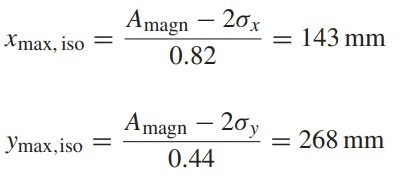</img>

A yielding a total maximal (elliptic) scanning field of 286 mm × 536 mm. This indicates that the proposed design has still a good margin of bending magnet aperture for the stated 20 cm × 20 cm clinical field size requirement. This margin can be used to increase the momentum acceptance of the bend (see Section 4.3).

To summarize, the design of proton gantry optics should aim to fulfill the requirements stated in Table 1.

产生的总最大（椭圆）扫描场为286 mm×536 mm。 这表明对于规定的20 cm×20 cm临床视野尺寸要求，建议的设计在弯曲磁体孔径方面仍具有良好的余量。 该余量可用于增加弯头的动量接受度（请参见第4.3节）。

综上所述，质子龙门光学器件的设计应旨在满足表1中所述的要求。

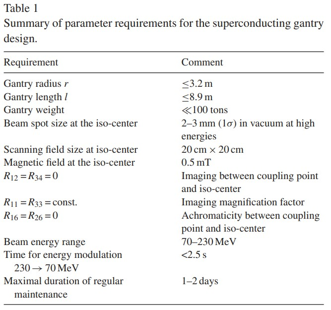</img>

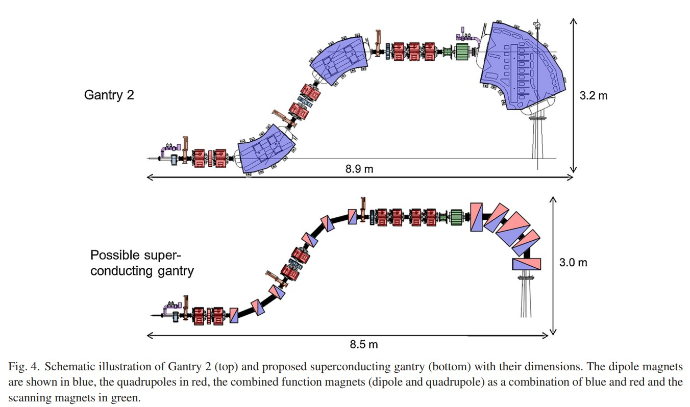</img>

Fig. 4. Schematic illustration of Gantry 2 (top) and proposed superconducting gantry (bottom) with their dimensions. The dipole magnets are shown in blue, the quadrupoles in red, the combined function magnets (dipole and quadrupole) as a combination of blue and red and the scanning magnets in green

图4.龙门架2（顶部）和建议的超导龙门架（底部）及其尺寸示意图。 偶极子磁体显示为蓝色，四极子显示为红色，组合功能磁体（偶极子和四极子）显示为蓝色和红色的组合，扫描磁体为绿色

### 4 Proposed optics design of the gantry

A beam optics design of a superconducting gantry based on the requirements specified in Section 3 has been developed and is presented in the current section. A brief description of the magnets considered for the current design is given in Section 6.

已经根据第3节中的要求开发了超导龙门架的光束光学设计，并在本节中进行了介绍。 在第6节中简要介绍了当前设计中考虑使用的磁体。

### 4.1 Gantry layout

**机架布局**

Fig. 4 shows the layout of the proposed superconducting gantry (bottom) compared with PSI Gantry 2 (top). In both designs there are two bending sections of 60◦ and one of 90◦. However, in the superconducting gantry design the bending sections consist of several superconducting combined function magnets with overlapping dipole and quadrupole fields. Additionally, the design contains eight normal conducting quadrupoles before and between the bending sections.

Scanning has been implemented upstream of the final bend, requiring a relatively large aperture of the final bend magnets.

图4显示了与PSI龙门2（顶部）相比拟议的超导龙门的布局（底部）。 在这两种设计中，都有两个60°的弯曲段和一个90°的弯曲段。 但是，在超导龙门架设计中，弯曲部分由几个具有重叠偶极和四极场的超导组合功能磁体组成。 此外，设计在弯曲部分之前和之间包含八个法向导电四极子。

扫描已在最终弯曲的上游进行，要求最终弯曲磁体具有较大的孔径。

### 4.2 Gantry optics and imaging

The specifications of the beam phase space area at the coupling point are assumed to be 1.75 mm × 4.25 mrad × π = 7.44 mm mrad (1σ values) in both transverse planes. The simulation of beam characteristics while passing through the gantry is shown in Fig. 5. The simulation has been performed as a first order calculation with Transport software for a beam of 250 MeV energy (Bρ = 2.4 Tm). In the figure the horizontal axis represents the z-position along the beam from coupling point to gantry iso-center. The vertical axis above zero indicates two standard deviations value of the vertical beam size (2σy). The vertical axis below zero indicates the value of the horizon beam size (2σx). The dotted line shows the dispersion (0.01 × R16) – the beam trajectory deviation for a momentum offset of p/p = 1%. The red and blue curves show the trajectory of the beam when deflected by the scanning magnets in transverse and dispersive planes, respectively. In the calculations the available magnet aperture was not decided upon yet, so the deflection angles have been chosen so that the offset of the beam at the iso-center is 100 mm in each plane to achieve a rectangular scanning field of size 20 cm x 20 cm. The bending sections are marked in green.

在两个横向平面中，假设耦合点处的束相空间区域的规格为1.75 mm×4.25 mrad×π= 7.44 mm mrad（1σ值）。通过龙门架时的光束特性仿真如图5所示。该仿真已通过传输软件针对250 MeV能量（Bρ= 2.4 Tm）的光束进行了一次计算。在图中，水平轴表示从耦合点到龙门等中心点沿光束的z位置。高于零的垂直轴表示垂直光束大小的两个标准偏差值（2σy）。低于零的垂直轴表示水平光束大小（2σx）的值。虚线表示色散（0.01×R16）–动量偏移为p / p = 1％时的光束轨迹偏差。红色和蓝色曲线分别显示了光束在扫描平面和横向平面中偏转时的轨迹。在计算中，尚未确定可用的磁体孔径，因此已选择偏转角，以使光束在等角点处在每个平面中的偏移为100 mm，以实现大小为20 cm x 20的矩形扫描场厘米。弯曲部分标记为绿色。

As mentioned before, each bending section has been made achromatic to first order. The two 60◦ bending sections at the entry of the gantry consist of three 20◦ bending magnets, each having 30 mm aperture radius and 283 mm length (AMLA, AMLB, AMLC and AMLD, AMLE, AMLF in Fig. 5). In these sections the respective central magnets (AMLB and AMLE) also have strong quadrupole gradients (field index =/ 0), focusing the beam in x-plane and hence reducing the dispersion. The magnets have a dipole field of 3 T and a quadrupole gradient of up to 45 T/m, based on what can be achieved realistically [6]. The final 90◦ bending section has been split into five 2 T dipoles with 125 mm aperture radius and combined with overlapping quadrupole gradients of up to 33 T/m for the dispersion suppression and focusing.

如前所述，每个弯曲部分被制成消色差至一阶。 门架入口处的两个60°弯曲部分由三个20°弯曲磁体组成，每个磁体的孔径半径为30 mm，长度为283 mm（图5中的AMLA，AMLB，AMLC和AMLD，AMLE，AMLF）。 在这些部分中，各自的中央磁体（AMLB和AMLE）也具有很强的四极梯度（磁场指数= / 0），将光束聚焦在x平面上，从而减小了色散。 磁铁具有3 T的偶极场和高达45 T / m的四极梯度，这是基于可以实际实现的结果[6]。 最终的90°弯曲段已被分成五个具有125 mm孔径半径的2 T偶极子，并结合了高达33 T / m的重叠四极梯度，以抑制色散和聚焦。

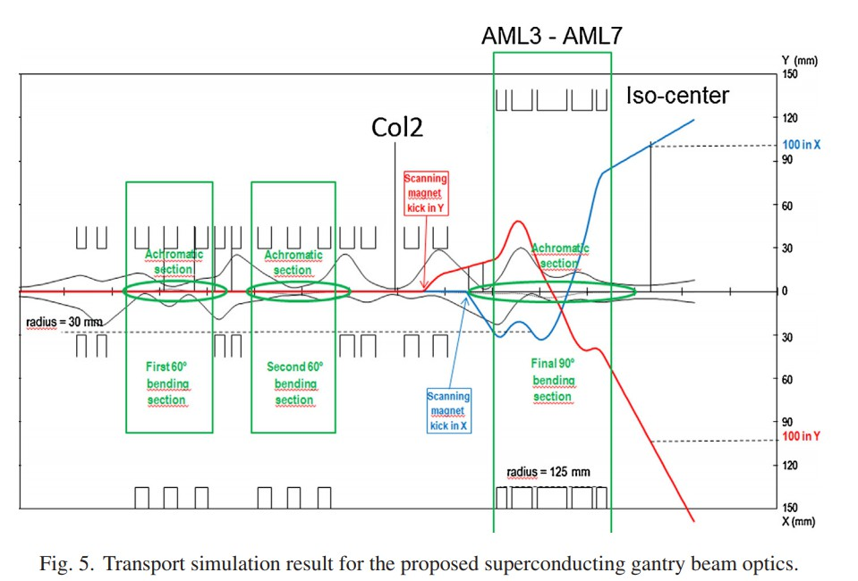</img>

In the calculation result presented here non-linear effects on the pencil beam size due to the scanning have not been taken into consideration. Such tracking simulations have been carried out for a variation of this gantry and can be found in [27]. These show that the sextupole compensation might be required to achieve a sufficiently small beam size for the scanned beam.

There are several parameters which need separate, dedicated simulations, such as field variations due to hysteresis and time dependent settings of the superconducting magnets and an imperfect alignment of the magnets due to a non-perfect rigidity of the gantry mechanics, which can be gantry angle dependent.

在这里给出的计算结果中，没有考虑到由于扫描导致的铅笔束尺寸的非线性影响。 已经针对这种龙门架的变体进行了这种跟踪模拟，可以在[27]中找到。 这些表明，可能需要六极补偿，以实现扫描光束足够小的光束尺寸。

有几个参数需要单独进行专门的模拟，例如由于超导磁体的磁滞和与时间有关的设置而引起的磁场变化，以及由于龙门机构力学的不完美刚性而导致的磁体不完全对准，这可能是龙门角度 依赖。

### 4.3 Momentum acceptance and use of a collimator and degrader

**降能器、准直器。因为动量接受度大，所以新的设计束流可以有大的动量分散、改变能量时可能还是需要一些四级铁矫正**

As discussed at the end of Section 1, all existing normal conducting gantries are achromatic as a whole, but the achromaticity is not restored within each individual bending section. In the proposed superconducting gantry design each bending section is achromatic by itself (“local achromaticity”). Such achromaticity in the beam optics is achieved using strong quadrupole fields focusing in the dispersive plane, located within each bending section. Because of that, the dispersion function never reaches a high value. Using this feature, a gantry design is presented here, with a momentum acceptance of >±10%. This means that without a change of the currents in the superconducting magnets, a beam with a momentum offset of up to ±10% (corresponding to the energy offset of almost ±20%) can still pass through the aperture of the gantry magnets and the vacuum pipe

如第1节末尾所述，所有现有的常规导电门架总体上都是消色差的，但是在每个单独的弯曲段中都不会恢复消色差。 在提出的超导龙门设计中，每个弯曲部分本身都是消色差的（“局部消色差”）。 光束光学器件中的这种消色差是通过使用位于每个弯曲部分内的色散平面中的强四极场来实现的。 因此，色散函数永远不会达到很高的值。 利用此功能，这里提出了一种龙门设计，动量接受度>±10％。 这意味着，在不改变超导磁体中电流的情况下，动量偏移高达±10％（对应于几乎±20％的能量偏移）的光束仍可以通过龙门磁体的孔，并且 真空管

The combination of a large momentum acceptance downstream of a degrader can lead to interesting clinical beam delivery modalities that might otherwise not be achievable in a superconducting magnet gantry system. Firstly, the momentum spread of the beam entering such a superconducting gantry does not need to be limited to the ±0.5–1%, required by the apertures in most normal conducting gantries. This can be of potential benefit to transport a larger momentum spread at low energies (when the energy spread is too small for easy longitudinal spreading), or as otherwise clinically acceptable. In the described design, the speed of energy changes is only determined by the mechanical speed of the degrader. An energy step of 2% can be made within several ms if the degrader is mounted at a location where the beam size is small.

降级器下游的大动量接受度的组合会导致有趣的临床束传输方式，否则在超导磁体龙门系统中可能无法实现。 首先，进入这种超导龙门架的电子束的动量散布不必限于大多数普通导电龙门架中的孔所要求的±0.5–1％。 这可能在低能量下（当能量散布太小而难以进行纵向散布时）传输更大的动量散布或在临床上是可以接受的。 在所描述的设计中，能量变化的速度仅取决于降解器的机械速度。 如果将衰减器安装在光束尺寸小的位置，则可以在几毫秒内将能量阶跃提高2％。

In that case the mechanical motions in the degrader can also be small (and can thus be fast). To minimize the emittance growth the beam should have a small diameter when entering a degrader. The round collimator aperture at the coupling point at the entrance of the gantry is imaged to the iso-center, but with an intermediate image at a second collimator between the second and the third bend (Col2). The (1σ) beam size at this collimator is 1.25 mm × 1.25 m, which is also imaged to the iso-center in such a way that the beam spot size there is 2.5 mm × 2.5 mm (1σ).

Due to the large momentum acceptance, the bending magnets then need not change their fields when the degrader is set to another energy. However, first order imaging to isocenter is blurred by chromatic errors. If the energy changes are implemented just after the collimator before the last bend, one can correct the chromatic imaging errors. This can be done by applying an energy dependent correction in some quadrupoles behind the degrader. The optical feasibility of such correction has been demonstrated above on the example of energy reduction of p/p = −10% (see Fig. 6), however it will require fast power supplies for the normal conducting quadrupole magnets.

在那种情况下，降级器中的机械运动也可以很小（因此可以很快）。为了使发射率的增长最小化，光束在进入降级镜时应具有较小的直径。在机架入口处的耦合点处的圆形准直器孔径成像到等角点，但在第二个和第三个弯曲（Col2）之间的第二个准直器中具有中间图像。在该准直仪上的（1σ）光束尺寸为1.25 mm×1.25 m，它也以等距光束点尺寸为2.5 mm×2.5 mm（1σ）的方式成像到等中心点。

由于接受了大的动量，因此当降级器设置为另一种能量时，弯曲磁体无需更改其磁场。但是，到等中心点的一阶成像因色差而模糊。如果在准直仪之后最后一次弯曲之前实施能量改变，则可以校正彩色成像误差。这可以通过在降噪器后面的某些四极杆中应用能量依赖的校正来完成。上面已经在能量降低p / p = -10％的示例中证明了这种校正的光学可行性（参见图6），但是对于正常导电的四极磁体，将需要快速供电。

In the present design the beam forms a waist at the position of the collimator, which is designed such that the beam divergence is high by strong focusing. This high divergence ensures that multiple scattering in a degrader will not increase the beam divergence too strongly, since the angular spread from the multiple scattering adds quadratically to the original beam divergence. For the worst-case-scenario of degradation from 70 MeV to 53 MeV the divergence would increase approx. from 15 mrad to 25 mrad in both transverse directions.

The generally known limited ramping speed of the superconducting magnets might be a bottleneck for the speed of energy scanning. However, if a treatment can be performed with zero, only one or maybe two field settings per gantry angle, the treatment time can be strongly reduced.

在本设计中，光束在准直仪的位置处形成腰部，该腰部被设计成使得光束通过强聚焦而发散高。 这种高的发散度确保了降级器中的多次散射不会太大地增加光束发散度，因为来自多次散射的角展度平方地增加了原始光束的发散度。 对于从70 MeV降级到53 MeV的最坏情况，发散将增加大约。 在两个横向方向上从15 mrad到25 mrad。

超导磁体的通常已知的有限的倾斜速度可能是能量扫描速度的瓶颈。 但是，如果每个龙门角度可以零位，仅一个或两个场设置进行治疗，则可以大大减少治疗时间。

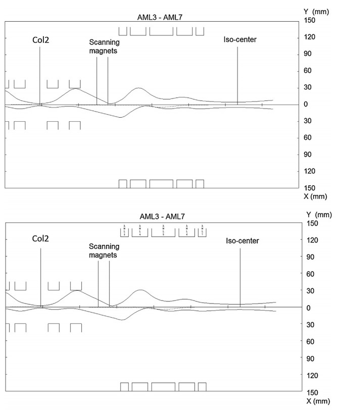</img>

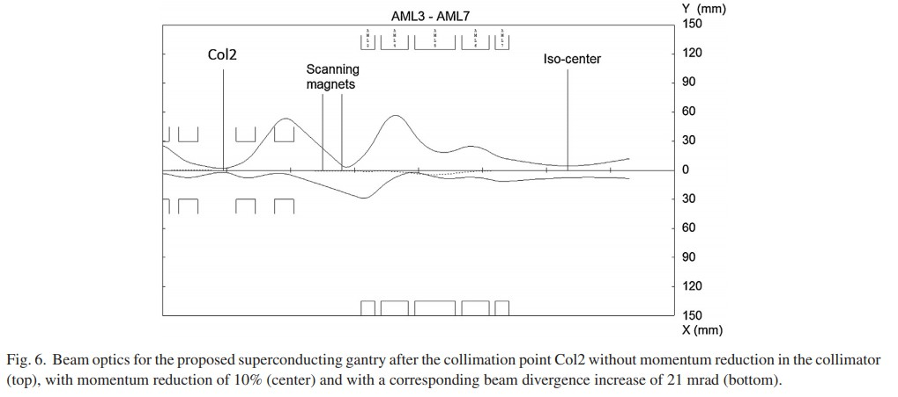</img>

Fig. 6. Beam optics for the proposed superconducting gantry after the collimation point Col2 without momentum reduction in the collimator (top), with momentum reduction of 10% (center) and with a corresponding beam divergence increase of 21 mrad (bottom).

图6.准直点Col2之后拟议的超导龙门的光束光学系统，在准直仪中没有动量减少（顶部），动量减少了10％（中心），相应的光束发散度增加了21 mrad（底部）。

### 4.3.1 Challenges

**降能器、准直器放在机架上的难点挑战**

Fig. 6 demonstrates the effect of such a range shifter installed in the collimator point between the second and the third bend (Col2). The diagram in Fig. 6 top shows the beam envelope downstream of Col2 with a momentum matched to the fields of the magnets (same situation as for Fig. 5). In the central diagram the beam transport with a momentum change at Col2 of p/p = −10% has been simulated. The fields of normal conducting quadrupoles have been modified for the changed energy to keep the focus and the imaging at the iso-center at this modified energy, while the fields of the superconducting magnets have been left unchanged. The focusing and imaging function works well in this case. However if one includes also the effect of the emittance growth produced by the range shifter for the worst case of beam energy reduction from 70 MeV to 53 MeV (see Fig. 6, bottom), the beam size at the location of the normal conducting quadrupoles and at the iso-center would become too large. Therefore, also with a gantry designed for large momentum acceptance, one still needs the pre-absorber in the nozzle to achieve very low energies for dose applications in and just below the skin.

图6展示了这种距离转换器安装在第二和第三弯曲（Col2）之间的准直器点的效果。图6顶部的图显示了Col2下游的光束包络，其动量与磁体的磁场相匹配（与图5相同的情况）。在中心图中，模拟了在Col2处的动量变化为p / p = -10％的光束传输。为了改变能量而对法向导电四极场进行了修改，以使聚焦和成像保持在等中心点处，而修改后的能量保持不变，而超导磁体的场则保持不变。在这种情况下，聚焦和成像功能效果很好。但是，如果还包括在最坏情况下将光束能量从70 MeV降低到53 MeV时，距离转换器产生的发射率增长的影响（请参见图6，底部），则光束大小位于正常导电四极杆的位置等中心处会变得太大。因此，对于设计用于大动量接收的龙门架，仍然需要喷嘴中的预吸收器来获得非常低的能量，以用于皮肤内和皮肤下的剂量应用。

We have observed that for the scanning with the momentum reduction via the range shifter the offset of the beam at the iso-center is dependent on beam energy for a given scanning magnet strength or deflection angle. The achromatic condition R16 = R36 = 0 is not fulfilled for all the variable bending angles of the scanning magnets, meaning that this first-order effect due to the scanning angle can defy the dispersion suppression. However, we found that it is possible to correct the corresponding beam shift at the iso-center by modifying the scanning magnet’s deflection angle. This first order chromaticity error induced by the scanning magnets will also increase the spot size at isocenter. However, we found that this can be corrected for by readjustment of a quadrupole between the second collimator (Col2) and the scanning magnets. Since these magnets are designed for fast scanning, such corrections will be included in the setting tables generated in the treatment planning. Additionally we are studying the possibility of modifying the exit angle of the scanning magnet pole faces, to obtain a scanning-angle related focusing correction.

我们已经观察到，对于通过范围移位器进行动量减小的扫描，在给定的扫描磁体强度或偏转角下，束在等中心处的偏移取决于束能量。对于扫描磁体的所有可变弯曲角度，不满足消色差条件R16 = R36 = 0，这意味着由于扫描角度而产生的这种一阶效应可以克服色散抑制。但是，我们发现可以通过修改扫描磁体的偏转角来校正等角点处的相应电子束偏移。由扫描磁体引起的这种一阶色度误差也将增加等中心点的光斑尺寸。但是，我们发现可以通过重新调整第二个准直器（Col2）和扫描磁体之间的四极杆来纠正此问题。由于这些磁铁是为快速扫描而设计的，因此此类校​​正将包含在治疗计划中生成的设置表中。另外，我们正在研究修改扫描磁极面的出射角，以获得与扫描角有关的聚焦校正的可能性。

### 4.4 Other beam optics concepts

**替代设计方案：1.前两个60度磁铁，是分别局部消色散还是作为整体消色散（整体消色散，导致R16更大，横向位移大，动量接受度小）2.上游扫描还是下游扫描3.组合磁铁还是二极和四极分开。**

In this section several alternative possibilities in the design are discussed. These alternative solutions motivate the choices made for the here presented design of a gantry with superconducting magnets. 

在本节中，讨论了设计中的几种替代可能性。 这些替代解决方案促使人们为此处介绍的带有超导磁体的龙门设计做出选择。

### 4.4.1 First two bends as achromatic section

It has been examined whether the first two bends could be used as one achromatic section instead of each one of them being achromatic by itself. The advantage of such arrangement would be that it would not be necessary to separate the magnets of the first two bending sections in three segments with different (or alternating) quadrupole gradients, but it would just be sufficient to have two 60◦ bending magnets with homogeneous fields. However, in that case the maximum amplitude of the dispersion would be significantly higher in this layout compared with the case with two separate achromatic sections. This is due to the longer bending magnet (60◦ instead of 20◦) in that case. For the quadrupole magnets an aperture radius of 30 mm has been assumed, hence such arrangement would pose a limitation to the momentum acceptance and in these two bending sections it would be reduced from p/p = ±10% to p/p ≈ ±2%. However, since most energy spread will be due to the degrader mounted at Col2 in the gantry and the momentum spread in the incoming beam is smaller than ±1%, this could be acceptable.

已经检查了前两个弯曲是否可以用作一个消色差部分，而不是每个弯曲本身都是消色差的。这种布置的优点是，不必将前两个弯曲部分的磁体分成具有不同（或交替的）四极梯度的三个分段，但是只要具有两个均质的60°弯曲磁体就足够了。领域。然而，在那种情况下，与具有两个分开的消色差部分的情况相比，在这种布局中色散的最大幅度将明显更高。在这种情况下，这是由于较长的弯曲磁铁（从60o而不是20o）所致。对于四极磁体，假设其孔径半径为30 mm，因此，这种布置将限制动量接收，并且在这两个弯曲部分中，它将从p / p =±10％减小到p / p≈±2 ％。但是，由于大多数能量散布将归因于安装在机架中Col2上的降噪器，并且入射光束中的动量散布小于±1％，因此这是可以接受的。

### 4.4.2 Downstream scanning with 30 mm aperture radius dipole

A very serious option is to use the same superconducting magnets with 30 mm radial aperture used for the first two bends also for the final bending magnets. The smaller aperture would ensure less stray fields and shorter fringe fields, resulting in an easier beam optics design and reducing the necessity for extensive shielding of the magnets. Also, the dipole field of the magnets could be strongly increased, hence making the bend significantly shorter.

However, this would only be possible with downstream scanning. In that case the scanning field is not limited by the aperture of the last bending magnet. The earlier mentioned experience at PSI with upstream scanning has demonstrated the feasibility of such approach and the desire to keep the gantry radius as low as possible has motivated our preference for a system with upstream scanning.

一个非常严肃的选择是使用相同的具有30 mm径向孔径的超导磁体，用于前两个弯曲以及最终的弯曲磁体。 较小的孔径将确保较少的杂散场和较短的边缘场，从而使束光学设计更容易，并减少了对磁体进行广泛屏蔽的必要性。 同样，可以大大增加磁体的偶极场，从而使弯曲大大缩短。

但是，这只有在下游扫描时才有可能。 在那种情况下，扫描场不受最后弯曲磁体的孔的限制。 前面提到的在PSI上进行上游扫描的经验证明了这种方法的可行性，并且希望将龙门架半径保持得尽可能低，这激发了我们对采用上游扫描的系统的偏爱。

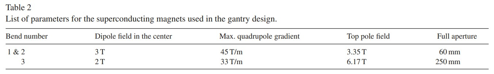</img>

### 4.4.3 Using quadrupoles between the dipoles

In the design of the achromatic bending sections it has been considered to use two dipoles and a few (e.g. 3) quadrupoles between them, to give more possibilities for focusing, while keeping the system achromatic. This has also been done in ProNova SC360 Gantry design [9,18]. However, all quadrupoles between the dipoles influence the dispersion as well as the focusing. In addition to this, the total length of the achromatic bending section would increase. Also, due to their larger length, there is less dispersion focussing in the bending magnets, so that the momentum acceptance will not be as large. From magnet technology [27] we experienced that it can be relatively easy to add quadrupole fields that overlap the bending dipole field. When using five instead of three quadrupole fields, this conveniently adds degrees of freedom for the design of the beam focussing and dispersion suppression. As will be discussed in the next section, the CCT magnet design is supporting this possibility.

在消色差弯曲部分的设计中，已经考虑使用两个偶极子和它们之间的几个（例如3个）四极子，以提供更多的聚焦可能性，同时保持系统消色差。 在ProNova SC360龙门设计中也已经做到了这一点[9,18]。 但是，偶极子之间的所有四极子都会影响色散以及聚焦。 除此之外，消色差弯曲部分的总长度将增加。 而且，由于它们的长度较大，弯曲磁体中的分散聚焦较少，因此动量接受度不会那么大。 从磁体技术[27]中，我们发现添加与弯曲偶极子场重叠的四极子场相对容易。 当使用五个而不是三个四极场时，这方便地增加了光束聚焦和色散抑制设计的自由度。 正如将在下一节中讨论的那样，CCT磁体设计正在支持这种可能性。

### 5 Magnet design

**磁铁设计：经过讨论，使用CCT，均匀度最好有10-4到10-3**

A brief overview of the requirements set for the superconducting magnets for the described gantry design.

The field qualities required for the stated gantry optics are described in Table 2. Since the final bend has a large aperture due to the upstream scanning system, the requirements of the central field and the field gradient can be more relaxed than for the first two bends: approximately 3.4 T. Due to the addition of the field gradient and the dipole field the maximal pole field, however, is significantly higher with 6.2 T in the final bend.

简要描述了上述龙门架设计对超导磁体的要求。

表2中描述了所述龙门光学器件所需的场质量。由于上游扫描系统导致最终弯曲具有较大的孔径，因此与前两个弯曲相比，对中心场和场梯度的要求可以更宽松 ：大约3.4T。由于增加了磁场梯度和偶极场，但是最大磁极场在最终弯曲处为6.2 T时明显更高。

Such fields are rather difficult to achieve with reasonable field quality using normal conducting magnets. Despite the fact, that such a locally achromatic design would not be impossible with normal conducting magnets, the size and weight of the normal conducting magnets implementing the presented design and local achromaticity would be significantly larger than for the current globally achromatic gantries. For example, the corkscrew downstream scanning design by the Harvard group [28] and first installed at Loma Linda, has local achromaticity in the bending sections and has a diameter of approximately 12 m. However these gantries cannot be modified easily into a gantry with upstream pencil beam scanning. Hence, it is the local achromaticity within each bend that becomes more practical with usage of superconducting magnets and is a particular feature facilitated by their use.

使用普通的导电磁体，以合理的磁场质量很难达到这样的磁场。 尽管存在这样的事实，即使用普通的导电磁体不是不可能实现这种局部消色差设计，但是实现所提出的设计的普通导电磁体的尺寸和重量以及局部消色差将明显大于当前的全局消色差门架。 例如，由哈佛小组[28]进行的开瓶器下游扫描设计，首先安装在洛马林达（Loma Linda），在弯曲部分具有局部消色差，直径约为12 m。 然而，利用上游笔形束扫描，这些龙门架不容易被修改成龙门架。 因此，使用超导磁体使每个弯曲内的局部消色差变得更加实用，并且通过使用它们是一个特殊的特征。

The proposed design considers magnetic fields below the technically achievable limits. Stronger magnetic fields would mean shorter magnets for the given beam rigidity Bρ. However, this would lead to a larger relative influence of the fringe fields at the entrance and the exit of the magnet. Nevertheless, the gantry design for carbon ions or for protons with 350 MeV energy even stronger magnetic fields can be considered.

The required field quality, here defined as the difference between the required field and the actually obtained field, for the magnets in the full aperture region is estimated to be on the order of 10−4 to 10−3. Detailed tracking calculations following the pencil beam along its different trajectories through the bending system will give a more accurate field quality constraint. We are working on a process to define the requirements more clearly than the ones defined by a simple number specifying the field homogeneity. We are continuing our work on a further refined optical layout that minimizes higher order aberrations to correct beam size and shape distortions and enhances the effective momentum acceptance.

提出的设计考虑了低于技术上可达到的极限的磁场。对于给定的梁刚度Bρ，较强的磁场将意味着较短的磁体。然而，这将导致磁体的入口和出口处的边缘场的较大相对影响。但是，可以考虑使用碳离子或具有350 MeV能量的质子的龙门架设计，甚至可以使用更强的磁场。

对于整个孔径区域中的磁体，所需的场质量（此处定义为所需场与实际获得的场之间的差）估计为10-4到10-3的数量级。沿笔形束通过弯曲系统的不同轨迹进行的详细跟踪计算将给出更精确的场质量约束。我们正在努力定义一个要求，而不是用一个简单的数字来指定字段的同质性。我们将继续致力于进一步优化光学布局，以最大程度地减少高阶像差，以校正光束尺寸和形状畸变，并提高有效动量接受度。

The relatively short length of approximately 1 m causes particular challenges of the design of such magnets, such as the effects on the field quality due to magnet curvature and as in case of the final bend magnets, the large aperture. Also, due to the rotation of the gantry the liquid helium cooling method is rather difficult to implement. The helium flow must be guaranteed under different angles and during the rotation. Quenching (e.g. due to a vapor in the cooling fluid) has to be kept to minimum to provide the required high availability. The connection of the liquid helium channels must not be disrupted due to the rotation. Hence, in case of the liquid helium cooling a gantry with a limited rotation angle of a bit more than 180◦, may offer technical possibilities when combined with a the patient table which can be rotated horizontally [7].

The detailed layout analysis and the tracking simulations recently performed in Canted–Cosine–Theta (CCT) magnets [27] show that these are a viable option to satisfy many of the requirements, since they offer a relatively good beam quality over a large aperture. A consequence of the large aperture is a longer extension of the fringe fields. The sharp cut off fringe field (“SCOFF“) model, which is frequently used in beam optics codes, cannot be applied and track simulations are the only valid tool in that case. To study the extent and shape of the CCT fringe fields a preliminary study has been performed [29]. Fig. 7 demonstrates this in the example of two different coil windings.

大约1 m的相对较短的长度给此类磁体的设计带来了特殊的挑战，例如由于磁体曲率而对磁场质量产生的影响，以及在最终弯曲磁体的情况下，孔径较大。而且，由于机架的旋转，液氦冷却方法相当难以实施。必须保证在不同角度和旋转过程中的氦气流量。淬火（例如由于冷却流体中的蒸汽引起）必须保持最小，以提供所需的高可用性。液氦通道的连接不得因旋转而中断。因此，在液氦冷却的情况下，将门架的旋转角度限制为略大于180°，当与可以水平旋转的患者床结合使用时，可能提供技术上的可能性[7]。

最近在Canted-Cosine-Theta（CCT）磁体中进行的详细的布局分析和跟踪模拟[27]表明，这是满足许多要求的可行选择，因为它们在较大的孔径上提供了相对较好的光束质量。大孔径的结果是边缘场的延长。光束光学代码中经常使用的尖锐边缘场（SCOFF）模型无法应用，在这种情况下，轨迹模拟是唯一有效的工具。为了研究CCT边缘场的范围和形状，已经进行了初步研究[29]。图7以两个不同的线圈绕组为例对此进行了说明。

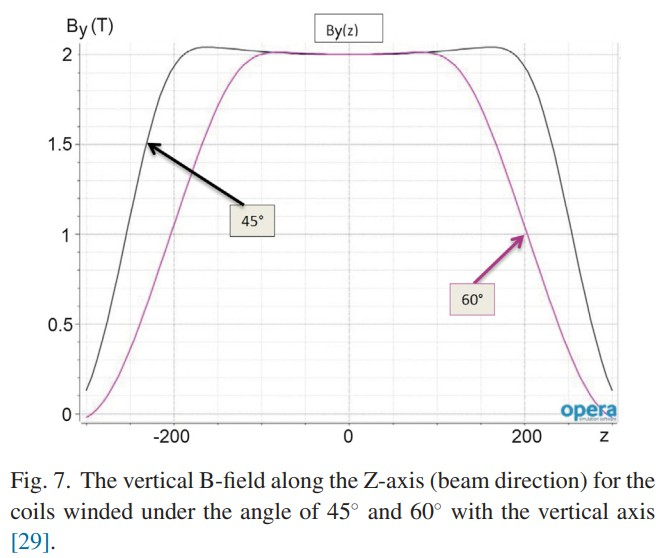</img>

### 6 Conclusions and outlook

**总结展望：超导很好、局部消色散、快速能量变化、需要设计高阶、磁铁设计、边缘场、机械结构**

We believe that the use of superconducting magnets is an important research topic in the field of proton and ion therapy gantries. The beam optics of a superconducting gantry has been developed. The optics design presented here is partially advancing concepts of some other currently existing superconducting gantry designs described in Section 2.

我们相信，超导磁体的使用是质子和离子治疗龙门领域的重要研究课题。 超导龙门的光束光学系统已经开发出来。 此处介绍的光学设计是第2节中描述的某些其他当前存在的超导龙门设计的部分先进概念。

In this contribution new options for the beam optics are shown, enabled by the use of superconducting bending sections. These include locally strong dispersion suppression, meaning that a first order achromatic correction becomes possible within each single bend. The superconducting magnets enable the combination of the required strong quadrupole fields within the bending magnets. The local dispersion suppression keeps the maximum value of dispersion low. In the design presented here this property has been used to accept a very large energy spread, so that in many cases the transport of a beam with varying energy through the last bending section of the gantry can be performed without adjusting the bending field of this section. The fast energy variation is accomplished by a degrader mounted at an intermediate focus before the last bending section in the gantry. This enables a beam energy modulation on much faster timescale than at the currently existing facilities, so that a scanning of the total tumor volume can be done within several seconds. The large aperture and the strong gradients of the superconducting magnets also help to transport the beam with a relatively large emittance far from the aperture of the magnet, hence minimizing the beam losses in the gantry.

在此贡献中，显示了光束光学器件的新选项，可通过使用超导弯曲部分来实现。这些包括局部强色散抑制，这意味着在每个单个弯曲内都可以进行一级消色差校正。超导磁体可以在弯曲磁体内组合所需的强四极磁场。局部色散抑制使色散的最大值保持较低。在此处介绍的设计中，此属性已被用来接受非常大的能量散布，因此在许多情况下，可以在不调整该部分弯曲场的情况下通过机架的最后弯曲部分进行能量变化的光束的传输。 。快速的能量变化是通过安装在机架中最后弯曲部分之前的中间焦点处的降级器实现的。这使得光束能量调制的时间尺度比当前现有设施快得多，因此可以在几秒钟内完成总肿瘤体积的扫描。超导磁体的大孔径和强梯度也有助于以相对较大的发射率来传输远离磁体孔径的束，从而将龙门架中的束损耗降至最低。

The combination of the strong fields with a large aperture enabled by the superconducting magnets can be used for the beam optics purposes. The mentioned magnet properties could ease the implementation of the upstream scanning, which would help to minimize the gantry radius. The proposed gantry is approximately 3.0 m in radius and 8.5 m in length including an estimated outer magnet radius, but without cryo-modules, free space and eventual shielding. This is to be compared with 3.2 m radius and 8.9 m length of PSI Gantry 2. In the first order calculation the beam spot size and shape are unaltered when the beam is scanned through the final bend, but additional higher order beam optics calculations are essential. The challenges include the correction of chromatic focusing errors and the control of the system’s imaging properties at large scanning amplitudes. Beam position and focusing errors depend on the field quality across the large magnet aperture.

Several points have been mentioned, which require further investigation and study. The following list summarizes these points:

由超导磁体实现的具有大孔径的强场的组合可用于光束光学目的。提及的磁体特性可以简化上游扫描的实现，这将有助于最小化龙门架半径。拟议中的龙门架半径约为3.0 m，长度约为8.5 m，包括估计的外部磁体半径，但没有低温模块，自由空间和最终的屏蔽功能。将其与PSI龙门2的3.2 m半径和8.9 m长度进行比较。在第一阶计算中，当光束经过最终弯曲扫描时，光束光斑的大小和形状不会改变，但是必须进行更高阶的光束光学计算。挑战包括校正彩色聚焦误差以及在大扫描幅度下控制系统的成像特性。光束位置和聚焦误差取决于大磁铁孔径上的磁场质量。

提到了几点，需要进一步的调查和研究。以下列表总结了这些要点：

List of further studies

Superconducting magnet design:

◦ Cooling of the magnets, incl. during gantry rotation.

◦ Mutual influence of the large aperture magnets with a strong field.

◦ Superconducting magnet ramping.

◦ Quench protection, incl. the effect of beam losses.

◦ Optimal superconductor material:

 The thermal acceptance.

 Mechanical properties.

 Cost of the material.

◦ Effect of fringe fields on the beam optics and the stray fields at the patient location.

• Beam optics:

◦ Chromatic effects at large transverse scanning angle.

◦ Higher order imaging effects due to large beam divergence and large magnet aperture.

◦ Higher order imaging at large beam momentum spread and large momentum offset.

◦ Tracking of scattering in the range shifter, nozzle and the air.

◦ Possibilities to increase SAD.

• Mechanics

◦ Design of mechanical support.

◦ Search for a layout allowing convenient imaging and patient table positioning

进一步研究清单

超导磁体设计：

◦磁铁的冷却，包括 在龙门旋转过程中。

◦具有强磁场的大孔径磁铁的相互影响。

◦超导磁体倾斜。

◦淬火保护，包括 光束损失的影响。

◦最佳超导材料：

  热验收。

  机械性能。

  材料成本。

◦边缘场对光束光学器件和患者位置杂散场的影响。

•光束光学系统：

◦在较大的横向扫描角度下的色度效应。

◦由于较大的光束发散度和较大的磁铁孔径，因此具有更高阶的成像效果。

◦高束动量扩散和大动量偏移时的高阶成像。

◦跟踪范围转换器，喷嘴和空气中的散射。

◦增加SAD的可能性。

•机械师

◦机械支撑的设计。

◦搜索布局，以方便成像和患者床定位

We have reported on the results of a preliminary study. While challenges remain to be worked out, it is believed that no insurmountable problems have been identified in the still open issues. Therefore the here presented gantry design of the new concept (degrader on gantry in combination with an energy acceptance such to allow a constant magnetic field during the treatment) can be considered a promising next step in the development of particle therapy.

我们已经报告了初步研究的结果。 尽管仍然有待解决的挑战，但据信在尚未解决的问题中没有发现无法克服的问题。 因此，这里提出的新概念的龙门架设计（龙门架上的降解器与能量接受相结合，以便在治疗过程中产生恒定的磁场）可以被认为是粒子疗法发展中的有希望的下一步。