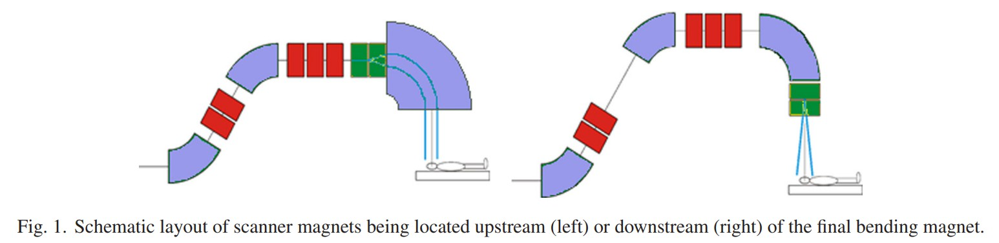

## 00 A novel beam optics concept in a particle therapy gantry utilizing the advantages of superconducting magnets

https://www.sciencedirect.com/science/article/abs/pii/S0939388916300010

时间 2015 作者 Alexander Gerbershagen, David Meer, Jacobus Maarten Schippers, Mike Seidel 机构 PSI

摘要

Purpose
**A first order design** of the beam optics of a superconducting proton therapy gantry beam is presented. The possibilities of superconducting magnets with respect to the beam optics such as strong fields, large apertures and superposition of different multipole fields have been exploited for novel concepts in a gantry. Since various techniques used in existing gantries have been used in our first design steps, some examples of the existing superconducting gantry designs are described and the necessary requirements of such a gantry are explained.

提出了超导质子治疗龙门光束的光束光学系统的一阶设计。对于机架中的新颖概念，已经开发了相对于束光学器件（例如强场，大孔径和不同多极场的叠加）的超导磁体的可能性。由于在我们的第一个设计步骤中已经使用了现有龙门架中使用的各种技术，因此将描述现有超导龙门架设计的一些示例，并说明这种龙门架的必要要求。

Methods
The study of a gantry beam optics design is based on superconducting combined function magnets. The simulations have been performed in first order with the conventional beam transport codes.

龙门束光学设计的研究基于超导组合功能磁体。已经使用常规的束传输码以第一顺序执行了仿真。

Results
The superposition of strong dipole and quadrupole fields generated by superconducting magnets enables the introduction of locally achromatic bending sections without increasing the gantry size. A rigorous implementation of such beam optics concepts into the proposed gantry design dramatically increases the momentum acceptance compared to gantries with normal conducting magnets. In our design this large acceptance has been exploited by the implementation of a degrader within the gantry and a potential possibility to use the same magnetic field for all energies used in a treatment, so that the superconducting magnets do not have to vary their fields during a treatment. This also enables very fast beam energy changes, which is beneficial for spreading the Bragg peak over the thickness of the tumor.

由超导磁体产生的强偶极和四极场的叠加使得能够引入局部消色差的弯曲部分，而不会增加机架的尺寸。与带有普通导电磁体的龙门架相比，在提出的龙门架设计中严格执行此类射束光学概念可以显着提高动量接受度。在我们的设计中，通过在龙门架内安装降噪器以及对治疗中使用的所有能量使用相同磁场的潜在可能性，已开发出了广泛接受的技术，因此超导磁体不必在磁场作用期间改变其磁场。治疗。这也使光束能量的变化非常快，这对于在肿瘤的整个厚度上扩展布拉格峰是有利的。

Conclusions
The results show an improvement of its momentum acceptance. Large momentum acceptance in the gantry creates a possibility to implement faster dose application techniques.

结果表明其动量接受度有所提高。门架中的大动量接受度为实现更快的剂量应用技术提供了可能性。

1 Introduction

1.1 Scanning the proton beam over tumor tissue

Proton therapy makes use of the Bragg peak with its finite range to help provide conformal dose distributions, thus minimizing dose to healthy tissue. In the scanning pencil beam technique, a narrow proton beam is scanned in the two transverse directions and the depth of the Bragg peak is set by adjusting the energy of the pencil beam.

In this study we have chosen to examine a gantry design based on pencil beam scanning.

The size of the tumor projection in the plane perpendicular to the beam direction is usually much larger than the beam diameter. Scanning of the beam in both transverse directions is performed in most modern facilities via the deflection of the narrow ‘pencil beam’, a technique first demonstrated in NIRS [1] and LBNL [2] and first used in clinical routine in a gantry at PSI [3]. The beam is deflected via the scanning magnets, which are located before (upstream scanning) or behind (downstream scanning) the final bending magnet in the gantry, but also other possibilities exist [4], [5].

The location in depth of the Bragg peak is set by choosing the beam energy. Presently, at almost all operating proton therapy facilities the beam is accelerated by a cyclotron with fixed extraction energy or by a synchrotron with adjustable energy. In cyclotron facilities the energy is being reduced by a so-called degrader – low Z material in the beam transport system – to the value required by the patient treatment plan. Such a system and the following magnets can be designed such that they allow energy variations to spread the dose in depth over the tumor thickness. The time needed to change energy accordingly, should be as short as possible to limit the total treatment time. Another advantage of the possibility to have fast energy changes is in the application of volumetric rescanning [6]. Currently, the energy change speed is limited by the time to change the magnetic fields between a degrader and the patient.

All magnets in the gantry must be ramped synchronously with the energy (proportionally to beam momentum) variation, which should be fast in order to minimize the treatment time. The PSI Gantry 2 magnetic field is changed on the order of ΔB/(BΔt) = 10% per second. We consider this speed as a desirable specification for a gantry with superconducting magnets. However, for such magnets the ramping speed of is slower due to limitations of AC-losses and hysteresis effects.

In order to reduce the treatment time, it is useful to reduce the time it takes to make an energy change. In Section 1.4 this will be discussed in more detail.

### Proton therapy gantry high level requirements

A gantry is a rotating system at the final section of the particle therapy facility beamline. It is composed of several dipole and quadrupole magnets, which are able to bend proton beams with a maximum energy of approximately 230–250 MeV or carbon ions of approximately 450 MeV/nucl, not taking particle beam imaging into account. Its rotation together with the movement of the patient table allows irradiating the tumor tissue from different directions. In the so-called iso-centric gantries the gantry and magnets direct the central (non-scanned) beam toward the iso-center, the common point in space, where the gantry rotational axis is crossed with the beams from all gantry directions. The irradiated tumor must coincide with the beam trajectory and can be placed at the gantry iso-center [7]. The scanning system deflects the beam in a lateral direction with respect to the direction of the central (non-scanned) beam.

There is a big interest in the proton therapy research to reduce the cost of the proton therapy facilities in order to make this type of therapy more affordable. It is perhaps possible that a reduction in the magnet weight can play a role in cost reduction, but this has not yet been proven. Since most proton therapy facilities are located in the densely populated areas in order to allow a good access of the potential patients to the facility, the footprint and the volume of the facility play an important role in the gantry acquisition decisions. Consequently, these parameters must as well be taken into account during the gantry design. Although these considerations will have an effect on decisions the direction of certain solutions, in this paper we concentrate on the design of the beam optics when using superconducting magnets.

The use of superconducting magnets is an emerging issue in the development of proton and ion therapy gantries. Designs of superconducting gantries have been developed worldwide by research institutes as well as companies. Presently several of these designs are under commissioning or construction [8], [9], [10]. A possible motivation to apply superconducting magnets in a gantry could be the possibility to reduce the gantry's weight, eventually up to an order of magnitude for heavy ion facilities. In case of the larger heavy ion gantries (e.g. a normal conducting Heidelberger Ionenstrahl-Therapiezentrum gantry l = 25 m and r = 6.5 m), the National Institute of Radiological Sciences design shows that the size could be reduced significantly. The implications of these factors for a proton therapy facility are not yet fully understood. We believe they could have positive benefit, but in the current study our concentration is on the possible performance benefits of using superconducting magnets.

### 1.2 Beam optics

The bending of the beam in every dipole magnet causes the trajectory of particles with a non-nominal momentum to deviate from the nominal axis of the beam. This chromatic phenomenon is called dispersion and can be described by the so-called dispersion function. The combination of gantry magnet apertures and the maximum amplitude of this trajectory determines the maximum momentum deviation that can be accepted by the gantry. In existing gantries with global chromatic correction a gantry accepts a momentum band of about ±0.5–1%.

In the present paper we distinguish global achromatic correction, meaning suppression of the transverse and angular dispersion at the iso-center, and local achromatic correction suppressing transverse and angular dispersion (see below) by a subgroup of magnets within the gantry. In both cases this is a first order achromaticity. The beam position is independent of energy, but chromatic focusing errors have not yet been taken into account. The gantry optics is simulated in first order with Transport [11], [12] software. In Transport the effect of the beamline elements on the beam envelope is described by so called “transform matrices” (R, with each matrix element represented by Rij) describing the beam optical elements (magnets and drift spaces).

### 1.3 Upstream and downstream transverse scanning

Scanning in the plane transverse to the depth direction is performed by “scanning magnets“, which are located upstream or downstream of the final bending section (see Fig. 1).

In the case of downstream scanning the gantry radius is larger than for a comparable upstream scanning gantry, since sufficient drift space for the beam after the scanner magnets is needed. One advantage of the downstream scanning is that the final bend dipole can have a smaller aperture and hence it can be lighter, easier to manufacture and may have more relaxed requirements for the field quality. Another advantage could be a larger clinical field size can be obtained.

In case of upstream scanning, the scanning magnets can be imaged to the iso-center as “point to parallel“. A deflection of the scanning magnet then causes a parallel displacement of the pencil beam at isocenter, i.e. an infinite Source-to-Axis-Distance (SAD). In the terms of optical imaging, this is achieved by arranging for R22 and R44 between the scanning magnets location and the iso-center to be small, i.e. zero for the infinite SAD. Another advantage of the upstream scanning is a possible reduction of gantry radius. On the other hand, it can lead to an increase of the gantry length, due to the location of the scanning magnets in the horizontal section of the gantry. But, since gantry length contributes linearly to the volume and footprint area, and the radius contributes with its square to the volume, upstream scanning is still advantageous for the gantry volume. In addition, the gantry radius contributes with a factor of two to the total height of the needed vertical space in the building.

In case of upstream scanning, the final bending dipole must have a relatively large aperture to enable a reasonable scanning field size in both x and y plane. For example in case of parallel scanning the aperture of the final bend must be at least as large as the sum of field size at the iso-center plus the beam spot size in the magnet. This may impose a complicated (due to large aperture and field homogeneity requirements) and costly design of the magnet [7], [13], and especially in this respect superconducting magnets are expected to be of advantage.

It is also possible to position one scanning magnet before and one after the final bend, combining the upstream and downstream scanning [5]. When using the first scanning magnet for scanning in the bending plane of the following bending magnet, this magnet only needs a large aperture in the bending direction. Scanning in the dispersive plane can be performed with the scanning magnet behind the bending magnet. For example, the “racetrack” dipole layout has a much larger aperture in the dispersive plane than in the transverse one and is a good candidate for such a scanning option.

In IBA's gantry Proteus I the scanning magnets are located in between the bending magnets of the last bending section, which also has reduced the gantry radius [14].

### 1.4 Energy modulation and magnetic ramping

Tumor tissue is scanned in depth by varying the energy of the beam and hence the penetration depth of the Bragg peak. Given the width of the Bragg peak in proton beams, scanning is performed in layers of approx. 5 mm thickness. The corresponding required change of the beam momentum per layer is of the order of ∼1%. The time needed for a momentum change between the layers should be kept as short as possible to reduce the treatment time. It varies from 1 s in existing commercial gantry models to 0.1 s at PSI Gantry 2, including a pause for the system to stabilize [15]. In this gantry the full range of energy change (70–230 MeV, which corresponds to ∼50% in the momentum) needs approx. 2.5 s. The fields of all magnets downstream of the degrader are changed synchronously, proportional to the momentum of the particles. Since each step (of ∼1% in momentum) requires an accurate synchronization and several checks, effectively such a step takes 80–100 ms. Of course a requirement is that the gantry should be able to “follow” such an energy change: there should be no change in position or spot shape in the transverse plane at isocenter when energy is changed. An achromatic layout is of great advantage in this respect. We have adopted this requirement for the specifications of the planned superconducting gantry as well.

For the gantries with large ferromagnetic yokes the effect of the magnetic hysteresis must be considered as well. One way to deal with the effect is to perform the energy change only in one direction, e.g. from the higher to the lower energy, so that the impact of hysteresis becomes reproducible. Allowing energy changes in both directions would require a complicated algorithm taking into account the recent magnetic ramping history.

For the superconducting magnets achieving a high ramp rate might become a serious problem because of the eddy currents. Eddy currents in the normal conducting part of the cables generate heat and increase the probability of the magnetic quenching. Eddy currents in the superconducting cables are remanent, hence they can lead to field shape changes. If it is necessary to include rapid (e.g. <1 s) magnetic field changes, a particular focus must be laid on the design of a suitable magnet with large aperture, the choice of the optimal superconductor material and its filament-layout, as well as on the consideration of cooling possibilities (e.g. cryo-coolers, liquid helium etc.).

</img>

### 2 Examples of existing superconducting gantries

Some interesting proposals of superconducting gantries have been published [16,10]. In the current chapter some examples of gantries with superconducting technology use are discussed. The chosen examples are based on designs or use components which we have used as starting points or have regarded as interesting concept for our study. In particular, the combination of dipole and quadrupole fields within one magnet in the currently commissioned NIRS gantry and the achromaticity and compactness of the two bending sections in the ProNova SC360 gantry have served as starting reference of the design presented here.

### 2.1 ProNova SC360 Gantry

In 2011 a design of a superconducting gantry for therapy with 230 MeV protons was proposed by the company ProNova [17,9]. This design consists of two superconducting bending sections. Each of them contains two superconducting dipoles with a superconducting quadrupole triplet between them (in Fig. 2 marked green). Before the first superconducting section and in between the two sections four normal conducting quadrupoles are located. This design performs downstream scanning (see Section 4.1), and makes use of superconducting separated-function magnets (i.e. separate dipoles and quadrupoles) in the bending sections. The optics of each bending section has been designed such that each is locally achromatic. This gantry is commercially available, but at the moment of writing no clinically working system was in operation yet.

