## 01 Design of an Achromatic Superconducting Magnet for a Proton Therapy Gantry

https://escholarship.org/uc/item/0qn9h8jz

时间 2017 作者 L. Brouwer, S. Caspi, R. Hafalia, A. Hodgkinson, S. Prestemon, D. Robin, and W. Wan 机构 LBNL

### Abstract

**AGCCT交变梯度磁场增大机架得动量接受度**

Recent studies have shown that strong, alternating focusing magnets can be used to greatly increase the momentum acceptance of hadron therapy gantries. With the high gradients achievable with superconducting magnets a level of momentum acceptance can be reached which may have significant implications to medical gantries and to the introduction of superconducting technology in this area. The design of such a superconducting magnet system for a proton therapy gantry will be presented. The Canted-Cosine-Theta concept is extended to a curved magnet system generating the desired bending and alternating focusing fields for the achromatic optics. Magnetic, structural, and thermal analysis of this design is presented along with preliminary efforts towards fabrication and assembly of the curved magnet.

最近的研究表明，可以使用强而交替的聚焦磁体来大大提高强子治疗龙门架的动量接受度。 利用超导磁体可获得的高梯度，可以达到动量接受水平，这可能对医学门架和该领域中超导技术的引入产生重大影响。 将介绍用于质子治疗台架的这种超导磁体系统的设计。 Canted-Cosine-Theta概念扩展到弯曲磁体系统，该系统为消色差光学系统生成所需的弯曲和交替聚焦场。 介绍了该设计的磁性，结构和热分析，以及对弯曲磁体的制造和组装的初步工作。

Index Terms—Accelerator magnets, superconducting gantry magnets, proton therapy, ion beam therapy, canted-cosine-theta.

### I. INTRODUCTION

**介绍AGCC，动量接受度20%，LBNL和PSI都在研究CCT，超导磁铁已经用在加速器中，但是还没有用到机架。**

SUPERCONDUCTING magnets are desirable for particle therapy gantries due to their low weight and ability to produce the complex, combined function fields required for achromatic beam optics. Recently, a new superconducting magnet concept called the Alternating Gradient Canted-Cosine-Theta (AG-CCT) was developed to make use of these advantages. A first design study implementing the AG-CCT concept was completed, achieving twenty-five percent momentum acceptance in a compact gantry for proton therapy [1]. Lawrence Berkeley National Laboratory (LBNL) in collaboration with the Paul Scherrer Institute (PSI) and Varian Medical Systems is now developing a superconducting magnet for a similar system. This project is part of the newly established US Office of High Energy Physics Accelerator Stewardship Program and is aligned with the R&D needs for future state-of-the-art ion beam therapy facilities as concluded by a joint DOE and NIH workshop [2].

Superconducting technology is not new to particle therapy treatment facilities, having been implemented in superconducting medical cyclotrons [3], but is only recently nearing use in a clinical gantry. Superconducting magnets have been designed and built for the carbon ion gantry at NIRS in Chiba, Japan and for a compact proton gantry developed by the US company ProNova [4]–[6]. These first superconducting gantry systems are currently in commissioning [7]. While there are several additional and different approaches to superconducting gantry magnet design [8]–[11], previous work at LBNL has focused on the use of the Canted-Cosine-Theta (CCT) concept [12]–[14] for the gantry’s final bending magnet [15]–[17]. This paper will share the most recent developments of this effort by reporting on the design of a curved AG-CCT superconducting magnet.

The magnet is designed to transport protons of energy 70-220 MeV over the final 135 degrees of bending in a gantry similar to the system presented in [1]. The large momentum acceptance (Δp/p = 20%) allows for treatment using a range of energies without magnet field change. With respect to the gantry described in previous work, the number of superconducting magnets has been reduced from three 90 degree bends to this single 135 degree bend, and the location of the scanning magnet system has been moved downstream. In the updated gantry layout a single resistive magnet is included at the start of the gantry which bends the beam upwards by 45 degrees to the superconducting magnet.

超导磁体因其重量轻且能够产生消色差光束光学器件所需的复杂的组合功能场而非常适合用于粒子治疗门架。最近，开发了一种新的超导磁体概念，称为交替梯度斜余弦θ（AG-CCT），以利用这些优势。完成了第一项实施AG-CCT概念的设计研究，在用于质子治疗的紧凑型龙门架中达到了25％的动量接受度[1]。劳伦斯·伯克利国家实验室（LBNL）与Paul Scherrer研究所（PSI）和瓦里安医疗系统公司合作，目前正在为类似系统开发超导磁体。该项目是新成立的美国高能物理加速器管理计划办公室的一部分，并与美国能源部和美国国立卫生研究院联合举办的研讨会得出的未来最先进的离子束治疗设施的研发需求保持一致。

超导技术对粒子疗法治疗设施并不陌生，已经在超导医疗回旋加速器中实现[3]，但是直到最近才在临床龙门架中使用。已经为日本千叶市NIRS的碳离子龙门架和美国ProNova公司开发的紧凑型质子龙门架设计并制造了超导磁体[4] – [6]。这些第一批超导龙门系统目前正在调试中[7]。尽管有几种其他和不同的方法来进行超导龙门磁铁设计[8]-[11]，但LBNL先前的工作重点是将Canted-Cosine-Theta（CCT）概念[12]-[14]用于龙门架的最终弯曲磁铁[15] – [17]。本文将通过报告弧形AG-CCT超导磁体的设计来分享这项工作的最新进展。

磁体设计为在机架的最终135度弯曲过程中，将能量为70-220 MeV的质子传输到类似于[1]中介绍的系统。大的动量接受度（Δp/ p = 20％）允许在不改变磁场的情况下使用一定范围的能量进行治疗。关于先前工作中描述的门架，超导磁体的数量已从三个90度弯头减少到这个135度弯头，并且扫描磁体系统的位置已向下游移动。在更新的龙门布局中，在龙门的开始处包括单个电阻磁体，该电阻磁体将光束向上弯曲45度到超导磁体。

</img>

Gantry magnet cold mass

龙门磁铁冷块

### II. MAGNET DESIGN

### A. Method for Integrating Coil Design With Beam Optics

**COSY首先用于SCOFF设计，后面的CCT绕线设计也是COSY+Biot-Savart完成的（神奇，具体怎么做啊）**

A process has been developed to closely couple the magnet coil design to the desired beam optics [1]. This begins with the completion of an initial gantry optics design using the simulation code COSY Infinity [18]. An idealized magnetic field description called the sharp-cut-off fringe field (SCOFF) model is used for fast iteration of the optics calculations. The completed SCOFF model design defines an initial magnet geometry and desired integrated multipole content.

A set of conductor windings is then generated based on the SCOFF model geometry and desired fields. The COSY simulation is then updated such that the magnetic field is no longer generated from a SCOFF model but rather from the geometry of these windings. Since there is no iron present, a simple Biot-Savart integration of the current density over the winding path is used. The flexibility of COSY is such that the coil current and sectioning of the alternating quadrupole windings can be optimized concurrently with the beam optics. This allows for a design which, by generating the field from the windings themselves, includes all magnet curvature and end effects. This has proven to be a preferred method, as it directly couples coil design to desired beam behavior without the need for parametric field description or the transfer of field maps.

已经开发出一种将电磁线圈设计紧密耦合到所需光束光学系统的方法[1]。首先，要完成使用模拟代码COZY Infinity [18]进行的龙门式光学系统初始设计。理想的磁场描述称为锐截止边缘场（SCOFF）模型，用于光学计算的快速迭代。完整的SCOFF模型设计定义了初始磁体几何形状和所需的集成多极含量。

然后根据SCOFF模型的几何形状和所需的场生成一组导体绕组。然后更新COYY仿真，以便不再从SCOFF模型产生磁场，而是从这些绕组的几何形状产生磁场。由于不存在铁，因此使用绕组路径上电流密度的简单Biot-Savart积分。 COZY的灵活性在于，可以与光束光学器件同时优化线圈电流和交替四极绕组的截面。这允许一种设计，该设计通过从绕组本身产生磁场来包括所有磁体曲率和端效应。事实证明，这是一种首选方法，因为它可以将线圈设计直接耦合到所需的光束行为，而无需进行参数化场描述或场图传输。

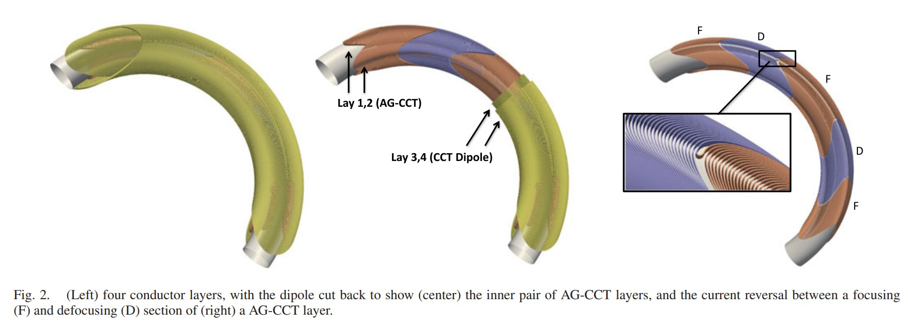</img>

结构图

</img>

参数表

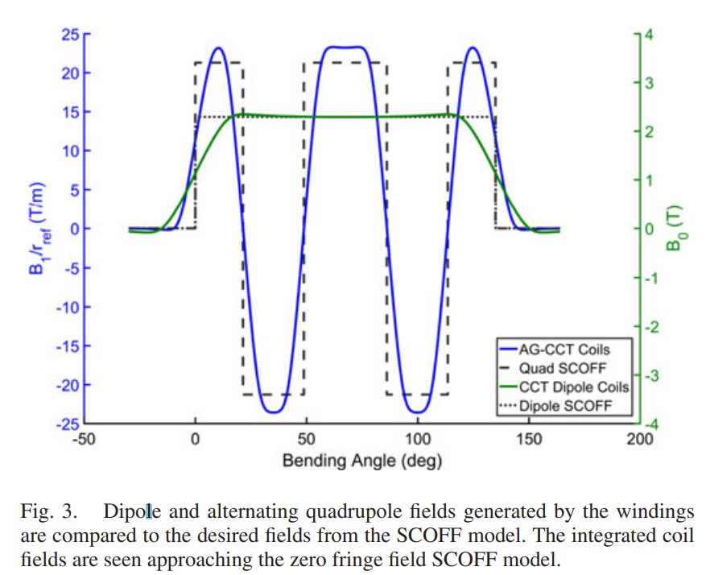</img>

磁场分布

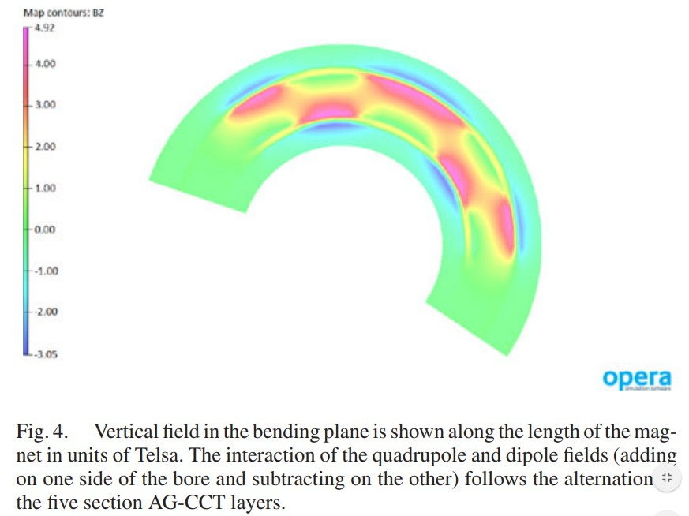</img>

OPERA 计算的磁场分布

### B. Four Layer Magnetic Design

**无重要内容（CCT设计已经完成、介绍CCT、AGCCT、电流怎么流）**

The coil and optics design process described in Section II-A was completed using the CCT geometry for the windings. The CCT approach consists of multiple tilted conductor layers, usually in pairs, which are designed and powered such that their transverse fields sum and longitudinal fields cancel. This concept has been shown to be an effective method for producing single harmonic or combined function fields of accelerator quality in both straight and curved magnets [13]–[15], [19]–[22].

The resulting magnetic design consists of the two pairs of curved CCT layers seen in Fig. 2. The innermost pair produces quadrupole fields which alternate along the length of the bend, and the outer pair generates a dipole field which is constant along the length. Table I gives an overview of the geometry and field strengths, Fig. 3 compares the dipole and quadrupole field calculated from the coil design to the SCOFF model, and Fig. 4 shows the vertical field in the magnet’s bending plane.

The innermost layers are designed with AG-CCT windings. This is a new concept, described in detail in [1], in which multiple CCT quadrupole winding sections are placed along the length of a bend such that the effective current is reversed between them. The alternation of the field along the length can be tuned by choosing the number and location of transitions between sections. Fig. 2 illustrates the AG-CCT concept and shows the short current reversal which ties the sections together into a continuous coil.

使用绕组的CCT几何形状完成了II-A节中描述的线圈和光学设计过程。 CCT方法由通常成对的多个倾斜导体层组成，这些导体层经过设计和供电，使得它们的横向场和和纵向场抵消。该概念已被证明是在直线磁体和弯曲磁体中产生加速器质量的​​单谐波或组合函数场的有效方法[13] – [15]，[19] – [22]。

最终的磁性设计由图2所示的两对弯曲的CCT层组成。最里面的一对产生四极场，该四极场沿弯曲的长度交替，而最外面的一对产生沿长度恒定的偶极场。表I概述了几何形状和场强，图3比较了从线圈设计和SCOFF模型计算出的偶极和四极场，图4显示了磁体弯曲平面中的垂直场。

最内层设计有AG-CCT绕组。这是一个新概念，将在[1]中进行详细描述，其中多个CCT四极绕组部分沿着弯头的长度放置，以使它们之间的有效电流反向。通过选择部分之间过渡的数量和位置，可以调整沿长度方向的场的交替。图2说明了AG-CCT概念，并显示了将这些部分连接成一个连续线圈的短路电流反向。

### C. Conductor and Short-Sample

**冷却方式、两层CCT的绕线方式（一层后就进入另一层）、超导线布线**

The magnet is designed for compatibility with a dry, cryocooler based cooling scheme. In a such a system it is desirable to limit the magnet current and therefore the heat load into the cryostat from the leads. For this reason monolithic wire was chosen as the baseline conductor instead of a high current Rutherford cable (see wire parameters in Table II). Superconducting materials other than Nb-Ti, such as Nb3Sn and HTS, were considered for their increased current carrying capability and temperature margin, but were ruled out due to cost and difficulties associated with magnet fabrication (such as conductor heat treatments or the winding of tapes). This may be reconsidered after a detailed study of the thermal margins when the cooling scheme is further developed.

The use of single wires as opposed to a Rutherford cable requires a more complicated winding and splicing scheme. The baseline approach is to use a stack of individually insulated wires wound into the rectangular channels of a winding mandrel (see Fig. 5). The wires are connected in series such that for each pair of CCT layers the current flows down first and back through the second. On the return side of each pair of layers all wires are jointed in series (see a slice box prototype in Fig. 5) and on the lead side all but a lead out and in are jointed. A total of 26 joints are needed for the number of wires per layer in Table III. Tests of this winding and splicing approach will be carried out using the two layer practice coil described in Section VII.

The conductor cross section was chosen to use the minimum number of wires in the stack while keeping the current below 1000 A and maintaining a short-sample current margin of near 30% at 4.2 K. The dipole and quadrupole layer pairs are powered independently and a different number of wires is used in each. Table III shows the number of wires in each set of layers and the peak field at the conductor calculated using the commercial software Opera3D. At a reference temperature of 4.2 K, the resulting current margin of 29% and temperature margin of 1.25 K is the same for both the quadrupole and dipole pairs.

磁体设计为与基于干式低温冷却器的冷却方案兼容。在这样的系统中，希望限制磁体电流，并因此限制从引线进入低温恒温器的热负荷。因此，选择单片电线作为基线导体，而不是使用大电流卢瑟福电缆（请参阅表II中的电线参数）。 Nb-Ti以外的超导材料（例如Nb3Sn和HTS）被认为具有更高的载流能力和温度裕度，但由于成本和与磁体制造相关的困难（例如导体热处理或胶带缠绕）而被排除在外）。在进一步研究冷却方案时，在详细研究热裕度之后，可以重新考虑这一点。

与卢瑟福电缆相反，使用单线需要更复杂的缠绕和接合方案。基线方法是使用一束单独绝缘的线束，缠绕到缠绕芯棒的矩形通道中（见图5）。导线串联连接，这样，对于每对CCT层，电流首先向下流动，然后再通过第二层流动。在每对层的返回侧，所有导线都串联连接（请参见图5中的切片盒原型），而在引线侧，除了引出线和引出线以外，所有线均被连接。表III中每层的导线数总共需要26个接头。这种缠绕和拼接方法的测试将使用第VII节所述的两层练习线圈进行。

选择导体截面时要使用堆叠中最少的导线，同时将电流保持在1000 A以下，并在4.2 K时保持接近30％的短采样电流裕度。偶极和四极层对分别供电，并且每种使用不同数量的电线。表III显示了使用商业软件Opera3D计算出的每组层中的导线数量以及导体的峰值场。在4.2 K的参考温度下，四极和偶极对的电流裕度为29％，温度裕度为1.25K。

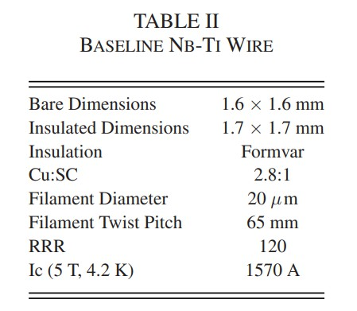</img>

超导线参数

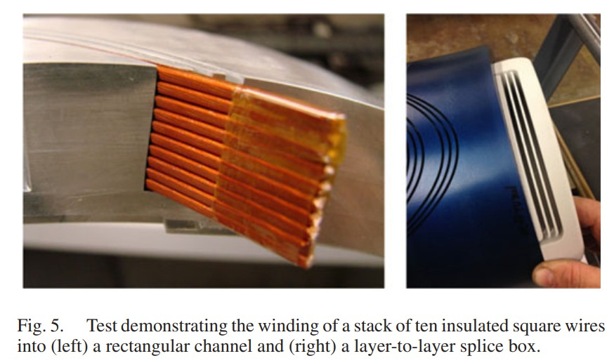</img>

布线实物图

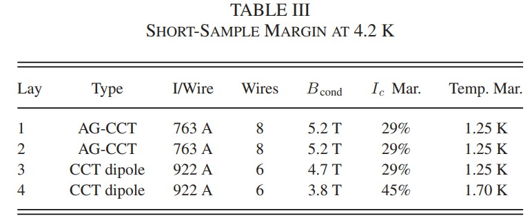</img>

布线参数

### D. Magnet Structure

**机械支持研究**

A key component in the CCT design is the winding mandrel (sometimes called a former) into which the conductor is placed. A mandrel is produced for each layer by machining channels into a curved metallic cylinder. The channels allow for precise placement of the conductor (optimized for the desired field) and the mandrel provides mechanical support against the Lorentz forces. The use of mandrels as structural support internal to the coil pack has been studied in detail for both gantry magnets and high-field dipoles [17], [23].

In addition to the winding mandrels, an external support structure outside of the coil pack is being considered with a preliminary concept shown Fig. 1. A backbone is connected to three mechanical pads to provide additional stiffing, and two cooling pads are located between the mechanical pads for the connection of cryocoolers. The supports which suspend the cold mass within the cryostat are attached to the mechanical pads and the backbone of the structure (not all supports are shown in Fig. 1). Initial mechanical and thermal analysis of the coil pack coupled to this external structure will be described in Sections IV and VI.

CCT设计中的关键组件是放置导体的绕组心轴（有时称为线圈芯）。通过将通道加工成弯曲的金属圆柱体，为每一层生产一个心轴。通道可以精确放置导体（针对所需的场进行了优化），而心轴可提供抵抗洛伦兹力的机械支撑。对于龙门磁铁和高场偶极子，已经详细研究了使用心轴作为线圈组内部的结构支撑[17]，[23]。

除了绕组心轴，还考虑了线圈组外部的外部支撑结构，其初步概念如图1所示。骨架连接到三个机械垫以提供额外的刚性，两个冷却垫位于机械垫之间。冷却器连接垫。将冷物质悬浮在低温恒温器内的支撑件连接到机械垫和结构的骨架（图1中未显示所有支撑件）。第四部分和第六部分将介绍耦合到此外部结构的线圈组的初始机械和热分析。

### III. SINGLE MESH APPROACH TO ANSYS MODELING

An integrated approach was developed in ANSYS to perform magnetic, mechanical, and thermal modeling using a single shared mesh. A solid, meshed model of the conductor, mandrels, external structure, and bounding air box needed for magnetic boundary conditions is generated (see Fig. 6). This mesh is then shared by the models described in Table IV.

The change from one physics model to another is accomplished by: (1) retaining the required regions of the full mesh, (2) changing element type, (3) applying new boundary and contact conditions, and (4) transferring the appropriate loads from previous solutions. The use of the same mesh for all cases allows for simplified load transfer from one model to another using the LDREAD command. The combination of a large mesh and transient analysis made the solution of these models beyond the capability of a desktop computer. Reasonable solution times of less than a day for all cases were obtained on a linux cluster using the HPC ANSYS license and up to twenty cores.

在ANSYS中开发了一种集成方法，以使用单个共享网格进行磁，机械和热建模。生成了导体，心轴，外部结构和磁性边界条件所需的边界气箱的实体网格模型（参见图6）。然后，表IV中描述的模型共享该网格。

从一种物理模型到另一种物理模型的更改是通过以下步骤完成的：（1）保留全网格所需的区域，（2）更改元素类型，（3）应用新的边界和接触条件，以及（4）从先前的解决方案。在所有情况下都使用相同的网格可以简化使用LDREAD命令将载荷从一种模型转移到另一种模型的过程。大网格和瞬态分析的结合使这些模型的解决方案超出了台式计算机的能力。在所有情况下，使用HPC ANSYS许可证和多达20个内核的linux集群都获得了合理的解决方案时间，少于一天。

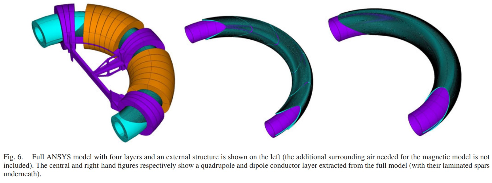</img>
Fig. 6. Full ANSYS model with four layers and an external structure is shown on the left (the additional surrounding air needed for the magnetic model is not included). The central and right-hand figures respectively show a quadrupole and dipole conductor layer extracted from the full model (with their laminated spars underneath).

图6.带有四层和外部结构的完整ANSYS模型在左侧显示（不包括磁性模型所需的额外周围空气）。 中心图和右手图分别显示了从完整模型中提取的四极和偶极导体层（下面有叠层梁）。

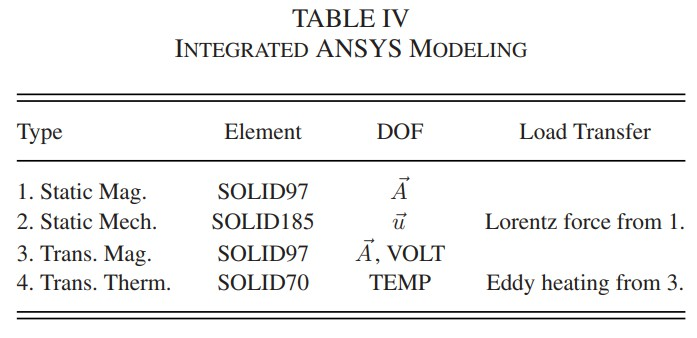</img>

ANSYS 建模

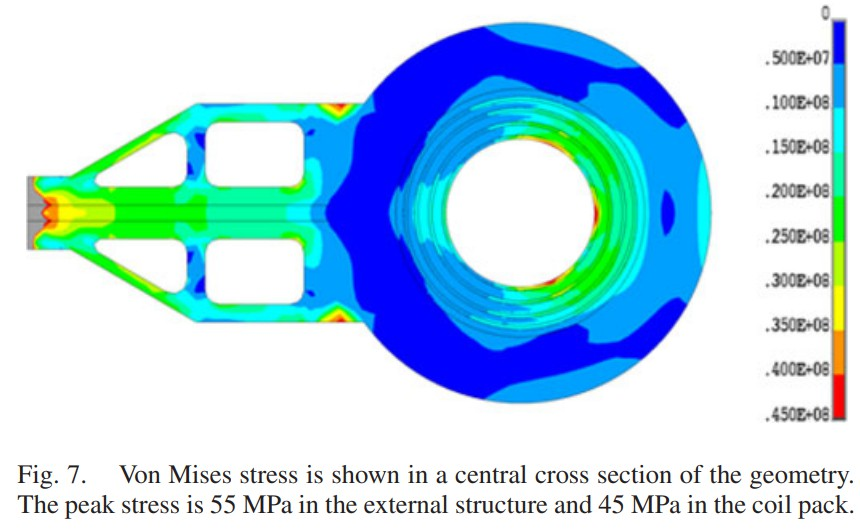</img>

Fig. 7. Von Mises stress is shown in a central cross section of the geometry. The peak stress is 55 MPa in the external structure and 45 MPa in the coil pack.

图7.冯·米塞斯应力在几何图形的中央横截面中显示。 外部结构的峰值应力为55 MPa，线圈组的峰值应力为45 MPa。

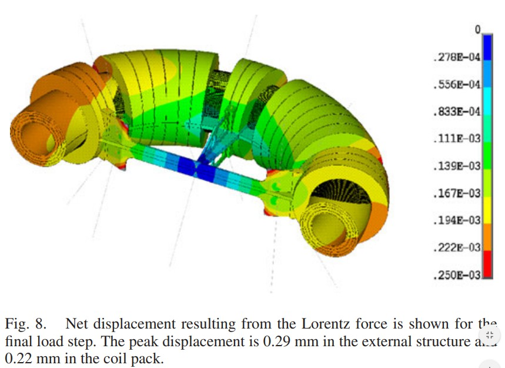</img>

Fig. 8. Net displacement resulting from the Lorentz force is shown for the final load step. The peak displacement is 0.29 mm in the external structure and 0.22 mm in the coil pack.

图8.显示了洛伦兹力产生的最终位移的净位移。 外部结构的峰值位移为0.29 mm，线圈组的峰值位移为0.22 mm。

### IV. MECHANICAL ANALYSIS

**力学分析**

A three load step mechanical analysis of the coil pack and external structure was performed using ANSYS. The load steps are: (1) pre-tensioning of the supports which suspend the cold mass within the cryostat , (2) cooldown to 4.2 K, and (3) powering of the magnet to peak operating current. The Lorentz force loads for the final step were transferred from a previously solved magnetic model in ANSYS (see Table IV). These forces were compared on an element by element basis with an Opera3D model and found to be within 5% of each other.

A baseline material of copper was used for the cooling pads and aluminum for the mandrels and external structure. Anisotropic material properties for the conductor channel were determined using the rule of mixtures for a stack of Nb-Ti wires impregnated with epoxy [24]. The von Mises stress in a central cross section after the final load step (peak current operation) can be seen in Fig. 7, and the net displacement of the cold mass in Fig. 8. For all load steps the von Mises stress remains below 55 MPa and the displacement below 0.29 mm.

使用ANSYS对线圈组和外部结构进行了三步载荷力学分析。加载步骤为：（1）将冷块悬挂在低温恒温器中的支架预张紧；（2）冷却至4.2 K；以及（3）磁体供电以达到峰值工作电流。最后一步的洛伦兹力载荷是从ANSYS中先前求解的磁模型中转移过来的（见表IV）。将这些力与Opera3D模型逐个元素地进行比较，发现彼此之间的误差在5％之内。

基线材料铜用作冷却垫，而铝材料用于心轴和外部结构。导体通道的各向异性材料特性是使用一堆用环氧树脂浸渍的Nb-Ti线的混合物的规则确定的[24]。最终载荷步骤（峰值电流运行）后，中心截面的冯·米塞斯应力如图7所示，冷物质的净位移如图8所示。对于所有载荷步骤，冯·米塞斯应力均保持低于55 MPa，位移低于0.29 mm。

### V. AC LOSSES

**交流损耗 为什么研究这个？**

The momentum acceptance of a gantry magnet is closely coupled to the field ramping rate required during treatment. For example, estimates have shown a change in momentum acceptance from 8% to the 20% can lower the required peak dipole ramp rate by a factor of ten. Because the magnet heat load scales with the ramp rate (and in some cases the square of the rate), a large momentum acceptance is beneficial for the thermal design.

Two sources of AC losses have been considered: (1) eddy current loss in the structural materials, and (2) AC loss in the conductor. The initial studies in this paper will focus on a peak dipole ramp rate of 0.02 T/s which corresponds to estimates for a 20% momentum acceptance. More detailed studies are in progress to investigate the losses during a typical treatment including periods of lower ramp rate and resting (during which the magnet temperature can recover). The resulting cold mass temperatures and net cryogenic load for a treatment duty cycle will determine if modifications to the baseline design are necessary.

龙门磁体的动量接受度与治疗过程中所需的磁场加速速率紧密相关。例如，估计表明动量接受度从8％更改为20％可以使所需的峰值偶极子斜坡率降低10倍。由于磁体的热负载与斜率（在某些情况下是斜率的平方）成比例，因此接受大的动量对于热设计是有益的。

已经考虑了交流损耗的两个来源：（1）结构材料中的涡流损耗，以及（2）导体中的交流损耗。本文的初步研究将集中在0.02 T / s的峰值偶极子斜率上，这对应于20％动量接受度的估计。目前正在进行更详细的研究，以研究典型处理过程中的损耗，包括较低的斜率和静止时间（在此期间磁体温度可以恢复）。处理工作周期的最终冷质量温度和净低温负荷将确定是否需要对基准设计进行修改。

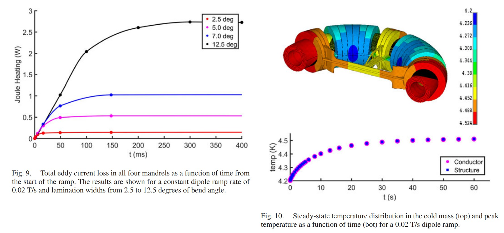</img> 

Fig. 9. Total eddy current loss in all four mandrels as a function of time from the start of the ramp. The results are shown for a constant dipole ramp rate of 0.02 T/s and lamination widths from 2.5 to 12.5 degrees of bend angle. 

Fig. 10. Steady-state temperature distribution in the cold mass (top) and peak temperature as a function of time (bot) for a 0.02 T/s dipole ramp.

图9.从爬坡开始起，所有四个心轴的总涡流损耗随时间的变化。 结果显示出恒定的偶极子斜率为0.02 T / s，层压宽度为2.5至12.5度的弯曲角。

图10.对于0.02 T / s的偶极子斜率，冷块中的稳态温度分布（顶部）和峰值温度随时间的变化（底部）。

### A. Eddy Current Losses in the Structure

**涡流损耗**

The eddy current losses in the magnet structure were simulated using the transient magnetic ANSYS model described in Table IV. A laminated approach to constructing the winding mandrels and external structure was studied. Results showing the net power deposited in the mandrels for several different lamination bend angles can be seen in Fig. 9. From this study a baseline mandrel lamination width of six degrees was selected, making the total loss 0.7 W for a dipole ramp rate of 0.02 T/s. An investigation of the eddy currents in the preliminary external structure using the same ANSYS model is in progress, with material selection and lamination schemes being considered to bring the losses to an acceptable level.

使用表IV中所述的瞬态磁性ANSYS模型对磁体结构中的涡流损耗进行了仿真。 研究了一种构造缠绕心轴和外部结构的层压方法。 结果显示了在几种不同的层压弯曲角度下，沉积在心轴上的净功率。图9中显示了该结果。从这项研究中，选择了六度的基线心轴层压宽度，使得偶极斜率为0.02时总损耗为0.7 W 吨/秒 目前正在使用相同的ANSYS模型对初步外部结构中的涡流进行研究，并考虑了材料选择和层压方案，以使损耗达到可接受的水平。

### B. AC Losses in the Conductor

**导体中的交流损耗**

A method was developed to estimate the AC loss in the conductor using a combination of the ANSYS mesh, Opera3D, and analytic loss approximations. First the location and current direction of each conductor element is exported from the ANSYS mesh. Then the magnetic field transverse to the current direction at each of these locations is calculated using Opera3D. With this information, analytic formulas for the hysteresis, inter-filament coupling current (IFCC), and stabilizer loss [25], [26] can be used to estimate the heating within each ANSYS mesh element. This method was applied to estimate the losses assuming the baseline conductor properties in Table II and a dipole ramp rate of 0.02 T/s. The results of this study showed a net hysteresis loss of 3.0 W, IFCC loss of 1.3 W, and stabilizer loss of 1.0 W.

开发了一种方法，可以结合使用ANSYS网格，Opera3D和解析损耗近似值来估算导体中的交流损耗。 首先，从ANSYS网格中导出每个导体元件的位置和电流方向。 然后，使用Opera3D计算在每个位置处与电流方向垂直的磁场。 有了这些信息，可以使用磁滞，线间耦合电流（IFCC）和稳定器损耗的解析公式[25]，[26]来估算每个ANSYS网格单元内的热量。 假设表II中的基线导体特性和0.02 T / s的偶极子斜率，则采用该方法估算损耗。 这项研究的结果表明，净磁滞损耗为3.0 W，IFCC损耗为1.3 W，稳定器损耗为1.0W。

### VI. THERMAL ANALYSIS

**热研究**

The use of the ANSYS mesh for the eddy current and conductor loss calculations allows for simplified load transfer to the thermal model described in Table IV. A study was performed to find the temperature distribution due to a fixed dipole ramp rate of 0.02 T/s. An initial temperature of 4.2 K was set for all nodes and the joule heating from eddy current and AC loss models were applied to the mandrel and conductor elements. Patches of nodes on the cooling pads at the cryocooler locations were fixed at 4.2 K, and the contact conditions radially between cold mass layers were estimated using the assembly gap and epoxy properties.

Fig. 10 shows the peak temperature as a function of time into the ramp and the final, steady state temperature distribution in the cold mass. After ramping for 60 seconds, the peak temperature in the cold mass rises to a value 320 mK above the starting temperature of 4.2 K. The peak temperatures are located in the magnet ends which is away from the peak field on the conductor. When the distribution of the field on the conductor is considered, the temperature rise due to the conductor and mandrel eddy current losses reduces the thermal margin from the 1.25 K given in Table III to 1.1 K. This is within the initial design requirement of a 1.0 K temperature margin, which is planned to be further refined following the test of a prototype magnet.

在涡流和导体损耗计算中使用ANSYS网格可以简化将载荷转移到表IV中描述的热模型的过程。进行了一项研究，以查找由于0.02 T / s的固定偶极子斜率引起的温度分布。将所有节点的初始温度设置为4.2 K，并将涡流和交流损耗模型产生的焦耳热应用于心轴和导体元件。在低温冷却器位置的冷却垫上的节点补丁固定为4.2 K，并使用装配间隙和环氧树脂特性估算冷块之间的径向接触条件。

图10显示了峰值温度与进入斜坡的时间的函数关系，以及冷块中最终的稳态温度分布。在倾斜60秒后，冷块中的峰值温度上升到比4.2 K的起始温度高320 mK的值。峰值温度位于磁体末端，远离导体上的峰值磁场。当考虑导体上的磁场分布时，由于导体和心轴涡流损耗引起的温度升高会将热裕度从表III中给出的1.25 K降低到1.1K。这在1.0的初始设计要求之内K温度裕度，计划在测试原型磁体后进一步完善。

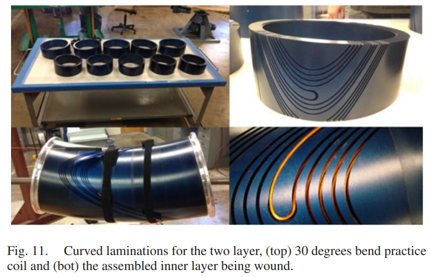</img>

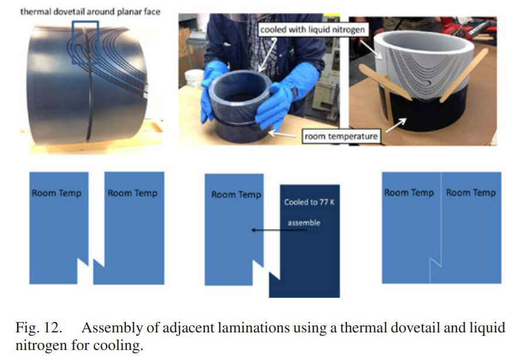</img>

### VII. THIRTY DEGREES PRACTICE COIL

**30度样品线圈（测试呢？）**

Thirty degrees of the two quadrupole layer mandrels was fabricated using the baseline lamination size of six degrees. These ten laminations can be seen in Fig. 11. Channels were machined into the parts to form three sections of the AG-CCT, resulting in two current reversals per layer. A small number of turns per section (five) was chosen to minimize the overall bend angle of the assembly while still allowing for realistic winding tests of full turns and current reversal transitions.

A thermal dovetail was machined into the axial faces of the laminations so adjacent pieces could be assembled together using thermal shrinkage of one part at liquid nitrogen temperature (see Fig. 12). A single dowel pin and slot was included to “clock” the azimuthal alignment of the laminations so the bend of the torus and the machined channels are matched during assembly. The laminations for both layers have been assembled, and the winding is in progress.

The mandrels will follow the assembly and epoxy impregnation steps anticipated for the final magnet. The proposed layerto-layer assembly method is similar to the process used at LBNL for straight CCT magnets. G10 sheets are used to shim the gap between layers and a mechanical puller asissts to assemble one layer inside another. After this assembly the layers will be impregnated together using an external potting tooling or vacuum bag approach.

使用六度的基线层压尺寸制造了两个四极层心轴的三十度。这十个叠片可以在图11中看到。通道被加工到零件中以形成AG-CCT的三个部分，每层产生两个电流反转。选择每节少量匝数（五匝）以最大程度地减小组件的总体弯曲角度，同时仍允许对完整匝数和电流反向过渡进行实际的绕组测试。

将热燕尾榫加工到叠片的轴向表面，以便可以使用一部分在液氮温度下的热收缩将相邻的块组装在一起（参见图12）。包括单个销钉和狭槽，以“计时”叠片的方位角对齐，因此在组装过程中，圆环的弯曲和加工好的通道可以匹配。两层的叠片均已组装，并且卷绕正在进行中。

心轴将遵循最终磁体预期的组装和环氧树脂浸渍步骤。所提出的层到层组装方法类似于LBNL中用于直型CCT磁体的过程。 G10薄板用于填平各层之间的间隙，并使用机械拉拔器将一层组装在另一层内部。组装后，将使用外部灌封工具或真空袋方法将各层浸渍在一起。

### VIII. CONCLUSION

**略**

The design of an achromatic gantry magnet for a proton therapy gantry was presented. Four layers of conductor based on the CCT and AG-CCT concept is used to produce the desired constant dipole and alternating quadrupole fields. A method for integrating magnetic, mechanical, and thermal analysis in ANSYS was developed and applied to model the coil pack coupled to an external structure. Finally, efforts towards magnet fabrication and assembly were shown for a two layer practice coil.

介绍了一种用于质子治疗龙门的消色差龙门磁体的设计。 基于CCT和AG-CCT概念的四层导体可用于产生所需的恒定偶极子场和交替的四极子场。 开发了一种在ANSYS中集成磁，机械和热分析的方法，并将其用于对耦合到外部结构的线圈组进行建模。 最后，展示了针对两层练习线圈的磁体制造和组装工作。
