# 02 Design and measurement of a combined function magnet intended for a cancer therapy accelerator

https://www.researchgate.net/publication/32154504_Design_and_measurement_of_a_combined_function_magnet_intended_for_a_cancer_therapy_accelerator

时间 2001 作者 A Morita，Y Iwashita，A Noda，T Shirai，M Tadokoro 机构 日本日立 Hitachi

### abstract

组合功能磁铁

A compact proton synchrotron using combined function magnets is proposed to help realize the wider availability of charged particle cancer therapy facilities. This combined function magnet was designed with the help of three-dimensional magnetic field calculations to take account of a realistic fringe and the interference among the magnetic poles. An evaluation scheme for tune values based on particle tracking was developed to improve the magnet design. To verify the magnet design, a model magnet was fabricated and measured. In order to achieve a tune value evaluation from the measured magnetic field, schemes for accurate field mapping and field interpolation were developed. From the tune value evaluation of the measured magnetic field, it was thought that the performance of the model magnet was good enough to construct a synchrotron. In this paper, we report details of the design and the evaluation scheme for the combined function magnet and the results of the field measurements of the model magnet.

提出了使用组合功能磁体的紧凑型质子同步加速器，以帮助实现带电粒子癌症治疗设备的更广泛的可用性。这种组合功能的磁体是在三维磁场计算的帮助下设计的，考虑了实际的条纹和磁极之间的干扰。开发了基于粒子跟踪的调谐值评估方案，以改进磁体设计。为了验证磁体设计，制造并测量了模型磁体。为了从测量的磁场中获得音调值评估，开发了用于精确场映射和场插值的方案。从所测磁场的调谐值评估，认为模型磁体的性能足以构成同步加速器。在本文中，我们报告了组合功能磁体的设计和评估方案的详细信息，以及模型磁体的磁场测量结果。

### I. INTRODUCTION

Radiation cancer therapy has recently been the subject of attention because of both its ability to preserve human body function and shape and its light load to the patient compared with other therapies. Among the radiation therapies, charged particle therapy has the advantage that it can localize dose distribution to the tumor, largely due to the presence of the Bragg peak which reduces damage to normal cells. But such charged particle cancer therapy is not yet common because of the high cost of the accelerator.

To realize widespread use of charged particle cancer therapy, an accelerator with low construction cost and easy handling is required. A compact proton synchrotron using combined function magnets is proposed as one approach for such an accelerator system [1,2].

Using combined function bending magnets as the main focusing elements, tracking between bending dipole and focusing quadrupole becomes unnecessary because the functions of bending and focusing are both realized with the same magnets. The operating point of the ring will be fixed if the relative distribution of the magnetic field does not change over the whole excitation range. As a merit of the combined function magnet, the possibility of eliminating a tune change due to a power supply ripple is pointed out and an experiment of proof of principle was achieved [3,4]. Power, coil space, and alignment costs between dipole and quadrupole can be saved. Using an untuned cavity [5,6] and an rf source controlled by magnetic field strength, the acceleration operation will be easy.

However, the adjustment of the tune values after fabrication of such a magnet is not easy. To achieve a good magnet design we employed the three-dimensional magnetic field calculation code. To evaluate and adjust the tune values of the magnet, an evaluation method by particle tracking using calculated field distribution was developed.

In order to verify this design scheme, a model magnet was fabricated and its magnetic field distribution was measured. This paper describes our design of a combined function synchrotron emphasizing the design of the magnet and the measured results of the model magnet.

由于与其他疗法相比，放射癌疗法具有保持人体功能和体形的能力以及对患者的轻负荷能力，因此最近已成为关注的焦点。在放射疗法中，带电粒子疗法的优势在于它可以将剂量分布定位在肿瘤上，这主要归因于布拉格峰的存在，这减少了对正常细胞的损害。但是由于加速器的高成本，这种带电粒子癌疗法尚不普遍。

为了实现带电粒子癌疗法的广泛使用，需要一种结构成本低且易于操作的促进剂。提出了一种使用组合功能磁体的紧凑型质子同步加速器作为这种加速器系统的一种方法[1,2]。

使用组合功能的弯曲磁体作为主要聚焦元件，由于在相同的磁体上都实现了弯曲和聚焦的功能，因此不需要在弯曲偶极子和聚焦四极子之间进行跟踪。如果磁场的相对分布在整个激励范围内不变，则环的工作点将固定。作为组合功能磁体的优点，指出了消除由于电源纹波引起的音调变化的可能性，并实现了原理验证的实验[3,4]。可以节省功率，线圈空间以及偶极和四极之间的对准成本。使用未调谐的腔[5,6]和受磁场强度控制的射频源，加速操作将很容易。

然而，在制造这样的磁体之后调节音调值并不容易。为了获得良好的磁体设计，我们使用了三维磁场计算代码。为了评估和调整磁体的调谐值，开发了一种通过使用计算出的磁场分布进行粒子跟踪的评估方法。

为了验证该设计方案，制造了模型磁体并测量了其磁场分布。本文介绍了我们的组合功能同步加速器的设计，强调了磁体的设计和模型磁体的测量结果。

### II. DESIGN

### A. Initial design

The synchrotron ring is composed of six sets of 2 m drift space and 60± sector magnets (Fig. 1). In the orbit in the bending magnet, the radius of curvature and the maximum field strength are designed as 1.9 m and 1.28 T, respectively, for protons up to 240 MeV. The bending magnet has three combined function magnet sections and an FDF triplet focusing structure. The bending angles of the three poles are designed to be 15±, 30±, and 15±. The design target values for horizontal and vertical tunes are both 1.75. After a preliminary calculation, the n indices of the magnet poles [n = -(ρ/B)(∂B/∂ρ)] were determined

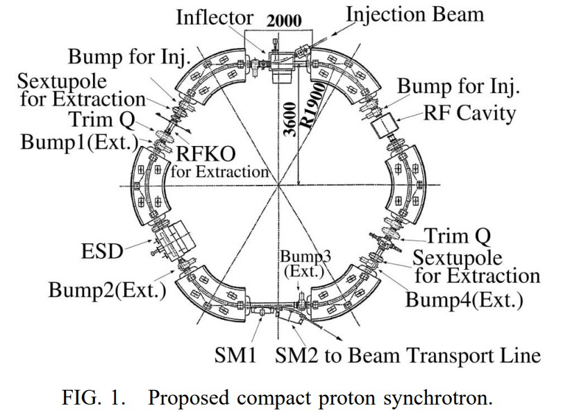</img>

as 25.855 for the F sector and 6.164 for the D sector. The main coil is made by a hollow conductor, and the winding number of the main coil is 28 per pole. The conductors of the main coil make a 7 * 4 * W * H conductor stack, and this is installed into the magnetic pole with a one turn correction coil.

The basic magnet pole shapes are designed to suppress the sextupole component by a two-dimensional magnetic potential formula,

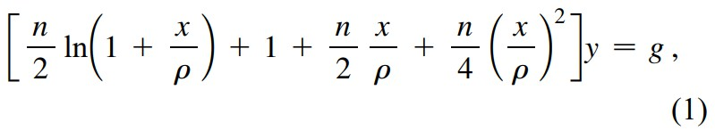</img>

where r, g, and n are the radius of the curvature of the magnet sector, the gap height on the designed orbit, and the n index of the magnet pole, respectively. x and y denote the horizontal and vertical distance, respectively, from the designed orbit. The gap height on the designed orbit is 67 mm. The sextupole error field is evaluated from a magnetic field distribution calculated by 2D code and its polynomial fitting. In order to avoid a variation of the field distribution due to saturation, slots to equalize the magnetic flux density [7] are situated at the low flux density area in the pole, as shown in Fig. 2. From the magnetic field calculations of the initial design, a useful aperture, +/-70 mm, of the magnet with an error of 0.1% was obtained.

The entrances of the sectors are shaped by a step function which approximates the magnetic potential of the Rogowski cut pole. There are five steps. The width of these Rogowski-like steps are 10, 10, 10, 20, and 20 mm, sequentially, from the edge of the sectors. Figure 3 shows the original Rogowski curve and the step function of the real pole cut.

</img>

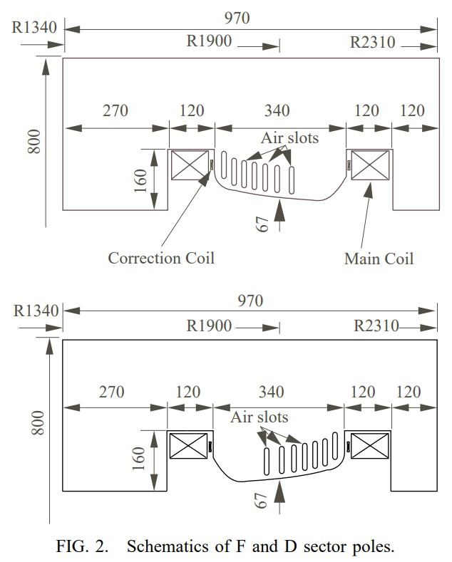</img>

同步加速器环由六组2 m的漂移空间和60±扇形磁体组成（图1）。在弯曲磁体的轨道上，对于质子达240 MeV的质子，曲率半径和最大场强分别设计为1.9 m和1.28T。弯曲磁体具有三个组合功能磁体部分和一个FDF三重态聚焦结构。三个极的弯曲角度设计为15±，30±和15±。水平和垂直曲调的设计目标值均为1.75。经过初步计算，确定了磁极的n个指标[n =-（ρ/ B）（∂B/∂ρ）]

F部门为25.855，D部门为6.164。主线圈由空心导体制成，主线圈的绕组数为每极28。主线圈的导体构成7 * 4 * W * H的导体叠层，并通过一匝校正线圈将其安装到磁极中。

基本的磁极形状旨在通过二维磁势公式来抑制六极分量，

其中，r，g和n分别是磁体扇形的曲率半径，设计轨道上的间隙高度和磁极的n指数。 x和y分别表示距设计轨道的水平和垂直距离。设计轨道上的间隙高度为67毫米。根据由2D代码及其多项式拟合计算出的磁场分布来评估六极误差场。为了避免由于饱和而导致的磁场分布变化，如图2所示，在磁极中的低磁通密度区域处放置了用于均衡磁通密度的槽[7]。在最初的设计中，获得了磁体的有效孔径+/- 70 mm，误差为0.1％。

扇形的入口由阶跃函数整形，该阶跃函数近似于 Rogowski 切极的磁势。有五个步骤。这些类似于 Rogowski 的台阶的宽度从扇区的边缘开始依次为 10、10、10、20 和 20 mm。图3显示了原始的 Rogowski 曲线和实际极点切割的阶跃函数。

### B. Operating point evaluation method

To evaluate a realistic magnetic field including fringe fields and interference between the F and D sectors, the magnetic field distribution of the model magnet was calculated by the 3D magnetic field calculation code, TOSCA. A conventional analysis which used the transfer matrices of the ring component was not enough to evaluate the tune values from such a calculated magnetic field. Therefore we introduced a tune value evaluation method based on particle tracking [8]. In this method, the condition of the reference particle which made the closed orbit is determined from the given magnetic field at the first step. At the second step, a curvilinear coordinate s, x, y, which is based on the trajectory of the reference particle, is introduced and becomes the basis of the trajectory description. At the third step, a set of particles that has an initial distribution in a phase space is tracked in the magnet. Finally, the transfer matrices are reconstructed from the initial and final phase space distributions using least squares fitting.

为了评估包括边缘场以及F和D扇区之间的干扰的实际磁场，通过3D磁场计算代码TOSCA计算了模型磁体的磁场分布。使用环形分量的传递矩阵的常规分析不足以从这种计算出的磁场评估调谐值。因此，我们介绍了一种基于粒子跟踪的调谐值评估方法[8]。在该方法中，第一步，根据给定的磁场确定成为封闭轨道的参考粒子的状态。在第二步中，引入基于参考粒子轨迹的曲线坐标s，x，y，并成为轨迹描述的基础。在第三步中，在磁体中跟踪在相空间中具有初始分布的一组粒子。最后，使用最小二乘拟合从初始和最终相空间分布中重建传递矩阵。

From the curvilinear coordinate, the development of the trajectory is considered as the mapping of the phase space,

m(s1|s0):X0 -> X1

where s0 and s1 are the curvilinear coordinates of the initial and the mapped points, respectively, and x0 and x1 are the initial phase space vector at the point of s0 and the mapped vector at the point of s1, respectively. The linear component is the lowest order of this mapping because the origin is the fixed point of mapping from the definition of the reference orbit of the coordinate. In this mapping, the transfer matrix is understood as a linear representation. To extract the transfer matrix Ms1js0, we reconstructed it from the two phase space distributions by the following method. The initial vector of the particle number n is x n is X0 and the mapped vector of n is x n is X1 ; the least squares method for the transfer matrix is then written as

从曲线坐标来看，轨迹的发展被认为是相空间的映射，

m（s1 | s0）：X0-> X1

其中s0和s1分别是初始点和映射点的曲线坐标，x0和x1分别是s0点的初始相空间矢量和s1点的映射矢量。 线性分量是此映射的最低顺序，因为原点是从坐标参考轨道的定义开始的映射的固定点。 在该映射中，传递矩阵被理解为线性表示。 为了提取传输矩阵Ms1js0，我们通过以下方法根据两个相空间分布对其进行了重构。 粒子数n的初始向量为x n为X0，n的映射向量为x n为X1； 然后将传递矩阵的最小二乘法写成

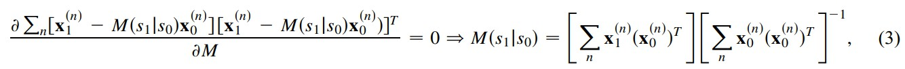</img>

where T denotes the transposition of the vector and the matrix. This reconstructed transfer matrix Ms1js0 is equal to the linear representation of the mapping ms1js0 under the L2 norm.

Once a transfer matrix of an arbitrary interval of the ring is calculated, we can obtain a transfer matrix of one revolution. The phase advance of betatron oscillation m and the Twiss parameter a, b, and g are easily obtained from the twodimensional transfer matrix of one revolution using the periodic boundary condition of the betatron oscillation in the following relationship:

其中T表示向量和矩阵的转置。 该重构的传输矩阵Ms1js0等于L2范数下映射ms1js0的线性表示。

一旦计算出环的任意间隔的传递矩阵，我们就可以获得一转的传递矩阵。 使用等离子加速器振荡的周期边界条件，以下列关系很容易从一圈的二维传递矩阵中获得等离子加速器振荡的相位提前量和Twiss参数a，b和g：

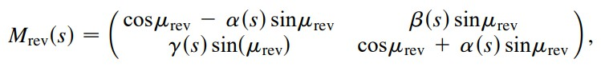</img>

where Mrevs, as, bs, and gs are the transfer matrix of one revolution begun from the point s and Twiss parameters at the point s, respectively. mrev denotes the phase advance of the betatron oscillation per revolution. Finally, the tune value n is derived from the phase advance per revolution mrev as

v = μ(rev)/2π

When we applied this method to our magnet, it was assumed that the closed reference orbit stayed on the median plane and coincided with the designed orbit at the middle of the drift space. With the help of these assumptions, we define the initial position and the initial direction of the reference orbit. The last parameter needed to complete the definition of the closed reference orbit is the initial momentum of the orbit. Therefore, a candidate of the closed reference orbit corresponding to the given initial momentum can be obtained by tracking the particle trajectory. Under good field symmetry, the closed reference orbit parallels the designed orbit at the center of the magnet. Thus, assuming such good field symmetry, the closed reference orbit is obtained by choosing the trajectory that parallels the designed orbit at the center of the magnet from the candidates generated by the tracking method. The angle between the designed orbit and the tracked trajectory at the center of the magnet is a function of the initial momentum of the trajectory. By applying the Newton-Raphson method to this function, the initial momentum generating the closed reference orbit is obtained. Once the initial momentum of the closed reference orbit is obtained, the curvilinear coordinate with respect to the reference orbit is defined and the calculations on the curvilinear coordinate can be performed. In order to make it easy to calculate the inverse matrices, the initial distribution of xn0 was selected to eliminate the off diagonal terms of [xxx] Eq. (3). In the evaluation of the Twiss parameters and the phase advance, it was assumed that the betatron oscillations could be decoupled into x-x0 and y-y0 subphase spaces. This treatment, to decouple the betatron oscillations, is valid under the assumption of the magnet having good symmetric poles. 

其中Mrevs，as，bs和gs分别是从点s和点Twiss参数开始的一转的传递矩阵。 mrev表示每转的电子感应加速器振荡的相位超前。最后，从每转的相位超前mrev得出调谐值n为

v =μ（rev）/2π

当我们将这种方法应用于我们的磁体时，假设封闭的参考轨道位于中间平面上，并且与漂移空间中间的设计轨道重合。在这些假设的帮助下，我们定义了参考轨道的初始位置和初始方向。完成封闭参考轨道定义所需的最后一个参数是轨道的初始动量。因此，可以通过跟踪粒子轨迹来获得与给定的初始动量相对应的闭合参考轨道的候选。在良好的场对称下，闭合参考轨道与磁体中心处的设计轨道平行。因此，假设这种良好的场对称性，则通过从由跟踪方法生成的候选中选择与磁体中心的设计轨道平行的轨迹来获得闭合参考轨道。设计轨道与磁体中心的跟踪轨迹之间的角度是轨迹初始动量的函数。通过将牛顿-拉夫森方法应用于此函数，可以获得生成封闭参考轨道的初始动量。一旦获得了闭合参考轨道的初始动量，就可以定义相对于参考轨道的曲线坐标，并可以对曲线坐标进行计算。为了便于计算逆矩阵，选择xn0的初始分布以消除[xxx]方程的非对角项。 （3）。在评估Twiss参数和相位超前时，假设可以将电子感应加速器振荡解耦到x-x0和y-y0子相空间中。在假定磁体具有良好对称磁极的假设下，这种用于使电子感应加速器振荡解耦的处理是有效的。

### C. Evaluation and tuning of the rough design

The operating point in our rough design is evaluated as nh, ny1.64, 1.86. These tune values can be adjusted by modifying the ratio of bending angles between the F and D sectors. This increases the bending angle of the F sector by Du degrees and decreases the bending angle of the D sector by 2Du degrees, as shown in Fig. 4. Because we plan to make the magnetic pole of the laminated iron sheets, this modification can be easily incorporated into the design by changing the number of the iron sheets laminated of the F and D sectors. Changing the ratio of the bending

我们的粗略设计中的工作点评估为nh，ny 1.64，1.86。 可以通过修改F和D扇区之间的弯曲角度的比率来调整这些调谐值。 如图4所示，这将F扇区的弯曲角度增加了Du度，并将D扇区的弯曲角度减少了2Du度，因为我们计划制作层压铁板的磁极，因此可以进行这种修改 通过更改F和D扇形的叠层铁片的数量，可以轻松地将其合并到设计中。 改变弯曲比例

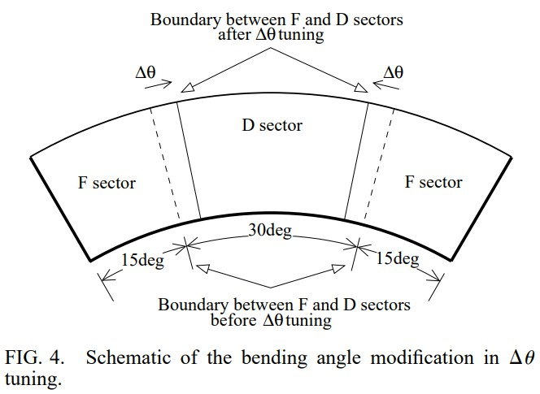</img>

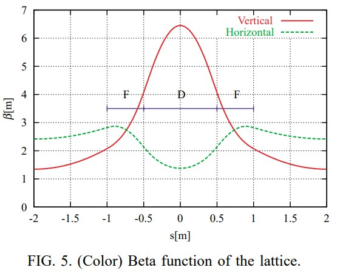</img>

angles can be treated as a local modulation of the n index around the transition region between the F and D sectors. From the tune shift formula of Hill’s equation, the tune shift per bending angle modulation is obtained as follows:

可以将角度视为F和D扇区之间的过渡区域周围n索引的局部调制。 从希尔方程的移调公式，可以得出每个弯曲角度调制的移调如下：

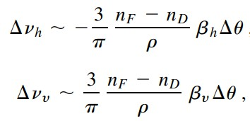</img>

where nF and nD are design n indices and r is the radius of the designed orbit curvature. bh and by are horizontal and vertical beta functions at the border between the F and D sectors, respectively. Thus, under the linear approximation, the ratio of the horizontal and vertical tune shifts is given by the ratio of the beta function around the transition region, and the magnitude of the tune shifts is proportional to the modulation of the bending angle Du. Figure 5 shows the beta functions evaluated from the calculated magnetic field distribution, where bh and by in Eqs. (6) and (7) are about 2 and 4 m, respectively. Thus the estimated proportional coefficients of the tune shifts for the angle Du are 0.21 deg21 horizontally and 20.42 deg21 vertically. The tune shifts predicted by Eqs. (6) and (7) are shown in Fig. 6 by the dotted line from the open circle labeled “0.0 deg.” The open and the filled circles in Fig. 6 show the evaluated tune values by the tracking method. These circles have good agreement with the predicted line. Therefore, using this Du tuning method, we can control the operating point on the predicted line, as shown in Fig. 6.

其中nF和nD是设计n个指标，r是设计轨道曲率的半径。 bh和by分别是F和D扇区之间边界处的水平和垂直beta函数。因此，在线性近似下，水平和垂直调谐偏移的比率由过渡区域周围的β函数的比率给出，并且调谐偏移的大小与弯曲角度Du的调制成比例。图5显示了从计算出的磁场分布评估的beta函数，其中bh和by表示为等式。 （6）和（7）分别约为2和4 m。因此，角度Du的估计的音调偏移的比例系数水平为0.21deg21，垂直为20.42deg21。由等式预测的音调变化。图6中的（6）和（7）由标有“ 0.0度”的空心圆的虚线表示。图6中的空心圆和实心圆表示通过跟踪方法评估的乐曲值。这些圈子与预测线有很好的一致性。因此，使用这种Du调整方法，我们可以在预测线上控制工作点，如图6所示。

### D. Final design and model magnet

Considering the operating point and resonance lines in Fig. 6, we selected 0.25± for the Du parameter and operating point 1.70, 1.74 of the final point to avoid resonance lines up to the fifth order. Figure 7 shows the excitation dependence of tune values evaluated from the magnetic field calculated by TOSCA with main coil current conditions of 383, 574, 765, 861, 957, 1053, 1148, 1244, and 1349 A. In Fig. 7, the horizontal tune is shifted to the lower side with an excitation increase, and the vertical tune has a peak around current I  1000 A. From the analysis of the position dependence of the contributions to the tune shift, the qualitative property of excitation dependence can be explained as follows. The ratio between the vertical and horizontal beta functions, which determine the modulation magnitude of the tune values, is especially large in the D sector. In the low excitation case, field deformation in the D sector is small, and the tune shifts are dominated by field deformation of the F sector. Then the vertical and horizontal tunes move in opposite directions. In the condition beyond the current of 1000 A, a strong field deformation due to pole saturation appears in the D sector. This saturation affect dominates only the vertical tune, then the direction of the vertical tune shift is changed. Therefore it is easily supposed that the tune excursion curve is modified by the B-H curve of iron, the lamination packing factor, and the machining error of the slots equalizing flux density, etc.

考虑到图6中的工作点和共振线，我们为Du参数选择了0.25±，最后一点的工作点为1.70、1.74，以避免共振线达到五阶。图7显示了由TOSCA计算的磁场在383、574、765、861、957、1053、1148、1244和1349 A的主线圈电流条件下评估的磁场的调谐值的激励依赖性。在图7中，水平调谐随着激励增加而移至下侧，垂直调谐在电流I 1000 A附近出现一个峰值。从对调谐偏移贡献的位置相关性分析，可以解释激励相关性的定性性质如下。垂直和水平贝塔函数之间的比率决定了音调值的调制幅度，在D扇区中尤其大。在低激励情况下，D扇区中的场变形很小，并且音调偏移由F扇区的场变形控制。然后，垂直和水平曲调沿相反方向移动。在超过1000 A电流的条件下，由于磁极饱和而导致的强磁场变形会出现在D扇区中。这种饱和效应仅在垂直调谐中占主导地位，然后垂直调谐偏移的方向会改变。因此，可以容易地认为，曲调偏移曲线是通过铁的B-H曲线，叠片堆积系数和使通量密度相等的槽的加工误差等来修改的。

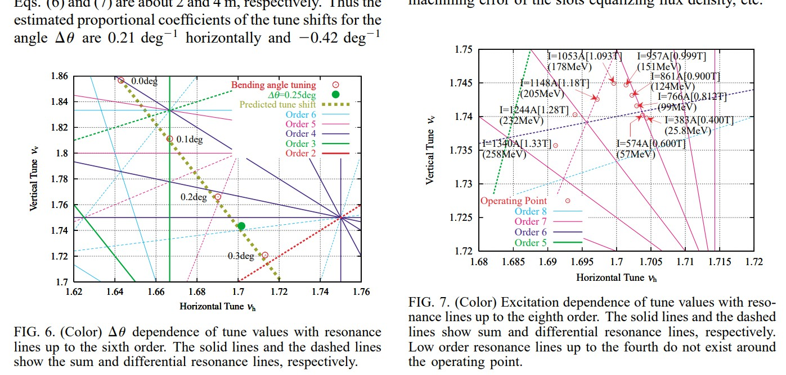</img>

To verify the three-dimensional calculation, we fabricated a model magnet reflecting the final design and measured the field distribution. Figure 8 shows the lower half of the model magnet being assembled. The poles of the magnet are made of laminated silica steel sheets of 0.5 mm thickness compatible with Nippon Steel Corporation 50H600 (see http://www.nsc.co.jp/si-steel/products/ 05.html). The achieved packing factor of the laminated pole was about 0.95.

为了验证三维计算，我们制作了反映最终设计的模型磁体并测量了磁场分布。 图8显示了正在组装的模型磁体的下半部分。 磁铁的磁极由厚度为0.5 mm的层压硅钢片制成，与新日铁公司50H600兼容（请参见http://www.nsc.co.jp/si-steel/products/ 05.html）。 叠层杆的堆积系数约为0.95。

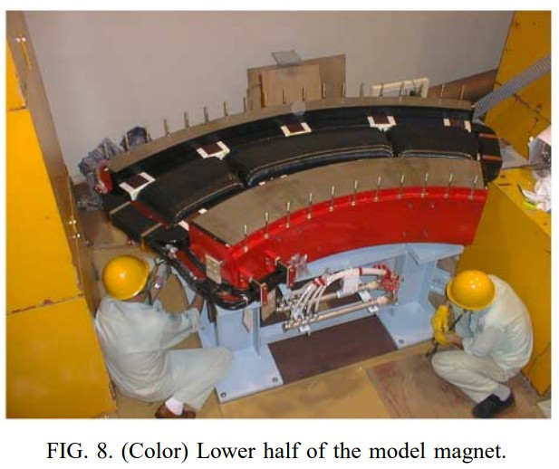</img>

### III. FIELD MEASUREMENT
### A. Basic strategy

In order to check the n index and the operating point of the model magnet, we needed accurate field gradient additions to the field strength. Because a harmonic coil method is not feasible for a sectored magnet, Hall probe mapping was chosen. This Hall probe mapping was achieved using the combination of a three-axes stage and Hall probes. The alignment method and the details of the measurement setup are described in a later section.

The information of field distribution required by the transfer matrix reconstruction using particle tracking is less than that in a full three-dimensional distribution, because of its linear approximation, magnet pole symmetry, and Maxwell law. Although evaluation of the dynamic aperture requires a full three-dimensional measurement, such a measurement is difficult because of the limitations of the measurable area, the probe stability, and the measurement time. Thus, we restricted measurement to the minimum set, which was enough to evaluate the n index and tune values by tracking. The symmetry between the upper and lower poles and Maxwell equation ∇ B = 0 told us that the magnetic field flux crosses perpendicular to the median plane, and that the magnetic field near the median plane can be reconstructed from the major component Bz on the median plane as follows:

为了检查n指数和模型磁体的工作点，我们需要在场强上添加准确的场梯度。由于谐波线圈方法对扇形磁体不可行，因此选择了霍尔探头映射。使用三轴位移台和霍尔探头的组合可以实现该霍尔探头的映射。校准方法和测量设置的详细信息将在后面的部分中介绍。

由于使用了粒子跟踪的传递矩阵重建所需的场分布信息少于线性的完整分布，磁极对称性和麦克斯韦定律，因此其信息少于完整的三维分布。尽管评估动态孔径需要完整的三维测量，但是由于可测量区域，探头稳定性和测量时间的限制，这种测量很困难。因此，我们将测量值限制在最小范围内，这足以评估n索引并通过跟踪来调整值。上下极之间的对称性和麦克斯韦方程∇B = 0告诉我们，磁场通量垂直于中间平面交叉，并且可以从中间平面上的主要分量Bz重建中间平面附近的磁场如下：

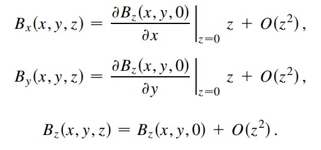</img>

### B. Alignment method

Before field mapping, both the three-axes stage and the Hall sensor axis of the Hall probe have to be mechanically aligned against the magnet and the magnetic median plane found. To arrange the horizontal plane of the stage with the horizontal plane of the magnet, both the magnet and the stage are leveled using a water level. To arrange the movable area and the moving axes of the stage within the measurement region, the stage axis is aligned to the magnet axis at an appointed angle using a theodolite in the horizontal plane after translation of the stage. After mechanical stage alignment, the probe axes have to be aligned with the coordinate axes of the magnetic field to accurately measure the component of the magnetic field. It is difficult to find the coordinate axes of the magnetic field because of the change in the direction of the magnetic flux caused by the combined function magnet. Thus, a plane in which the direction of the flux is already known has to be found before alignment of the probe axes. Fortunately, the median plane has such a property because the whole magnetic flux is perpendicular to the median plane if the poles are symmetric. Because the flux direction in the offmedian plane depends on the n index of the pole, the positional dependence of the flux direction over the whole measurement region can be detected by a roughly aligned probe. Thus the problem of finding the magnetic median plane is replaced with one of finding the plane where the directions of the flux of the F and D sectors are aligned. Using this searching method for the median plane, the accuracy requirement of the primary probe alignment can be relaxed. Once the median plane is found, the probe axes can be aligned with that plane and the alignment error of the probe size effect reduced by iterating the median plane searching and probe alignment. Finally, the probe origin in the horizontal plane is determined mechanically by using the geometry of the probe and the magnet.

在进行磁场映射之前，三轴位移台和霍尔探头的霍尔传感器轴都必须与磁体和找到的磁性中间平面机械对齐。为了将平台的水平面与磁体的水平面布置在一起，使用水位将磁体和平台均调平。为了将台架的可移动区域和移动轴布置在测量区域内，在台架平移之后，使用经纬仪将台架轴与磁体轴以指定角度对齐。在机械平台对准之后，探针轴必须与磁场的坐标轴对准才能准确地测量磁场的分量。由于由组合功能磁体引起的磁通量方向的变化，因此很难找到磁场的坐标轴。因此，必须在探头轴线对齐之前找到一个已知通量方向的平面。幸运的是，中间平面具有这种特性，因为如果磁极对称，则整个磁通量都垂直于中间平面。由于偏心平面中的磁通方向取决于磁极的n指数，因此可以通过大致对齐的探针来检测整个测量区域中磁通方向的位置依赖性。因此，用找到其中F和D扇区的通量方向对准的平面之一来代替找到磁性中间平面的问题。使用此搜索方法来查找中值平面，可以放宽主探针对准的精度要求。一旦找到中间平面，就可以将探针轴与该平面对齐，并通过重复中间平面搜索和探针对齐来减少探针尺寸效应的对准误差。最后，通过使用探针和磁体的几何形状来机械确定水平面中的探针原点。

### C. Setup and equipment

It is difficult to measure a field map of a whole area with a single setup because of the sector shape of the magnet. Considering the mirror symmetry of the magnet along the beam path, we measured only half of the magnet area with a small overlap of the mirrored area. Figure 9 shows the geometry of the measurement setup. In this setup, the probe arm has a tilt angle of 15± to the central orbit at the entrance, to cover the maximum magnet aperture of

由于磁体的扇形，难以通过单个设置来测量整个区域的场图。 考虑到磁体沿光路的镜像对称性，我们仅测量了磁体面积的一半，而镜像面积却有很小的重叠。 图9显示了测量设置的几何形状。 在这种设置中，探头臂相对于入口处的中心轨道倾斜15°，以覆盖

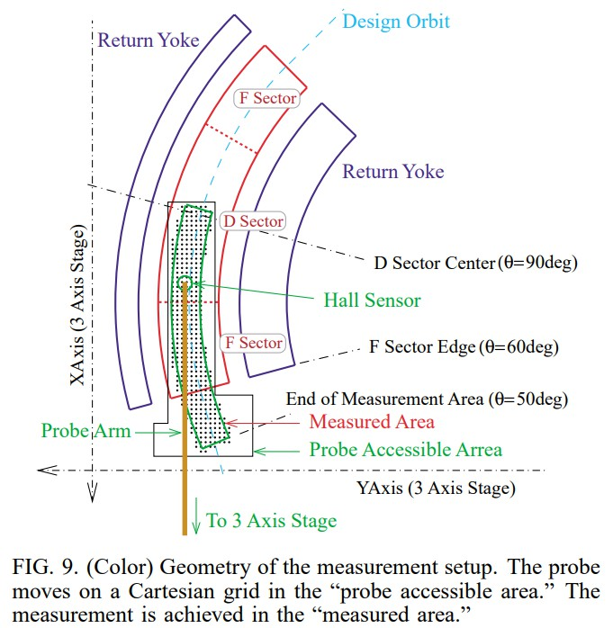</img>

the measurement area. The longest axis of the movable stage is aligned to the probe arm direction, which is used as the main scan axis to reduce the vibration of the probe arm when excited by the acceleration and deceleration of the stage. Figure 10 shows the setup as seen from the rear of the stage.

测量区域。 可移动平台的最长轴与探针臂方向对齐，该轴用作主扫描轴，以减少由平台的加速和减速激发时探针臂的振动。 图10显示了从舞台后部看到的设置。

Measurement was performed on 5 * 5 mm rectangular grids along the stage axes. Considering the requirements for the evaluation of the field characteristics, only the field distribution around the designed orbit is needed. The zonal area of the field distribution around the closed orbit, whose width is proportional to the beta function, is required to track the betatron particles. The beta function is maximized at the center of the D sector, and this position stays at the deepest area in the measurement region. Hence, the

scan width of this measurement area cannot be extended widely because of the conflict between the probe arm and the coil support. In order to reduce the measurement time, we decided to cut the measurement points which had relatively small contributions to the tracking aperture and the characteristic evaluation. Thus the selected measurement area covered half of the D sector, the F sector, and a 10± fringe within a radius from 1.84 to 1.96 m. The total number of the measurement points in the selected area was 7139.

Our method for searching the median plane requires a two- or three-axes Hall probe. Two commercially available three-axes Hall probes could not satisfy our requirements for the measurement stability, reproducibility, and differential linearity. We finally decided to use a single Hall sensor Group 3 MPT-141 that has a small sensitive area, high enough accuracy, and good stability (see http://ourworld.compuserve.com/homepages/ group3tech/DTM.htm). Its sensitive area is a rectangle of 1.0 3 0.5 mm. The maximum temperature coefficient of the corrected readout is guaranteed within 610 ppm±C according to the catalog specification. Two Hall MPT-141 sensors were mounted on the aluminum mount (see Fig. 11), in which the geometric center of the sensing areas of the two Hall sensors stayed on the same horizontal plane at a distance of 7.5 mm. This probe mount was attached to the tip of the probe arm. To control the Hall sensor angle against the flux, the directions of the two Hall sensors were perpendicular to the probe arm. The probe arm was fixed on the three-axes stage, which was driven with a resolution of 5 mm by three stepping motors. The position reproducibility of the motor system, measured by a linear scale with 5 mm accuracy, was held within 20 mm on the axis having the worst reproducibility. The stepping motor drivers of the three-axis stage were connected to a TUJI DENSHI PM4C four-channel pulse motor controller (see http://www.tsuji-denshi.co.jp/english/pm4c05a.html). All measurement devices were controlled by a Note PC via a NI PCMCIA-GPIB card (see http:// www.ni.com/catalog/pdf/1gpib756a.pdf). Even though the linear scalers installed in each axis were independent of the control system, it was useful to confirm that the motor system worked well.

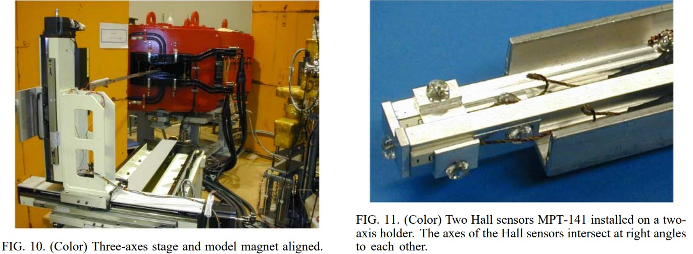</img>

沿着平台轴在5 * 5 mm的矩形网格上进行测量。考虑到评估场特征的要求，仅需要围绕设计轨道的场分布。跟踪闭环加速器粒子需要闭合轨道周围区域的纬向区域，其宽度与β函数成比例。 beta函数在D扇区的中心最大化，并且此位置位于测量区域中最深的区域。因此，

由于探头臂和线圈支架之间存在冲突，因此无法广泛扩展该测量区域的扫描宽度。为了减少测量时间，我们决定切割对跟踪孔径和特性评估贡献较小的测量点。因此，所选的测量区域覆盖了D扇形，F扇形的一半以及半径为1.84至1.96 m的10±条纹。所选区域中的测量点总数为7139。

我们搜索中间平面的方法需要两轴或三轴霍尔探头。两个市售的三轴霍尔探头不能满足我们对测量稳定性，可重复性和差分线性的要求。我们最终决定使用单个霍尔传感器3组MPT-141，该传感器具有较小的敏感区域，足够高的精度和良好的稳定性（请参见http://ourworld.compuserve.com/homepages/group3tech/DTM.htm）。它的敏感区域是1.0 3 0.5 mm的矩形。根据目录规格，校正后的读数的最大温度系数可保证在610 ppm±C之内。两个霍尔MPT-141传感器安装在铝制底座上（参见图11），其中两个霍尔传感器的感应区域的几何中心位于同一水平面上，相距7.5 mm。该探针支架安装在探针臂的尖端。为了控制霍尔传感器相对于通量的角度，两个霍尔传感器的方向垂直于探头臂。探针臂固定在三轴平台上，该平台由三个步进电机驱动，分辨率为5 mm。通过精度为5 mm的线性标尺测量的电机系统的位置再现性在再现性最差的轴上保持在20 mm以内。三轴平台的步进电动机驱动器连接到TUJI DENSHI PM4C四通道脉冲电动机控制器（请参见http://www.tsuji-denshi.co.jp/english/pm4c05a.html）。所有测量设备均由Note PC通过NI PCMCIA-GPIB卡控制（请参见http://www.ni.com/catalog/pdf/1gpib756a.pdf）。即使安装在每个轴上的线性洁牙机均独立于控制系统，但确认电动机系统工作正常也很有用。

### D. Field interpolation

Evaluation of the field characteristics and particle tracking required a continuous smooth field distribution. The Fourier series expansion was chosen for interpolation because of its easy handling of derivatives. Using a Cartesian measurement grid, a Fourier series of a field distribution was obtained by two-dimensional discrete cosine transformation (2D DCT). Although all the measured points were on rectangular grid points, as previously described, not all grid points in the rectangular area had data because of the sector shape of the magnet. A grid point that had no measured data was treated as a free parameter with an initial value of zero. The following iterations were applied to reduce the number of Fourier components and noise. First, the Fourier components were obtained by DCT. At the second step, higher frequency Fourier components were reduced by a low pass filter (LPF). At the third step, the field map was reconstructed by inverse DCT (IDCT), including the missing data points. At the final step, the interpolation error was estimated on the measured grid points, and the calculated data in the measured area were replaced by measured values. The sequence DCT, LPF, IDCT, and refilling were iterated until the interpolation error came within tolerances.

场特性的评估和粒子跟踪需要连续的平稳场分布。选择傅里叶级数展开进行插值是因为它易于处理导数。使用笛卡尔测量网格，通过二维离散余弦变换（2D DCT）获得傅立叶级数的场分布。如前所述，尽管所有测量点都在矩形网格点上，但是由于磁体的扇形，并不是矩形区域中的所有网格点都具有数据。没有测量数据的网格点被视为初始值为零的自由参数。应用以下迭代以减少傅里叶分量和噪声的数量。首先，通过DCT获得傅立叶分量。第二步，通过低通滤波器（LPF）降低高频傅立叶分量。第三步，通过逆DCT（IDCT）重建场图，包括丢失的数据点。在最后一步，对测量的网格点估计插值误差，并将测量区域中的计算数据替换为测量值。重复序列DCT，LPF，IDCT和重新填充，直到插值误差在公差范围内。

### IV. RESULTS OF MEASUREMENTS

### A. Characteristics of the model magnet

The excitation curve was initially compared with the TOSCA calculations. The excitation curve at the center of the D sector is shown in Fig. 12. The open and the closed circles show the results of magnetic field calculations and the results of field measurements, respectively. The excitation curve of the measurements almost corresponds to the curve of the field calculations. The apparent threshold of the saturation phenomenon exists around the main coil current of I = 1200 A. But the nonlinearity caused by magnetic pole saturation can be seen above a coil current of I = 900 A from the curve of the field strength normalized by the coil current.

最初将激励曲线与TOSCA计算进行比较。 D扇区中心的激励曲线如图12所示。空心圆和实心圆分别表示磁场计算的结果和场测量的结果。 测量的激励曲线几乎对应于场计算的曲线。 饱和现象的明显阈值存在于主线圈电流I = 1200 A附近。但是，从线圈归一化的场强曲线可以看出，在线圈电流I = 900 A以上，由磁极饱和引起的非线性 当前。

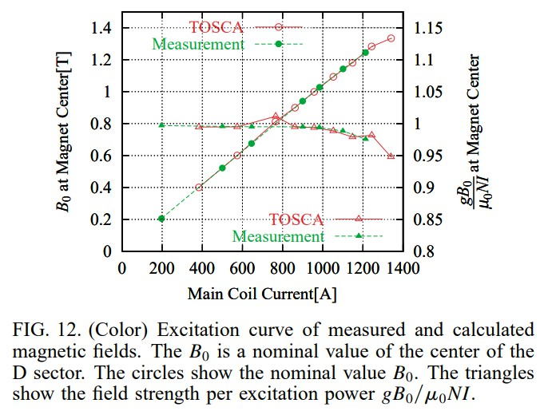</img>

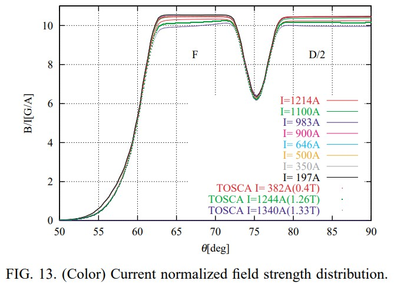</img>

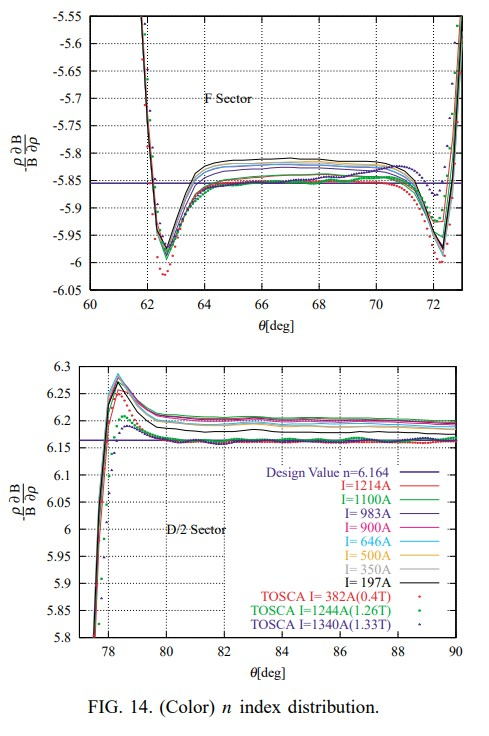</img>

In order to compare characteristics of field distribution, the field distributions of TOSCA calculations were compared with the measured ones by evaluating the magnetic field strength normalized by the main coil current BI and the n index XXX distribution in the designed orbit.

Figures 13 and 14 show the normalized field strengths and n indices, respectively, on an arc of r  1.9 m. This arc overlaps with the designed orbit of the magnet. Although the position of the magnetic field edge and the field strength for low field cases are well predicted by the calculation, the field strength of the fringe and the absolute value of the n index are different.

The lamination structure of the pole edges was different between the model magnet and the TOSCA calculation model. In the TOSCA calculation, the whole magnet is constructed by sector lamination. But the Rogowski-like pole edge of the model magnet is laminated linearly because of assembling restrictions. This difference of the edge structure may be one of the causes of the characteristic difference around the magnet edges.

为了比较磁场分布的特性，通过评估在设计轨道上由主线圈电流BI和n指数XXX分布归一化的磁场强度，将TOSCA计算的磁场分布与测量的磁场分布进行了比较。

图13和图14分别显示了在r 1.9 m弧线上的归一化场强和n指数。该弧与磁体的设计轨道重叠。尽管通过计算可以很好地预测低场情况下的磁场边缘位置和场强，但条纹的场强和n指数的绝对值是不同的。

在模型磁体和TOSCA计算模型之间，磁极边缘的叠层结构不同。在TOSCA计算中，整个磁体是通过扇形层压构造的。但是由于组装限制，模型磁体的类似Rogowski的磁极边缘被线性层压。边缘结构的这种差异可能是磁体边缘周围的特性差异的原因之一。

### B. Tune diagram of the measured result

Previous graphs have shown the fidelity of the model magnet against the proposed design. The information is not enough to verify the operating point of the whole ring because of closed orbit distortion. Thus, we have to evaluate tune values by a tracking method based on the measured magnetic field distribution. Figure 15 shows an operating point evaluated by the tracking method. The field of the same excitation current was measured two times with a few days separation. The open circles show the primary measurement results and the filled circles show the secondary measurement results. These open and filled circles show the reproducibility of the measurements. The tune difference between the two measurements is larger in the lower field case because of relative error emphasis.

The major operating point was evaluated from the measurement as nh, ny1.71, 1.69. The horizontal and vertical differences of the major tune values between measurements and calculations are about 0.10 and 20.06, respectively. This discrepancy can be explained as follows. The vertical tune has a large sensitivity to field gradient error because of the large beta function, as shown in Fig. 5.

先前的图形显示了模型磁体相对于所提出的设计的保真度。由于闭合的轨道畸变，该信息不足以验证整个环的工作点。因此，我们必须根据测得的磁场分布通过跟踪方法评估调谐值。图15显示了通过跟踪方法评估的工作点。几天间隔测量两次相同激励电流的场。空心圆圈显示主要测量结果，实心圆圈显示次要测量结果。这些空心圆圈表示测量的可重复性。在低场情况下，由于相对误差的强调，两次测量之间的音调差异较大。

通过测量将主要工作点评估为nh，ny 1.71，1.69。在测量和计算之间，主调值的水平和垂直差分别约为0.10和20.06。这种差异可以解释如下。如图5所示，由于大的beta函数，垂直调谐对场梯度误差具有较大的灵敏度。

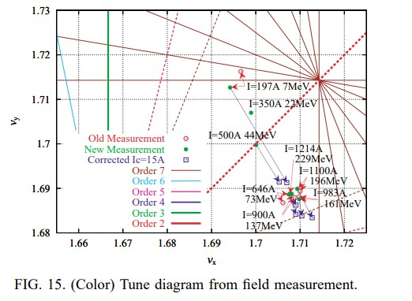</img>

The focusing power of the fringe field, which is difficult to calculate accurately, affects only the vertical tune.

A large excitation tune shift is found in the low excitation case shown in Fig. 15, and the tune shift at a high excitation was relatively small. In the tracking in TOSCA’s magnetic field, the tune shift is driven by the field deformation of iron saturation in the high magnetic field region.

Thus, this measured tune shift does not agree with the suggestion of the tune value from the TOSCA evaluation shown in Fig. 7. Considering that the tune shift becomes large at lower excitation currents, it seemed that this tune shift was caused by an offset of the magnetic field. From simulations based on the measured field under this offset assumption, the expected offset of the magnetic field became about 5 G. But this value was too large to be explained by either zero offset of tesla meters or by the Earth’s magnetism. Thus, it might be caused by the remanent magnetic field.

We tried to correct this tune shift with a one turn correction coil. This one turn correction coil was wound around the magnet poles and its winding directions were opposite between the F and D sectors, as shown in Fig. 16. Thus the correction coil could change the relative excitation level of the F sector against the D sector while keeping total bending power, because the total cross section of the correction current loop of the F sector was almost equal to the cross section of the correction current loop of the D sector. In a first order approximation, the closed orbit deformation was negligible and the tune shift was obtained from the tune shift formula of Hill’s equation as

边缘场的聚焦力很难精确计算，仅影响垂直调谐。

在图15所示的低激励情况下，发现大的激励调谐偏移，而在高激励下的调谐偏移相对较小。在跟踪TOSCA磁场时，音调偏移是由高磁场区域中铁饱和度的磁场变形引起的。

因此，该测得的音调偏移与图7中所示的TOSCA评估所提出的音调值的建议不一致。考虑到在较低的励磁电流下，音调偏移变大，看来该音调偏移是由的偏移引起的。磁场。根据在这种偏移假设下基于测量场的模拟，预期的磁场偏移约为5G。但是，该值太大，无法用特斯拉计的零偏移或地球磁场来解释。因此，这可能是由剩余磁场引起的。

我们试图用一匝校正线圈来校正此音调偏移。如图16所示，此一匝校正线圈缠绕在磁极上，并且其缠绕方向在F和D扇形之间是相反的。因此，校正线圈可以改变F扇形相对于D扇形的相对激励水平。保持总弯曲能力，因为F扇区的校正电流回路的总横截面几乎等于D扇区的校正电流回路的横截面。在一阶近似中，闭合轨道的变形可以忽略不计，并且从希尔方程的频移公式中获得了频移：

</img>

where B0 and DB are the nominal value of the magnetic field in the designed orbit and the shift from the nominal value at the F sector, respectively. The integrals R F ds and R D ds are the integration on the whole of the F and D sectors, respectively. If the pole saturation is small, the ratio DBB0 is proportional to the ratio of the ampere turn product between the correction coil and the main coil currents.

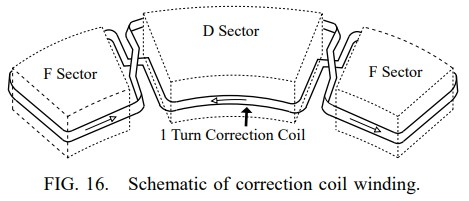</img>

The open box in Fig. 15 shows the operating point of the magnetic field corrected by the correction coil with a constant excitation current of 15 A. This correction is effective for the low excitation level; then the evaluated operating points come around the point 1.71, 1.69. The used correction current of 15 A is within the designed rating of the correction coil current of 100 A. Thus,  by using the correction coil, we could suppress the  excursion of the operating point sufficiently to use for the synchrotron.

### V. SUMMARY

We established an evaluation method for tune values from the magnetic field distribution and developed a field measurement scheme accurate enough to evaluate the tune values. The evaluated operating point from the measured field of the fabricated model magnet had reproducibility within 0.005. The horizontal tune, which did not have a large error propagation from the magnetic field as did the vertical tune, agrees with the design value. In addition, tune fluctuation with current excitation was found, but it was confirmed that the tune fluctuations were easily  compensated by a correction coil. Consequently, it was confirmed that we could fabricate a combined function magnet according to the design based on the three-dimensional magnetic field calculations, by paying attention to parameters which have  large error propagations. We cannot yet confirm that a synchrotron ring works with this model magnet because a complete magnet set to make such a synchrotron does not yet exist. However, from our tune value evaluation of the measured magnetic field, we think that the model magnet has sufficient performance for the construction of a synchrotron

我们建立了一种评估磁场分布中的调谐值的方法，并开发了一种足够准确的磁场测量方案来评估调谐值。从制造的模型磁体的测量场评估的工作点具有0.005以内的再现性。水平调谐不像垂直调谐那样引起大的磁场误差传播，因此与设计值一致。另外，发现了具有电流激励的调谐波动，但是已经确认，该调谐波动易于通过校正线圈来补偿。因此，证实了通过关注具有大误差传播的参数，可以根据基于三维磁场计算的设计来制造组合功能磁体。我们尚不能确定同步加速器环是否可与该模型磁体配合使用，因为尚不存在用于制造此类同步加速器的完整磁体。但是，从对测量磁场的调谐值评估中，我们认为模型磁体具有足够的性能来构造同步加速器

### ACKNOWLEDGMENTS

略
