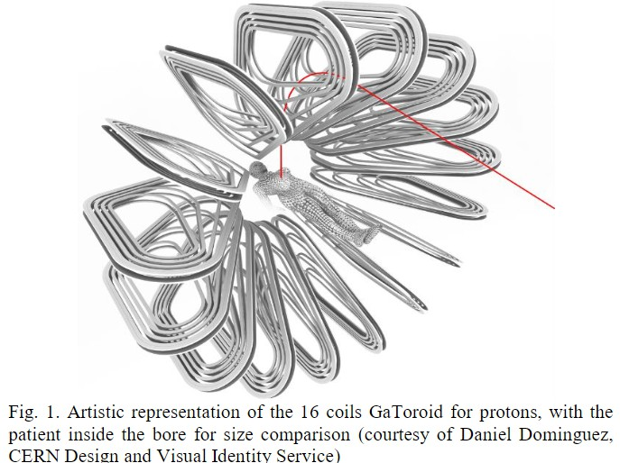
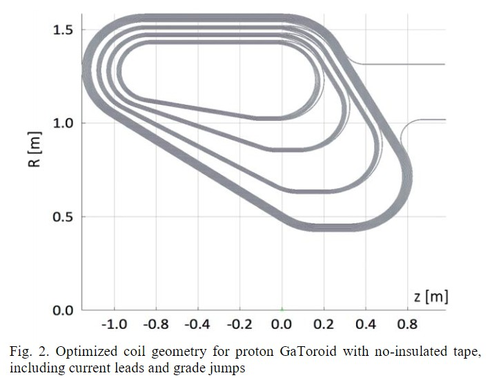
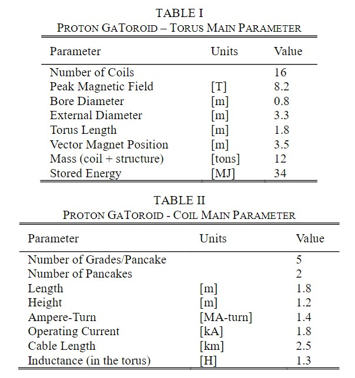
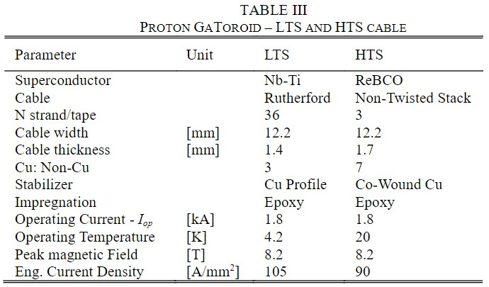
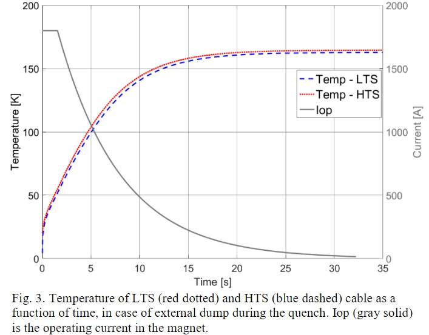
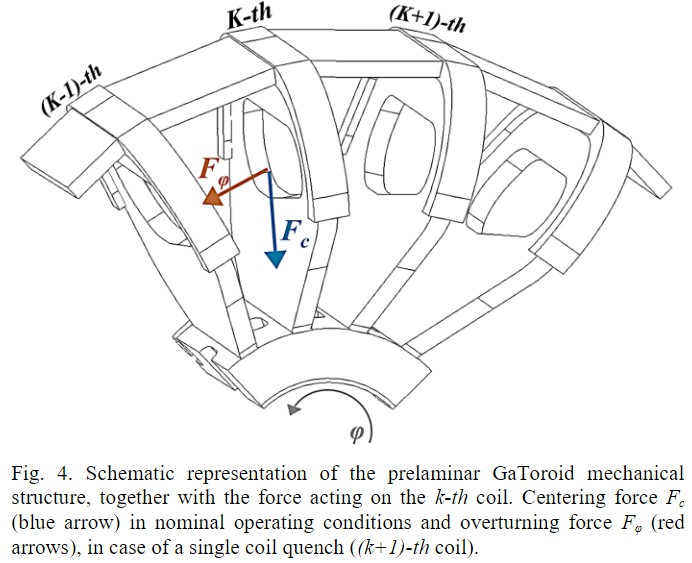
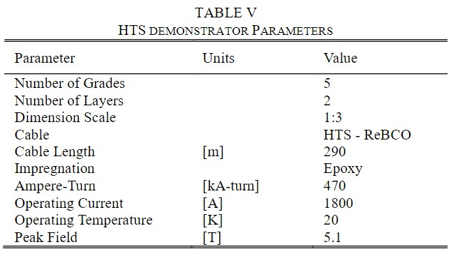
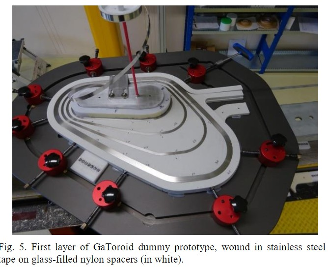

## Magnetic Design of a Superconducting Toroidal Gantry for Hadron Therapy

https://www.researchgate.net/publication/338560497_Magnetic_Design_of_a_Superconducting_Toroidal_Gantry_for_Hadron_Therapy

CERN 2020

## abstract

Hadron and proton therapy are cutting edge techniques for cancer treatment and a great development of specialized medical centers and research facilities is foreseen in the next decades. One of the main obstacles to the penetration of the use of charged particles for therapy is the construction of complex and expensive accelerating structures and rotating transfer lines, i.e. gantries, able to bend and focus the beam down to the patient. GaToroid is a novel concept of a fixed toroidal gantry, able to deliver the dose at discrete angles in the whole range of treatment energies in steady-state configuration. The steady-state current and magnet-ic field are appealing features, implying simplified demands on stability, powering, mechanics and cooling, as well as for the clinical perspective, allowing rapid variations of beam energy and treatment angle. In this work, we present the magnetic design of the toroidal coils composing the first instance of GaToroid, focusing the analysis on an option for a proton machine with an energy range of 70 MeV to 250 MeV. To create a proper magnetic field distribution, the coils have been designed with peculiar asymmetric shape and the windings have been graded. An initial winding geometry was obtained with an optimization aiming at maximum energy acceptance of the gantry. We are now progressing to the detailed engineering design. We describe here the over-all magnet design, coil and conductor layout (LTS and HTS options), and mechanical studies involving the general torus structure. Quench protection is evaluated for LTS (Nb-Ti) configuration, as well as more innovative HTS (REBCO) options. Finally, we present the design and the construction of a scaled-down demonstrator, intended as the proof of principle of winding procedure and mechanical coil structure.

强子和质子疗法是用于癌症治疗的最先进技术，预计在未来几十年中，专门医疗中心和研究设施的巨大发展。使用带电粒子进行治疗的主要障碍之一是构造复杂且昂贵的加速结构和旋转传输线，即龙门架，其能够将射束弯曲并聚焦到患者身上。 GaToroid是固定环形龙门架的一种新颖概念，能够在稳态配置下在整个治疗能量范围内以离散角度输送剂量。稳态电流和磁场是吸引人的功能，这意味着对稳定性，功率，机械和冷却以及临床方面的简化要求，从而可以快速改变束能量和治疗角度。在这项工作中，我们介绍了组成GaToroid的第一个实例的环形线圈的磁性设计，重点分析了能量范围为70 MeV至250 MeV的质子机的选件。为了创建适当的磁场分布，已将线圈设计为特殊的不对称形状，并对绕组进行了分级。通过针对门架的最大能量接受进行优化获得了初始绕组几何形状。我们现在正在进行详细的工程设计。我们在这里描述了总体磁体设计，线圈和导体布局（LTS和HTS选项）以及涉及一般环形结构的力学研究。对LTS（Nb-Ti）配置以及更创新的HTS（REBCO）选件评估了淬火保护。最后，我们介绍了按比例缩小的演示器的设计和构造，旨在证明绕线过程和机械线圈结构的原理。

## I.INTRODUCTION

Hadron  therapy  is  a  cutting-edge  radiation  therapy  which makes use of heavy particles (protons and ions), to deliver highly  localized  dose  to  tumors,  minimizing  potential  damage to   healthy   biological   structures. By   varying   the   particles energy,it  is  possible  to modify  the  Bragg  peak  position  and thus deliver  the  required  dose  at differentdepthsinto  the patient.  Hadron  therapy  relies  on  accelerating  structures,  as well as a beam transfer lines, able to bend, confine and control the  particle  beam from the  accelerator down to the  patient [1]. To  further  ameliorate  the  effectiveness  of  hadron  therapy,  the radiation  can  be  delivered  through  various  angles  around  the tumor  using  a  rotating  transfer  line, i.e.a  gantry.  Hadron therapy  centers  have  high  cost,  deriving,  among  others,  from the  footprint  of  the  gantry  and from the  size  of  buildings required to house  the  related structures [2]. Classical  solutions for hadron  therapy, based  on  rotating  transfer  lines,  are bulky and result in large, heavy and expensive infrastructures. This is especially  true  for heavy ions  gantries,  such  as  Carbon  ions, characterized  by  a  diameter  larger  than  10  meters  and  more than  600  tons  of  weight [3].Superconductingmagnetshavebeenusedtoincrease  the  achievable  magnetic  field  and, therefore, to reduce size and weight [4]. However, the rotating nature of the gantry introduces significant complexity in terms of cryogenics andmechanical stability. Here we present a fixed toroidal gantry, i.e.GaToroid [5][6], able to deliver the dose at a discrete   number   of   angles   with   neither   rotation   of   the magnets nor the  patient.  The basic  principle  is to use  the  axis-symmetric    magnetic    field    between    each    pair    of    coils constituting  the  torus  to  bend  and  focus  accelerated  particles down  to  the  isocenter. If  proven  successful,  the idea of  a steady-state   toroidal gantry, realized   with   superconducting magnets, could  result  in  aquantum  step  toward the concept  of single room facilities for hadron therapy.

强子疗法是一种先进的放射疗法，它利用重粒子（质子和离子）向肿瘤提供高度局部的剂量，从而最大限度地减少了对健康生物结构的潜在损害。通过改变粒子的能量，可以改变布拉格峰的位置，从而以不同的深度将所需的剂量输送给患者。强子疗法依赖于加速结构以及光束传输线，它们能够弯曲，限制和控制从加速器到患者的粒子束[1]。为了进一步改善强子疗法的有效性，可以使用旋转的传输线，即机架，通过围绕肿瘤的各种角度来递送辐射。强子治疗中心的成本很高，这主要是因为龙门架的占地面积以及容纳相关结构所需的建筑物大小[2]。基于旋转传输线的强子疗法经典解决方案体积庞大，导致基础设施庞大，笨重和昂贵。对于直径大于10米且重量超过600吨的重离子门架（例如碳离子）尤其如此[3]。超导磁体已被用于增加可达到的磁场，从而减小其尺寸和重量[4]。 。但是，机架的旋转特性在低温和机械稳定性方面引入了显着的复杂性。在这里，我们介绍了一种固定的环形龙门，即GaToroid [5] [6]，它能够以离散数量的角度递送剂量，而磁铁和患者均不会旋转。基本原理是利用构成圆环的每对线圈之间的轴对称磁场将加速的粒子弯曲并聚焦到等中心点。如果被证明是成功的，那么采用超导磁体实现的稳态环形龙门架的构想可能会导致向强子治疗单室设备概念迈出量子步伐。

## II.COIL OPTIMIZATION 

The GaToroidworking principle is explained in detail in[5][6], together   with   analytical   approximations   used   for   the   coil geometry  andmagnet  design.  Its  basic  principle  is  to  use  a toroidal  field  (toroidal  gantry) to  direct  beams  of  different energies and directions on the same  point (isocenter) by acting on  a  single  upstream  bending  magnet  (vector  magnet). The work described in this manuscript is focused on a configuration for  proton  treatments. Fig.  1  presents  an  artistic  view  of  a  16 coils  GaToroid  for  protons,  with  the  patient  in  the  treatment position.

GaToroidworking原理在[5] [6]中进行了详细说明，以及用于线圈几何形状和磁体设计的解析近似值。 它的基本原理是通过作用在单个上游弯曲磁体（矢量磁体）上，使用环形场（环形龙门架）将不同能量和方向的光束定向到同一点（等中心点）上。 本手稿中描述的工作集中在质子处理的配置上。 图1展示了一个16圈质子线圈GaToroid的艺术视图，患者处于治疗位置。

</img>

Fig.  1.Artistic  representation  of  the  16  coils  GaToroid  for  protons,  with  the patient  inside  the  bore  for  size  comparison(courtesy  of Daniel  Dominguez, CERN Design and Visual Identity Service)

图1.质子的16个线圈GaToroid的艺术表现形式，患者在孔内以进行尺寸比较（由CERN设计和视觉识别服务Daniel Dominguez提供）

In [6]the   ideal coil   shape   was   derived,   based   on   the simplification   of   a   hard   edge   magnet,   with   uniform   and constant field within the coils.In practice, the magnetic field in a  conventional  toroid  is  inversely  proportional  to  the  radius.Thus,  to  create  a  suitable  magnetic  field,  able  to  bend  the particle  trajectories  toward  the  isocenter  in  the  whole  range  of treatment   energies,   it   is   necessary   to   modify   the   current distribution  inside  the  coils,  i.e.  coil  grading.  Furthermore,  the effectof fringe fields on the beam is not negligible and the hard edge approximation is not sufficient.

To find an appropriate solution, an iterative optimization, based on  the  minimization  of  the  gap  between  the  particle  orbit positions  at  the  isocenter  at  different  energies,  was  used.  The particle  orbits  identify  the  ideal  trajectories  around  which  the classical  beam  optics  formalisms  are  defined [7].  A  detailed beam dynamics analysis is beyond the scope of this manuscript and  it  described  in [8].  The  whole  range  of  treatment  energies for  proton, i.e.  70  MeV  to  250  MeV,  was  analyzed  and  the convergence  criterion  was  set  to  1  mm  at  the  isocenter.  To maintain  the  orbit  positioning  at  isocenter  within  1  mm,  the vector   magnet   need   a   precision   of   about   5   mrad,   while misalignment errors in the coils, and respective grades, must be limited below the ±0.5 mm in the three axes. 

The optimization was performed onthe spacing between grades and on the  torus parameters, such as the  ideal  field  magnitude, internal  radius  and  the  position  of  the  vector  magnet.The analytical coil profile has a limb with negative curvature [6].To simplify    the    winding    procedure,    the    profile    has    been straightened,  with  little  effect  on  the  beam  bending  properties.The  size  of the  coil is considered a  crucial  parameter, not  only for the total footprint and weight of the gantry, but also for the amount  of  conductor  and  the  stored  energy, i.e.the  cost  of the machine [9]. For this reason, the geometry of the return current limb (located in the positive part of the z-axis in Fig.2) has been tilted  to  reduce  the  coil  area  and  the  length  of  conductor. Finally,  to  decrease  the  peak  magnetic  field  on  the  conductors down  to  approximately  8  T,  gaps  of  the  order  of  2  cm  have been  introduced  between  grades  in  the  outward  leg.The  coil geometry obtained by the optimization for a 16-coils GaToroid configuration,   including   current   leads   and   grade  jumps,   is presented in Fig. 2. Each coil is wound as a double pancake and each layer is composed of 5 grades.

在[6]中，基于简化的硬边磁体，得出了理想的线圈形状，在线圈内具有均匀且恒定的磁场。实际上，常规环形线圈中的磁场与半径成反比。为了产生合适的磁场，能够在整个治疗能量范围内使粒子轨迹向等角点弯曲，必须修改线圈内部的电流分布，即线圈分级。此外，边缘场对光束的影响不可忽略，并且硬边缘逼近还不够。

为了找到合适的解决方案，基于最小化等能量下等中心点的粒子轨道位置之间的间隙最小化，进行了迭代优化。质点轨道确定了定义经典光束光学形式主义的理想轨迹[7]。详细的射束动力学分析超出了本文的范围，并在[8]中进行了描述。分析了质子的治疗能量的整个范围，即70 MeV至250 MeV，并且在等中心点将收敛标准设置为1 mm。为了将等角点的轨道位置保持在1 mm之内，矢量磁体需要约5 mrad的精度，同时线圈和各个坡度的失准误差必须限制在三个轴的±0.5 mm以下。

优化是在坡度之间的间距和环面参数（例如理想磁场强度，内半径和矢量磁体的位置）上进行的。分析线圈轮廓具有负曲率的边[6]。为简化缠绕过程线圈的尺寸被认为是一个至关重要的参数，不仅对于龙门架的总占地面积和重量，而且对于导体的数量和存储的能量都至关重要，即机器的成本[9]。因此，返回电流臂的几何形状（位于图2中z轴的正向部分）已倾斜以减小线圈面积和导体长度。最后，为了将导体上的峰值磁场降低到大约8 T，向外分支的坡度之间引入了大约2 cm的间隙。通过优化16线圈GaToroid配置获得的线圈几何形状包括电流引线和等级跳动如图2所示。每个线圈缠绕成双层煎饼，每层由5个等级组成。

</img>

Fig.  2.Optimized  coil  geometry  for  proton  GaToroidwith  no-insulated  tape, including current leads and grade jumps

图2带无绝缘带的质子GaToroid的优化线圈几何形状，包括电流引线和坡度跳变

The  core  of electromagnetic  simulations is based on Field2017 [10].  Dedicated  software  was  developed  for  particle  tracking and  coil  optimization.  It  is  worth  to  underline  that,  because  of the  axis-symmetric  configuration,  the  magnetic  field  on  the patient, laying in the gantry bore, is below any value of concern for instrumentation or humans (order of T).

电磁仿真的核心是基于Field2017 [10]。 开发了专用软件进行颗粒跟踪和线圈优化。 值得强调的是，由于轴对称的配置，放置在龙门架孔中的患者身上的磁场低于仪器或人的任何关注值（orderT量级）。

## III.CONDUCTORS AND QUENCH PROTECTION

The  main  parameters  of  the  optimized  torus  and  coil  are  listed in  Tab.  I  and  Tab.  II,  respectively.  The  design  of  the  machine was   optimized   limiting   the   peak   magnetic   field   on   the conductors in the order of 8 T, to accommodate the use of both Low (LTS) and High (HTS) Temperature Superconductors.

表中列出了优化的圆环和线圈的主要参数。 我和Tab。 二，分别。 机器的设计经过优化，可将导体上的峰值磁场限制在8 T左右，以适应低温（LTS）和高温（HTS）超导体的使用。

</img>

Given the low price, limited magnetic field (~8 T), simplicity of winding (no heat treatment) and high experience level gained in  the  last  decades [11],  Nb-Ti  was  chosen  as  LTS.  Regarding HTS,  between  BSCCO  and  ReBCO  the  latter  was  selected. ReBCO  coated  conductors  are  widely  used  in  the  community, not only for toroidal  fusion  magnets [12][13], but also for new generation  of  high  field  magnets  for  particle  physics [14]and medical applications,such as gantries [15]and NMR-MRI [16]. ReBCO  is  a  costly  material,  produced  with  limited  length  and uniformity,   and   it   is   challenging   to   generate   homogenous magnetic   field   due   to   the   presence   of   screening   currents. However,  it  does  not  require  any  heat  treatment  after  the winding  and,  provided  the  absence  of  hard-way  bending  and small  radii  of  curvature,  can  be  easily  wound.  Finally,  at  the moment, coated conductors have larger margin of technological improvement [17]and    represent    a    stimulating    research challenge. 

We  have  defined  the  cable  parameters  based  on  margin  and hot-spot  considerations,  using  an  adiabatic  approximation  and lumped  circuit  parameters  for the  quench  protection  systems (i.e.no  propagation  considered).The  operating  current  was chosen  at  a  rather  modest  value,  1.8  kA,  to  reduce  heat  loads from  the  current  leads.  First,  a  solution  with  an  external  dump was  considered,  assuming  two  powering  circuits  of  eight  coils in series,  2 seconds for quench detection, a  voltage  limit at the coil terminals of ± 1kVand the cable parameters listed in Tab.III.  During  the  current  discharge,  the  hotspot  temperature  rise was evaluated both for LTS and HTS cables, and the results are shown  in  Fig.  3.  The  maximum  temperature  in  the  adiabatic condition  is  about  160  K  and,  therefore,  in  the  presented approximation, the cable topologies are suitable for the magnet protection with an external dump.

</img>

</img>

Fig.3.Temperature of LTS (reddotted) and HTS (bluedashed) cable as a function of time, in case of external dump during the quench. Iop (gray solid) is the operating current in the magnet

Asecond protection option was evaluated, considering the coils powered in series,  by-passed by diodes,  and quench heaters on the   magnets [18].   Assuming   500   milliseconds   of   quench detection  time,  190  Joules  of  energy  introduced  by  the  heaters on  the  whole  coil  and  the  parameters  of  Tab  III,  the  hotspot temperature  on  the  LTS  cable  is  about  100  K  and  the magnet can  be  considered  safely  protected.  However,  since  the  energy margin  of  HTS  in  the  operating  conditions  listed  in  Tab  III  is much  larger,  and  the  quench  propagation  much  slower,  the energy required at the heaters would exceed one hundred kJ per coil(about   15   kJ   per   grade).   Therefore,   for   this   magnet configuration  we  exclude  an  internal  protection  system  for HTS.Nevertheless,   given   the   steady-state   configuration   of GaToroid,  HTS  self-protected  magnets,  consisting  of  non  or partially   insulated   windings [19][20],   represent   a   further quench protection option to be evaluated in the future.

## IV.MECHANICAL DESIGN

Given  the  magnetic  field  on  the  conductor  surface, B,  and  the current  density J,  it  is  possible  to  calculate  the  force  density distribution  and  integrate  it  on  the  conductor  volume  to  obtain the total electromagnetic force generated by each coil Fc

Fc = ∫∫∫ J * B dV

As expected  from a  toroidal  magnet, Fcis a  centering  force, acting  radially  on  each  coil  toward  the  center  of  the  torus [21].The  forces  are  symmetric  and  uniformly  distributed  along the  azimuthal  direction φ.  A  first  estimation  of  the  supporting cylindrical  structure  was  done,  considering  the  hoop  stress σθcreated  by  a  uniform  pressure  on  a  thin-walled  cylindrical surface

σθ = Ncoilsis * Fc / (2πlt)

where Ncoilsis the  number of  coils, and l and t are  respectively the  length and the  thickness of the  bucking cylinder. In Fig. 4, the   centering   force   Fc and   bucking   cylinder   structure   are represented.  The  figure  shows  one-fourth  of  the  symmetric toroidal  structure,  and  it  is  worth  noting  the  cavities  on  the cylinder,   in   between   the   coils,   to   accommodate   the   beam passage

</img>

Similar calculations can be done in case of a coil quench. No transient  phenomena  were  taken  into  account  and  the  current was  set  constant  and  equal  to  zero  on  the  quenched  coil. Considering the coils plotted in Fig. 4, we can analyze the force acting   on   the k-thcoil   during   the   (k+1)-thquench.   This overturningforce Fφpushes the k-thcoil toward the (k-1)-thin the  azimuthal  direction φ, i.e.out of the  coil plane.k-thcoil is experiencing the maximum overturning force during the quench of (k+1)-thone[22].The structure foreseen to support the coils in  case  of  quench  is  based  on  flat  plates  connecting  the  coils along   the   azimuthal   direction φ.For   a   given   length and thickness, the stress on this simplified geometrical structure can be evaluated. The force Fφgenerated in the case of quench and the inter-coil concept are schematically represented in Fig. 4

The dimensions of the mechanical structures and the stresses are  listed  in  Tab.  IV,  both  for  the  bucking  cylinder  and  the inter-coils   structure.   Finally,   this   preliminarymechanical design  allows  estimating  the  mass  of  the  system,  comprising the  coils,  casings,  bucking  cylinder  and  inter-coil  structures. Assuming  the  use  of  stainless  steel,  the  total  weight  of  the assembly  results  in  about  12  tons, i.e.one  orderof  magnitude lighter  than  the  nowadays  available  commercial  gantries  for proton therapy

</img>

## V.HTSDEMONSTRATOR

A   single   coil   scaled-down   demonstrator   was   designed   to evaluate  the  practical  feasibility  of  the  coil  and  identify  the main  issues.  The  demonstrator  is  reduced  in  size  by  a  factor  3 with  respect  to  the  GaToroid coil  described  so  far.  At  nominal current, a single prototype coil will produce about 5 T (vs. 8 T in  the  full-size  toroid)  with  force  and  stress  distribution  not representative  of  the  final  configuration.  For  this  reason,  we plan  to  test  at  over-current,  to  simulate  internal  forces,  and  we are  evaluating  the  possibility  of  using  a  second  identical  coil with a magnetic mirror to reproduce centering and out-of-plane forces. 

The  demonstrator  will be  wound in HTS,  to evaluate  the  cable configuration  and  quench  protection  system  described  above. The  asymmetric  geometry  of  the  coils,  its  grades,  layers,  and respective   connections,   are   challenges   that   can   be   tackled during  the  prototype  winding.  Finally,  the  demonstrator  will serve  as  a  benchmark  of  the  electromagnetic  design,  through field  mapping,  and  of the  circuital  model  of  the  coil.  Though not yet finalized, this will be particularly relevant in case a non-insulated or partially insulated winding is pursued.

</img>

The circuital model in this case is similar to the one proposed in [22],  composed  by  5  blocks  of  inductances  and  resistances  per layer.   The   design   choices   for   the   demonstrator,   described above,   are   summarized   in   Tab   V.   Work   towards   the demonstrator   construction   has   started.   A   first dummy coil wound  with  stainless-steel  tapes  on  glass-filled  nylon  spacers has  been  assembled,  in  order  to  verify  the  winding  procedure and identify possible inaccuracies and faults in the design. Fig. 5  shows  the  first  layer  of  the dummy GaToroid  demonstrator, together   with   the ad   hoc developed   tooling   and   winding supports.

</img>

Fig. 5.First  layer  of  GaToroid  dummy  prototype,  wound  in  stainless  steel tape on glass-filled nylon spacers (in white).

## VI.CONCLUSION

GaToroid  is  a  novel  concept  of  toroidal  steady-state  gantry for  hadron  therapy.  This   work  presents  the  first   magnetic design  of  the  16  coils  GaToroid  for  protons.  The  coils  were designed  and  optimized  through  a  complete  integration  of magnetic  field  map  calculation  and  bi-dimensional  particle tracking. On the resulting torus, preliminary magnet design and studies  on  mechanical  structures  and  quench  protection  were performed to evaluate  the  feasibility of the  machine.  A scaled-down  HTS  demonstrator  of  a  single  coil  was  designed  and  the first  prototype  in  stainless  steel  tapes  on  glass-filled  nylon spacers  was  wound.  Further  investigations  are  necessary  to evaluate  the  gantry  feasibility,  including  detailed  analyses  of integrated   vacuum   and   cryogenic   systems. They   may   be composed  of Ncoilsflat  vacuum  pipes  originating  from  the vector magnet and entering the cryostat that encloses the whole torus  except  for  the  central  bore.  Although  the  engineering design   of   GaToroid   superconducting   torus   is   just   at   the beginning,  the  concept  seems  very  promising  and  could  result in   a   significant   reduction   of   gantries   size   and   weight, facilitating societal penetration of hadron therapy
