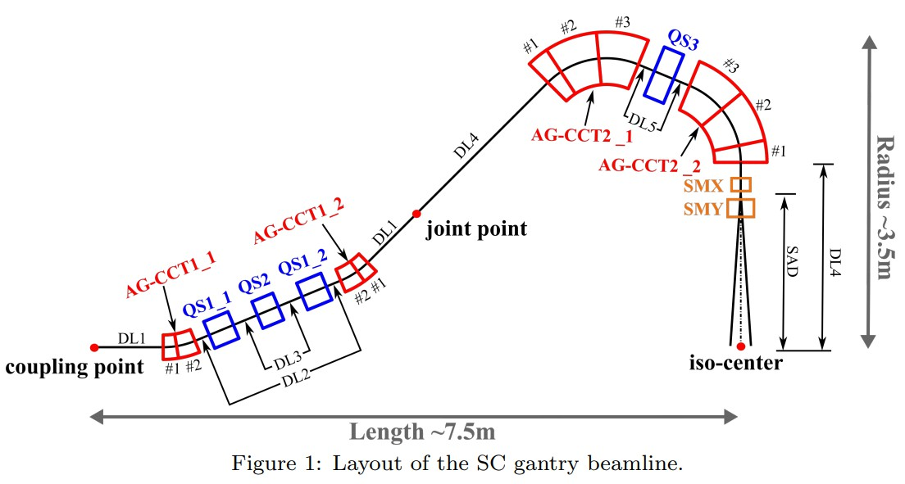
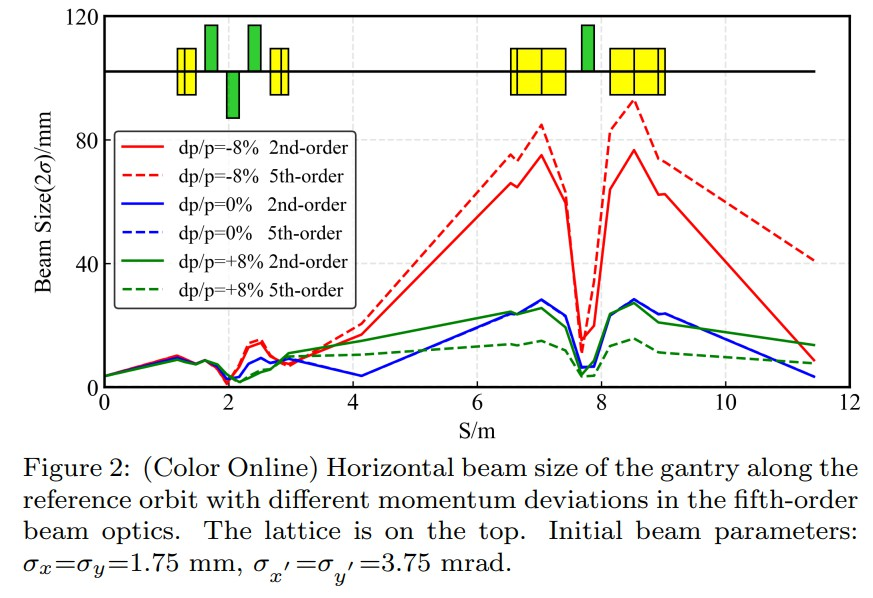
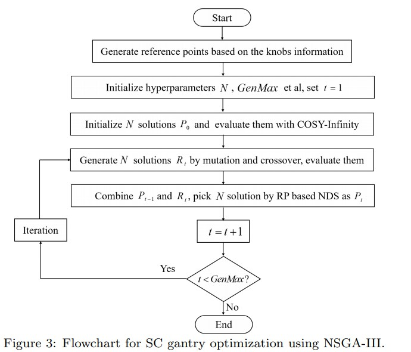
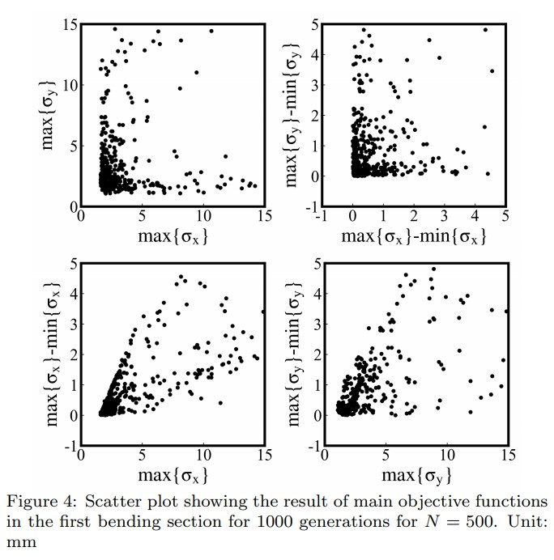
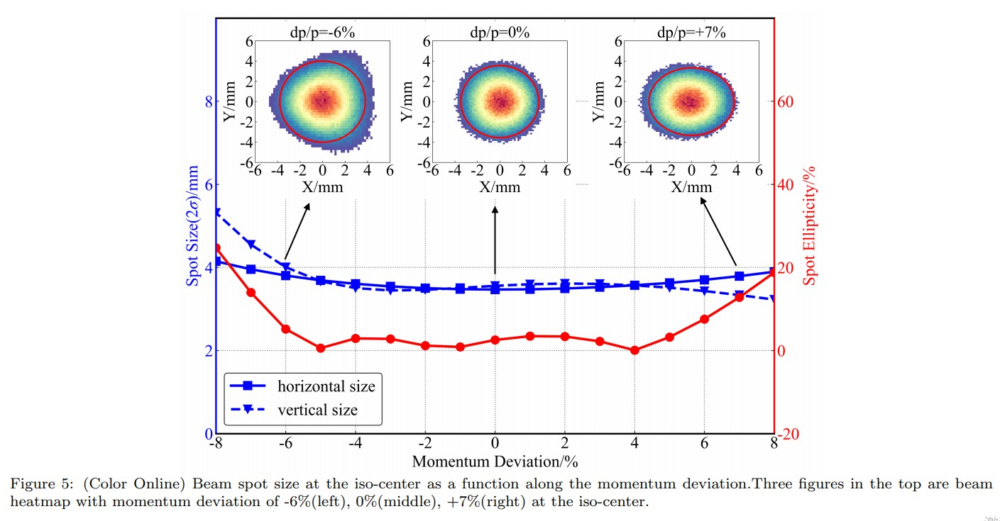
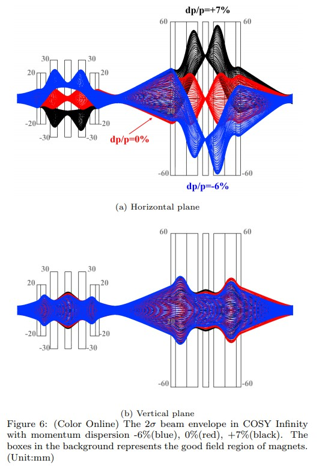
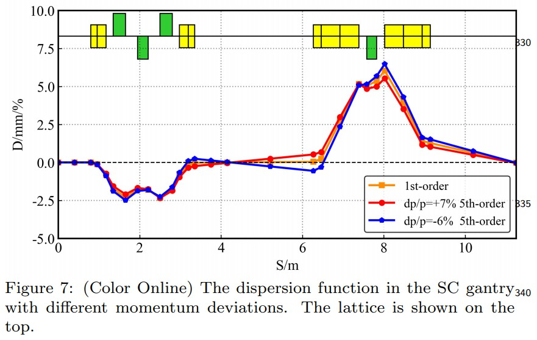

# 65 High order beam optics optimization for a superconducting gantry applied to proton therapy based on NSGA-III

廖益诚 小论文 遗传优化 2021

Yicheng Liao, Runxiao Zhao, Xu Liu∗ , Geng Chen, Qushan Chen, Bin Qin

## Abstract

A superconducting gantry with large momentum acceptance has been studied at Huazhong University of Science and Technology. The second-order beam optics design of this gantry was accomplished. To narrow the gap between beam optics and beam behavior in realistic magnetic fields, an optimization in high order beam optics should be carried out. The optimization is a many-objective and many-knob problem, and the non-linearity effects in high order optics are very complicated and hard to be suppressed by using traditional fitting procedures. To resolve this problem, the dispersion effects on beam spot stability are studied in high order optics situation, and a new optics optimization method based on the NSGA-III algorithm is proposed. By re-identifying the objectives and knobs and applying the genetic algorithm, the momentum acceptance of this superconducting gantry was achieved to -6%/+7% in the fifth-order beam optics, and a stable round beam can be obtained at the iso-center.

华中科技大学研究了动量接受度大的超导龙门。完成了该龙门架的二阶光束光学设计。为了缩小现实中磁场中光束光学器件和光束行为之间的差距，应该对高阶光束光学器件进行优化。 优化是一个多目标，多变量的问题，高阶光学器件中的非线性效应非常复杂，难以通过传统的拟合程序加以抑制。 为了解决这个问题，研究了高阶光学条件下色散对光束斑稳定性的影响，提出了一种基于NSGA-III算法的光学优化方法。通过重新识别物镜和旋钮并应用遗传算法，在五阶光束光学系统中，该超导龙门的动量接受度达到了-6％/ + 7％，并且可以在等距处获得稳定的圆形光束-中央。

## 1. Introduction

布拉格峰->质子治疗保护周围健康组织。
最近，轻紧凑 lightweight compact PT 研究热点 / 整合进医院。
机架的规模和重量是大问题。（什么鬼
传统机架100t以上，直径10m以上，主要是常规导体磁铁
使用超导，小型化
举例ProNova 只有25t

SC主要缺点，慢调节速度 slower ramping rate 能量调节耗时长
一种方法：增大动量接受度。固定磁场。
优点：支持快速能力改变、减少治疗时间
怎么做：整体消色散 -> 局部消色散

光学设计，即一些变量和限制目标。
拿 LBNL 举例。
即多目标多节点问题。many knobs and many objectives
PSI 的问题类似，他们一步步优化，需要人工参与和设计经验。

本文呈现下游机架高阶设计结果。
原始设计来自...，二阶优化 COSY 完成。
但是阶数增大，传数矩阵增大、无法优化。
因此使用NSGA3和新的优化策略。
介绍 NSGA3。

介绍文章结构。
S2 总结前人工作、分析高阶设计的款那
S3 介绍 NSGA3 和 目标/变量 的设计
S4 结果
S4 总结

## 2. High order optics and beam spot stability

HUST SC 机架如下图。

</img>

两个偏转段。每段两个对称的AG-CCT。QS插入压制高阶相差。
首先压制色散，二阶种T126/T346最大贡献。
在 COSY 中这些和 R16/R26 一起优化。
最终得到+/-8%动量接受度。
为了得到更真实的情况，高阶色散研究进行。

图2比对先前设计的SC机架，2阶和5阶下不同动量分散的包络。
描述图。结论是优化策略需要调整。

</img>

point-of-view 观察点
从治疗上来看，在ISOC的束流需要在大动量范围内稳定。
束斑稳定性有两个层面：束流位置和束斑尺寸
根据PSI设计结果，束流位置会有5mm移动，但是可以补偿
因此，束斑大小稳定更重要。
另外，除了束斑稳定，还需要圆束斑。ax=ay
扁平率 椭圆程度 ellipticity e = 2(a-b)/(a+b) 小于10%

总结目标：
束斑尺寸 1.5<ax,ay<3.0
椭度 e<10%
束斑波动 dax day <0.3
束斑位置波动 dx dy <1mm

## 3. Optics optimization by using NSGA-III

## 3.1. Optimization objectives 优化目标

图2显示束斑在不同动量分散下不一致。因此需要同时优化。
我们选择-5% 0 5% 三种动量分散值。
前后偏转段分开优化。
为了满足目标范围，设置了constraint conditions
4类目标和限制如下

1. σx σy 1.5-3 以及 max(σ)-min(σ)<0.3
2. 最大椭度 <10%
3. 包络对称的考虑
4. 包络大小限制
   
## 3.2. Knobs

SC 机架结构。knob 的定义。

1. AGCCT 磁铁 介绍 AGCCT 以及变量
2. QS磁铁
3. drifts

## 3.3 优化过程

变量多，目标多。所以传统优化方法不行。
本研究中，使用 NSGA3 配合 cosy
过程如下

1. 超参数。种群大小 N 500，最大迭代次数 1000
2. 初始第一代，放入 cosy 计算
3. 产生下代，变异率9/12.5%，杂交率100%
4. 对比前后两代。。。（具体 NSGA）
5. 迭代

表（略）具体超参数值

</img>

## 4. Results

优化后获得多个 Pareto front 的解。
任意查看两个维度下 Pareto front 形状。如下图。

</img>

人工选择最优解，标准如下

1. 束斑小 稳定
2. 包络对称
3. 低的 QS 磁场大小
4. 低的 AGCCT 四极场

下图显示束斑稳定。
动量分散 -6 - 7% 束斑大小波动 0.26mm

</img>

下图5阶粒子跟踪结果。

</img>

表格（略）展示重要的参数值

计算色散函数大小分布。这里的色散定义为 dx/dp ，因此高阶下随 dp 变化而变化。

</img>

## 5. Conclusions

SC + 大动量接受度 有希望小化PT
但是光学设计很有调整，因为numerous objectives and knobs 和复杂的非线性
NSGA3 
因此使用 NSGA3 优化束斑 而非 传输矩阵
结果证明可行 更好
如果模型复杂，可以用代理模型。
cosy 改为代理模型，优化时间从 3 小时缩短到 10几分钟

## Acknowledgements

This work was supported by the National Natural Science Foundation of China under Grant 11975107, Program for HUST Academic Frontier Youth Team and the
330 Fundamental Research Funds for the Central Universities(HUST: 2020JYCXJJ059).

