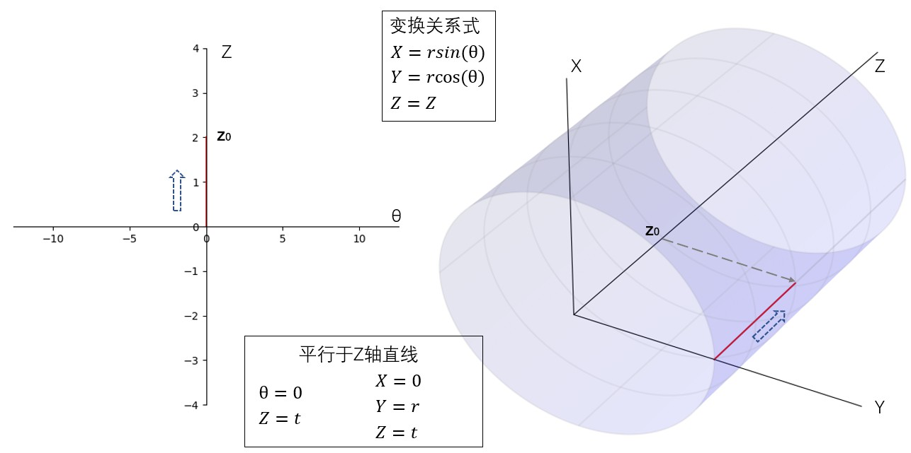
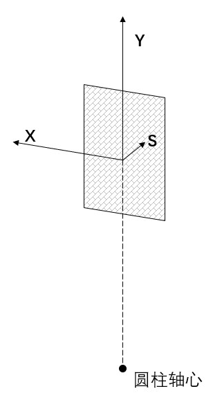
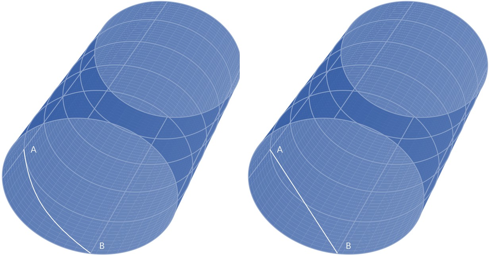
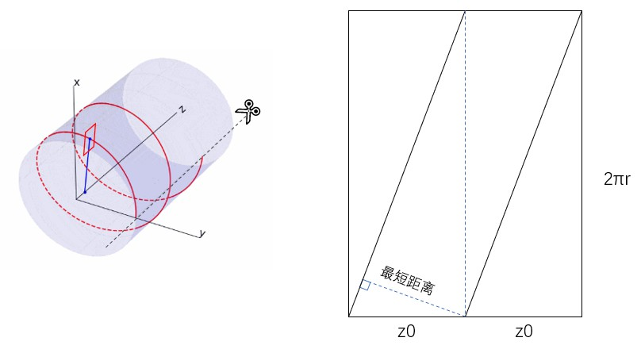
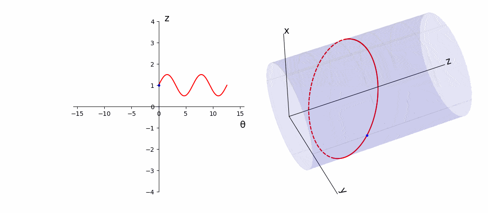
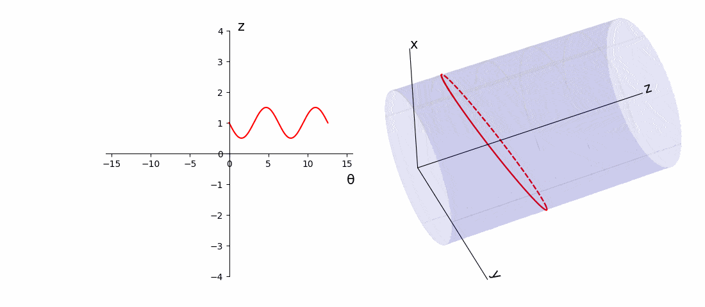
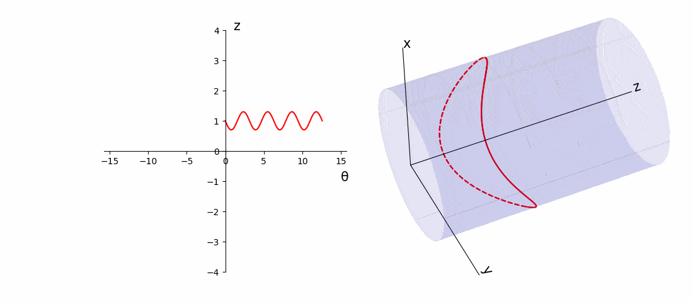
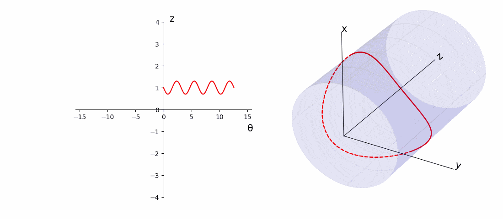
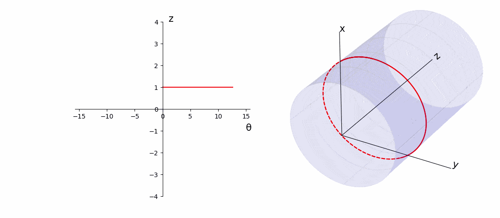
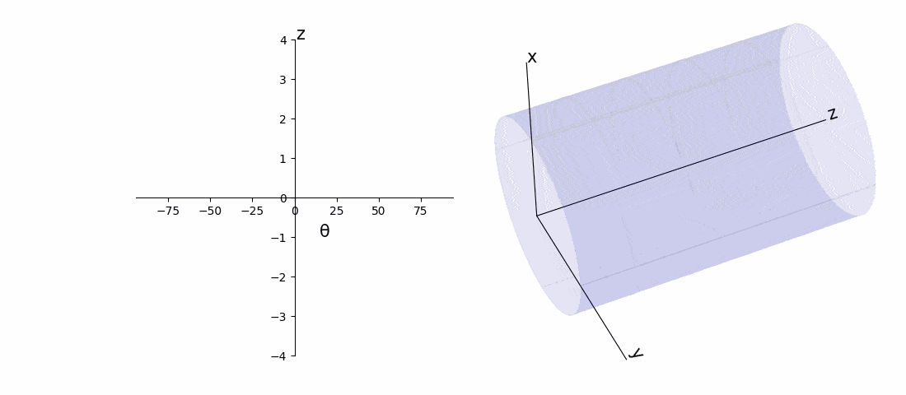

# 直线 CCT 和圆柱面 -- 建立二维到三维映射

引入：CCT 的路径是一条三维曲线，不利于观察分析，但同时 CCT 缠绕在圆柱表面（直线CCT）,在曲面上建立坐标系，可以把三维 CCT 路径方程，映射到二维。

## 圆柱面

建立如下图所示的圆柱面到二维坐标系(θ,z)的映射

</img>
图和CODE见同名PPT-1

其中右图三维坐标系中 Z 轴即圆柱轴线，XY 平面为圆柱的一个正横截面。左图二维坐标系 Z 轴和 三维坐标系 Z 轴相同，θ 轴取值表示以三维 X 轴为极轴的极角。

考虑三种简单的运动路径

1. 从二维(θ,z)坐标系原点出发，沿 θ 轴运动。在圆柱面上，点在 Z=0 的 XY 平面画出一个半径 r 的圆弧，起点为 (r,0,0)

</img>
图和CODE见同名PPT-2

2. 从二维(θ,z)坐标系原点出发，沿 Z 轴运动。在圆柱面上，点沿着 Z 轴移动，起点为 (r,0,0)

</img>
图和CODE见同名PPT-3

3. 从二维(θ,z)坐标系原点出发，向左上角运动。在圆柱面上，点正好走出一条螺线。可以看到，若螺距为 z0，则二维系中直线方程为 Z=θ*z0/2pi。

</img>

图和CODE见同名PPT-4

## rib 宽度问题

- 圆柱面上螺线的 rib 宽度

首先从最简单的情况考虑，直螺线管。对 rib 宽度的研究，首先要知道开槽方式。

螺线路径上的任意一点 P，找到它在 Z 轴的投影，投影线就是圆柱径向，如下图

</img>

以运动点建立自然坐标系 XYS，S 指向运动方向，**固定朝向纸内**，Y 轴沿圆柱径向向外，如下图所示

</img>
</img>

从直觉来看，rib 宽度就是路径上距离相差 2π 的点开槽矩形面之间的距离，但是具体是不是差 2π，可能 2π±t 范围内，许哟啊考虑一个范围。(t ∊ (-δ, +δ))

</img>
</img>

下面从数学上完成计算：

三维螺线路径方程 **P** = **P**(θ) = (rsin(θ), rcos(θ), z0θ/2π)

相距 2π+t 的点 **P'** = **P'**(θ+2π+t) = (rsin(θ+t), rcos(θ+t), z0(θ+t)/2π + z0)

两点间的距离平方 |**P**-**P'**|^2 = r^2(sin(θ+t)-sin(θ))^2 + r^2(cos(θ+t)-cos(θ)) + (z0 + zot/2π)

化简为 r^2(2-2cos(t))+z0^2+z0^tt^2/(4π^2)+z0^2t/π

可以注意到这里没有 θ，说明螺线中，固定相差的点距离是一个固定值。

让距离 |**P**-**P'**|^2 对 t 求导，有

4π^2r^2sin(t)+(z0^2t)/(2π^2)+z0^2/π = 0

这是个超越方程，如果认为 t 很小，做 sin(t)=t 的近似，解为 t = -z0^2/2πr^2

将 t 带入 |**P**-**P'**| - width，就可以算出螺线管 rib 的宽度

**但是这个计算方法是错的！因为超维了，曲面上两点之间的连线，应该在曲面上，而不是一条直线**

</img>

**rib 宽度问题进一步研究，设计完备的公式推导，在同名docs文件中详细记述**

另一方面，我们可以把圆柱侧面剪开，利用几何关系，简单运算就可得出匝间最短距离为 z0√((2πr)^2-z0^2)/(2πr)

</img>

S 轴方向，即路径切线 **s** = **P**'(θ)

路径点 **P** 在圆柱轴线上的投影 **Pa** = (0, 0, z0θ/2π)

Y 轴方向，即圆柱径向 **y** = **P**-**Pa** = (rsin(θ), rcos(θ), 0)

X 轴方向，可以用 Y 轴叉乘 S 轴求得 **x** = **y**×**s** = 

## 螺线核、CCT 核

CCT 先研究最简单的直线 CCT，如果不考虑绕线时向 z 轴方向的移动，CCT 的本质如下

1. 螺线核

路径方程，二维 **P**(t) = (t, z0)，三维 **P**(t) = (rcos(t), rsin(t), z0)

</img>

2. 二极 CCT 核

路径方程，二维 **P**(t) = (k0sin(t), z0)，三维 **P**(t) = (rcos(k0sin(t)), rsin(k0sin(t)), z0)

</img>
</img>

3. 四级 CCT 核

路径方程，二维 **P**(t) = (k1sin(2t), z0)，三维 **P**(t) = (rcos(k1sin(2t)), rsin(k1sin(2t)), z0)

</img>
</img>
</img>

4. 多级 CCT 核

</img>

5. CCT = CCT 核 + Z 轴平移

</img>
</img>

## CCT rib 研究

见 books\cct\圆柱直螺线管rib宽度公式推导.docx 

## 二维三维映射的意义

主要用于设计AGCCT，弄清楚每段 CCT 之间的关系

</img>

