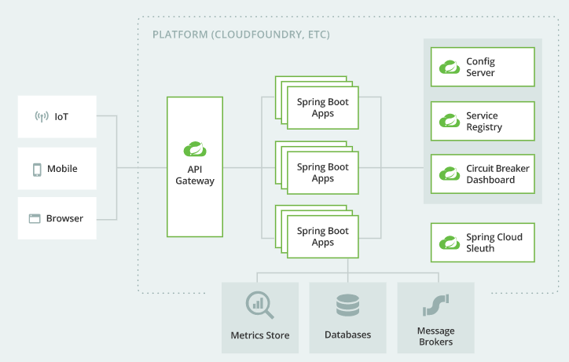

# 一级标题

## 二级标题
正文

```Java
public static void main(){}
```

行内代码`int a = 10;`

## 有序列表
1. abc
2. def


## 无序列表
- 123
- 456

**加粗**

*斜杠*

## 图片
小图

 

大图

 

 ## 特殊符号
 星号*，结束*。
 井号#，结束#。
 <>，><，大于小于号
 @，at符号
 